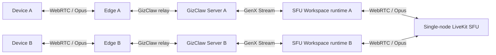
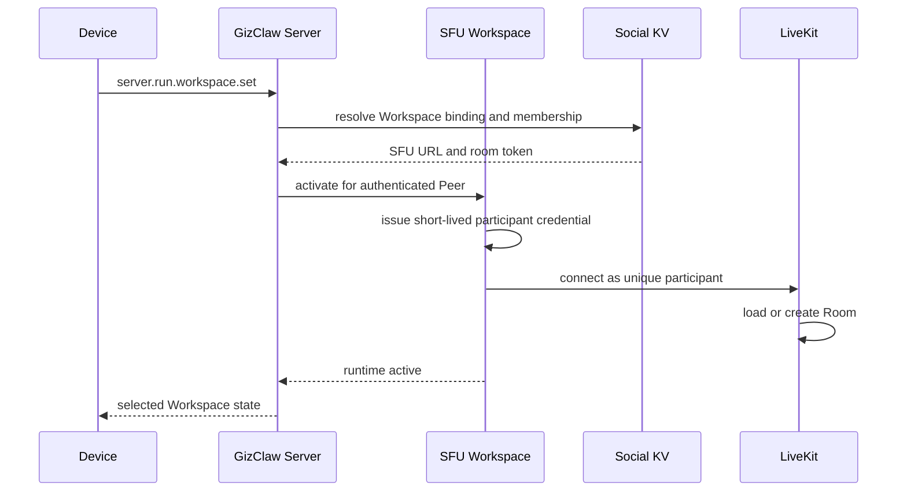

# SFU Workspace 目标设计

> 本文定义 Friend 与 Friend Group 实时语音的最终形态，以及替换 Chatroom 后 Social 与 Workspace History 的边界。文末“对照现有代码的补充决定”记录实现期间按仓库核对确定的约束。

## 目标

Friend 与 Friend Group 使用同一种实时语音模型：Social resource 拥有一个逻辑 SFU Workspace，在线 Peer 选择该 Workspace 后，GizClaw Server 将 Peer 的 GenX 音频流桥接到同一个 LiveKit Room。

该设计需要满足：

- 好友双方连接到不同 GizClaw Server 时仍能通话。
- 群组成员连接到多个 GizClaw Server 时进入同一个房间。
- Device 保持已有的 WebRTC 连接，不直接连接或感知 LiveKit。
- `server.run.workspace.set` 继续作为当前主要 Workspace 的唯一切换入口。
- Friend 与 Friend Group 不再把语音建模为 Message，SFU Workspace 不拥有 Workspace History。
- SFU Room 按需创建，不作为持久化资源常驻。

## 非目标

- 不在 Edge 上实现 Social resource、Workspace 或 SFU Room 逻辑。
- 不让 Device 直接执行 LiveKit signaling 或管理 LiveKit token。
- 不提供语音留言、历史消息、录音下载或历史播放能力。
- 不在 Workspace 中配置 PTT、realtime、ASR、transcript、model 或 memory。
- 不在第一版引入 LiveKit 集群、LiveKit Redis、Ingress、Egress、SIP 或 LiveKit Agent。

## 总体链路



Edge 只转发既有 Giznet/WebRTC connection，不解析 Workspace、Friend、Friend Group 或 LiveKit Room。SFU Workspace runtime 运行在 authoritative GizClaw Server 上，并作为 LiveKit participant 建立第二条 WebRTC connection。

## 资源模型

### 逻辑 Workspace

每个 Friend relationship incarnation 和每个 Friend Group lifecycle 拥有一个全局唯一的逻辑 Workspace identity。Workspace 本身是空的运行入口：

```yaml
id: ws-123
name: ws-123
workflow: system-sfu
parameters: null
system: true
```

SFU Workspace 不拥有 History、Message、media asset 或 Agent memory。它只把当前 Peer 的连接绑定到 Social resource 所声明的 SFU Room。

每个可能承载成员连接的 GizClaw Server 都必须能幂等 materialize 相同的本地 Workspace：

```text
相同 workspace_id
相同 workflow driver
相同 Social binding
相同 room token
```

这些本地记录是同一逻辑 Workspace 的副本，不能各自生成不同的 Room identity 或独立决定生命周期。

### Social SFU binding

Friend 使用双方共享的 canonical Relation 保存 SFU binding；Friend Group 使用 canonical Group 保存 SFU binding。面向单个 Peer 的方向性 Friend row 不能各自生成 binding。

```yaml
sfu:
  url: wss://sfu.internal
  room_token: opaque-room-id
```

`room_token` 是公开的稳定 Room identity，不是 LiveKit bearer credential。相同 Social lifecycle 的所有 Server 使用同一个 `url + room_token`。

LiveKit API Key 和 API Secret 只存在于 GizClaw Server 的 secret configuration。任何 Social KV、Workspace、Peer API、event、日志或 generated SDK 都不得暴露它们。

## Room 与 participant 生命周期

### 创建 Social resource

创建或重新建立 Friend relationship 时产生新的 relationship incarnation、Workspace identity 和 Room token。重新加好友不能复用已退休 lifecycle 的 Room token。

创建 Friend Group 时产生一个 Workspace identity 和 Room token。添加或删除普通成员不改变这两个 identity。

Friend Group 成员上限固定为 10 人（含 owner），写死在 `services/social/friendgroup`，不通过 RuntimeProfile 或配置调整。`friend_group.join`、`AddFriendGroupMember` 与 Admin 创建成员在成员数已达 10 时返回 conflict，不消费 invite token。上限的依据是每个 participant 要解码其他 N-1 路 Track，Server 侧解码开销随房间人数平方增长。

Social resource、Workspace binding 和 SFU binding 必须通过现有 creation intent、decision 和 reconciliation 边界保持幂等；不能出现 relationship 已提交但缺少最终 Room identity 的可见状态。

创建 Social resource 不调用 LiveKit `CreateRoom`。此时只有持久化 binding，不存在运行时 Room。

### 激活 Workspace



每个 Peer 使用唯一的 LiveKit participant identity。推荐直接使用已经认证的 Peer public key，或使用能够稳定映射回该 public key 的非秘密 identity。

同一个 Peer 同一时刻只允许一个 participant。Peer 在另一台 Server 重新激活时以相同 identity 加入 Room，LiveKit 会踢掉旧 participant，这是期望行为。旧 runtime 收到 `DuplicateIdentity` disconnect 后视为正常终止：关闭 Track、释放本地资源、不进入有界重连；只有网络错误和 LiveKit 重启才触发重连。

首次 participant 加入时，LiveKit 自动创建以 `room_token` 命名的 Room。后续 Server 使用相同 Room token 加入同一个 Room。最后一个 participant 离开并经过 LiveKit empty/departure timeout 后，运行时 Room 自动销毁；Social resource 和 Workspace identity 继续存在，下次激活时重新创建 Room。

Room 超时使用 LiveKit 默认值：`empty_timeout` 300 秒、`departure_timeout` 20 秒，GizClaw 不在 token 或 RoomService 上覆盖 room config。E2E lazy create 用例以这两个值为等待边界。

### 切换与退出

`server.run.workspace.set` 切换 Workspace 时必须先取消旧 SFU runtime，再激活新 runtime。旧 runtime 的 context cancellation 必须：

- 停止消费旧 Workspace 的 GenX input。
- 停止向旧 LiveKit Track 写入 Opus。
- 取消订阅并关闭所有远端 Track reader。
- disconnect 对应 LiveKit participant。
- 关闭输出 Stream，且不能影响 Device 与 GizClaw 的基础 connection。

Peer 断开、Workspace retirement 和 Server shutdown 使用同一关闭路径。

## GenX 与 LiveKit bridge

SFU workflow driver 使用 provider-neutral 名称 `sfu`；LiveKit 是它的第一种 connector 实现。Provider-specific signaling、credential 和 callback 不进入 GenX 通用 contract。

### 上行

```text
Device RTP
→ Giznet 提取 Opus payload
→ GenX MessageChunk(audio/opus)
→ SFU Workspace
→ Pion TrackLocal
→ LiveKit Room
```

GenX `audio/opus` chunk 已经携带一个裸 Opus frame。SFU Workspace 根据 Opus packet duration 写入 LiveKit local sample track，不需要为单纯转发解码或重新编码。

GenX BOS/EOS 只描述一次发言或一个输入 stream 的边界，不能创建或销毁 LiveKit Room，也不能断开 participant。Workspace activation context 才拥有 LiveKit connection 生命周期。

SFU Workspace 不区分 PTT 与 realtime：

- Device 在 PTT 模式下只在按键期间发送 Opus frame。
- Device 在 realtime 模式下持续发送，或在 Device 侧通过 VAD 抑制静音。
- Workspace 对收到的所有有效 Opus frame 执行同一 publish 路径。

### 下行

```text
LiveKit remote Track
→ Pion TrackRemote.ReadRTP
→ 提取 Opus payload
→ GenX MessageChunk(audio/opus)
→ AgentHost audio mixer
→ Device 单路 Opus Track
```

每个远端 participant Track 必须映射到不同的 GenX `stream_id`，使现有 AgentHost PCM mixer 可以并发解码和混合。下行沿用 Device 侧现有的 16 kHz 单声道 mixer 与 Opus 出口，LiveKit 的 48 kHz 音频在 mixer 解码时降采样；第一版不为 SFU 单独开 48 kHz 路径。LiveKit participant 默认不订阅自己的 local Track，因此下行自然形成 `mix-minus-self`：

```text
A receives mix(B + C)
B receives mix(A + C)
C receives mix(A + B)
```

Track mute、unmute、unsubscribe 和 participant disconnect 必须关闭对应 GenX audio route，不能结束整个 Workspace output。

SFU connector 负责把远端 RTP 整理成 AgentHost 能消费的有序完整 Opus 流。AgentHost 的音频解码与 mixer 路径没有 jitter buffer 和 PLC，它假设上游 chunk 有序且不缺帧。connector 在每个远端 Track 上使用 pion jitter buffer interceptor 或按 RTP sequence 自行排序，丢包位置以 Opus FEC/PLC 补帧后再发出 chunk，不把乱序或缺帧的 packet 直接交给 mixer。

## 权限与撤权

SFU attach 前必须从权威 Social KV 校验：

- Friend relationship 当前 incarnation 仍为 active，且 caller 是关系成员。
- Friend Group 当前仍存在，且 caller 是当前成员。
- Workspace identity 与 Social binding 完全匹配。
- Workspace 或 Social resource 没有进入 retirement/pending deletion。

Chatroom 的“每个新 turn 前校验”不足以保护持续媒体连接，因此已经建立的 SFU participant 必须在下列变化后停止：

- 删除好友关系。
- 删除 Friend Group。
- 从 Friend Group 移除成员。
- retirement decision 提交。
- SFU binding generation 被替换。

这些都由 SFU runtime 自己的周期重校验终止，没有任何推送通路（见“撤权取消通路”）。Workspace 被切换或 Peer connection 断开走 activation context 的取消路径，与撤权无关。

鉴权失败必须 fail closed，不得继续转发已经缓存的音频。

## 多 Server 行为

共享 Social KV 是 Friend、Friend Group、Workspace binding 和 SFU binding 的 source of truth。当前禁止 cross-server friend creation 和 cross-server friend group membership 的限制需要删除。

多 Server 只共享逻辑身份，不共享进程内对象：

| 全局一致 | Server 本地 |
| --- | --- |
| Friend/Group lifecycle | 在线 Peer connection |
| Workspace identity | SFU Workspace runtime |
| Social membership | LiveKit participant connection |
| SFU URL 与 Room token | RTP sequence、jitter 和 Track reader |

并发创建、重试和启动 reconciliation 必须收敛到同一 Workspace identity 与 Room token。任一 Server 都能只依赖共享 Social KV 和本地完整 driver 激活 Workspace，不能回调某个 Workspace owner Server 才能运行。

## LiveKit 部署

目标部署只需要一个单机 `livekit-server`：

```text
GizClaw Server 1 ─┐
GizClaw Server 2 ─┼──> wss://sfu.internal
GizClaw Server 3 ─┘          │
                       livekit-server
```

不配置 LiveKit cluster 或 LiveKit Redis。所有 GizClaw Server 通过火山云 VPC 访问同一个 signaling URL 和该节点公布的 WebRTC media address。

单机 LiveKit 重启时，正在进行的通话会中断。GizClaw SFU runtime 应返回明确错误并执行有界重连；重连成功后，同一个 Room token 会重新创建 Room。第一版不承诺无损故障转移。

重连的第一次尝试也要等一个最小 backoff：正在关闭的 Room 还会继续接受 join，立即重拨的两个 runtime 可能分别落到同名的旧实例和新实例上，从此互相听不到对方。

LiveKit Go Realtime SDK 提供 programmatic participant、Track publish 和 remote Track subscription 能力，参考 [server-sdk-go](https://github.com/livekit/server-sdk-go)。它的 `ConnectToRoom` 可以让 GizClaw Server 作为 participant 加入 Room，`LocalParticipant.PublishTrack` 接受 Pion `webrtc.TrackLocal`，`OnTrackSubscribed` 返回 Pion `webrtc.TrackRemote`。因此 SFU Workspace 不需要引入非 Go media client，也不需要自行实现 LiveKit signaling。LiveKit Room 在首个 participant 加入时自动创建，参考 [Connecting to LiveKit](https://docs.livekit.io/intro/basics/connect/)。

LiveKit URL、API Key 与 API Secret 是 Server 级单一配置，放在 `services.sfu`：

```yaml
services:
  sfu:
    url: wss://sfu.internal
    api_key_file: /etc/gizclaw/sfu/api_key
    api_secret_file: /etc/gizclaw/sfu/api_secret
```

credential 只通过文件引用加载，不在 RuntimeProfile、Workspace 或 Admin API 中按 profile 区分 SFU。`server-sdk-go/v2` 会引入 `livekit/protocol`、twirp 与 `mediatransportutil` 等间接依赖，`go.mod` 变化在 PR 中单独说明。

GizClaw 当前通过 module replacement 使用自己的 Pion WebRTC 和 SCTP fork。引入 LiveKit Go SDK 时，必须用仓库的最终 module graph 编译并运行真实媒体 E2E，确认该 fork 与 LiveKit SDK 依赖的 Pion API、interceptor、RTP/RTCP 和 SCTP 行为兼容；不能只用 mock client 证明集成成立。

## E2E

SFU E2E 分四步：Compose 搭多 Edge、多 Server、单 LiveKit 的集群；giztest client 连入不同 Edge；用 giztest 验证跨 Server 加好友、加群；用 giztest 验证对话广播。真实 LiveKit 是唯一验收环境，不用内存 fake 替代。

### Compose 集群

复用 `tests/gizclaw-e2e/docker/docker-compose.multi-server.yaml`，不另建旁路 harness：

```text
redis        共享 peers / friends / friend-groups KV
server-a     runtime-profiles 本地 memory；workspaces / workflows 与 gameplay 共用本地 sqlite
server-b     同上
edge-a       bootstrap 优先 server-a
edge-b       bootstrap 优先 server-b
livekit      单机 livekit-server
seed         按 Server 运行一次的 multiserver-seed 命令
giztest      运行 gizclaw test run 的 runner
```

| 文件 | 变化 |
| --- | --- |
| `docker-compose.multi-server.yaml` | 增加 `livekit` service，固定官方 image 版本与 digest；Server A/B 通过 `services.sfu` 使用同一 WebSocket URL 与 test credential；Server A/B 各自持有独立的 admin identity（`GIZCLAW_E2E_ADMIN_PUBLIC_KEY` 按 Server 注入，对应 private key 通过 `GIZCLAW_E2E_ADMIN_PRIVATE_KEY_A/B` 交给 seed 与 Go 用例），因为 Peer 归属由首次直连的 Server 决定；增加 `seed` 与 `giztest` service，用 image 内已有的 binary 运行 |
| `entrypoint-multi-server.sh` | 写入 `services.sfu` 配置；启动 GizClaw 前用 `curl` 等待 LiveKit signaling ready；只把 `peers`、`friends`、`friend-groups` 指向共享 Redis，`workspaces`、`workflows` 指向 Server 本地 `gameplay-db` sqlite，`runtime-profiles` 保持模板中的本地 memory store，不共享任何 catalog |
| `cmd/multiserver-seed` | 通过 Admin API 幂等种入一台 Server 的 Pet Workflow、RuntimeProfile 与 RegistrationToken；`.env` 中存在完整 Volc/Doubao 凭据时额外种入 `asr` Model alias 与 `narrator` Voice alias，并把 registration token 作为唯一 stdout 输出 |
| `entrypoint-multi-giztest.sh` | 把 scenario 路径转给 `gizclaw test run`，并按 `GIZCLAW_E2E_GIZTEST_EVIDENCE`（`redacted` 默认，`full` 排障用）选择 report evidence 模式 |
| `run_multi_server_tests.sh` | `compose up` 后对 server-a 与 server-b 各运行一次 seed，导出 `GIZCLAW_TEST_REGISTRATION_TOKEN_A/B`；先运行 Go 用例，再串行运行 giztest 场景，报告写入 `testdata/multi-server/`；`tests/gizclaw-e2e/.env` 缺少完整 provider 凭据时只运行 provider-free 场景，并打印跳过原因 |

LiveKit 配置固定 `rtc.node_ip` 为其容器在 project network 中的地址，关闭 `rtc.use_external_ip`，不使用 STUN 发现地址；signaling 与 UDP media port 只在 project network 内可达，不发布到宿主机，并行运行靠 project 隔离。不启动 LiveKit Redis、Ingress、Egress、SIP 或 Agent。API Key 与 Secret 每次 `compose up` 生成，只在该 project 生命周期内有效。测试结束关闭 participant、Server 与 LiveKit，失败时保留全部容器日志。

RuntimeProfile、Workflow 与 RegistrationToken 是 Server 本地 catalog，两台 Server 必须各自种入；Peer 归属由首次直连的 Server 决定，因此每个 giztest client 使用它所归属 Server 的 registration token。SFU Workspace 激活不读取 Workspace owner 的 RuntimeProfile：agenthost 对 `sfu` driver 只解析 Workspace 与 Workflow，不解析 owner profile、toolkit 或 Memory，所以非归属 Server 上不存在 owner 的 profile 也能激活。

`server.run.workspace.set` 选择 SFU Workspace 时立即激活 runtime 并加入 Room（重复选择同一 Workspace 幂等，不重连、不产生第二个 participant），响应携带激活后的 `runtime_state`；Workflow Workspace 保持懒激活。因此场景不再调用 `server.run.workspace.reload`，只在 `set` 之后用 `server.run.workspace.get` 等待 `PEER_RUN_STATUS_STATE_RUNNING`。

### giztest 连入不同 Edge

giztest client 的 `access_point` 与 `registration_token` 都按 client 指定，跨 Server 不需要 runner 改动：

```yaml
clients:
  alice: {identity: ephemeral, connection: webrtc, access_point: "${edge_a}", registration_token: "${token_a}"}
  bob:   {identity: ephemeral, connection: webrtc, access_point: "${edge_b}", registration_token: "${token_b}"}
  carol: {identity: ephemeral, connection: webrtc, access_point: "${edge_b}", registration_token: "${token_b}"}
variables:
  edge_a:  {direction: input, type: string, env: GIZCLAW_TEST_EDGE_A}
  edge_b:  {direction: input, type: string, env: GIZCLAW_TEST_EDGE_B}
  token_a: {direction: input, type: string, env: GIZCLAW_TEST_REGISTRATION_TOKEN_A, secret: true}
  token_b: {direction: input, type: string, env: GIZCLAW_TEST_REGISTRATION_TOKEN_B, secret: true}
```

`giztest` service 通过环境变量注入两个 Edge 地址和两个 token。alice 归属 Server A，bob 与 carol 归属 Server B。

### giztest 扩展

对话广播和现有对话场景的唯一区别是回应出现在房间里的其他 client 上，而不是发送方自己。runner 需要三个小扩展，单独一个 PR 先落：

- `peer_stream.mode: listen`：不推输入，只收 `duration` 内的下行，result 暴露 `audio_bytes`、`packets` 和可 `capture` 的 `/audio`（Ogg/Opus），与现有 `peer_stream` 的 `/audio` 相同。
- step 级 `background: true` 与 `await: <step_id>`：后台步骤立即返回，`await` 步骤等待它结束并对其 result 执行 `expect`。
- `peer_stream.completion: input_sent`：推完输入并发送 EOS 即完成，不等待自己的下行。

转写断言必须与 seed 种入的资源保持同语言：`narrator` 是 Volc `zh_female_xiaohe_uranus_bigtts`（`seed-tts-2.0`），`asr` 是 Volc BigASR SAUC，因此四个 SFU 场景的合成文本一律使用中文短句，`server.speech.transcribe` 使用 `language: zh-CN`。用同一个中文声音朗读英文短句时，BigASR 会漏词或改词（实测把“alice calling bob”识别成“Calling Bob.”、把“alice greets the group”识别成“Alice Grace the group.”），断言随之随机失败；中文短句的往返转写是逐字一致的。

接收方的 `audio_bytes` 断言使用与 provider-free 场景相同的下限（`audio_bytes` ≥ 2000、`packets` ≥ 50），保证转写失败时能区分“没收到真实音频”和“识别不准”。

音频输入与校验沿用现有对话场景的做法：`speech` 步骤用 `server.speech.synthesize` 把已知文本合成 Ogg/Opus，`peer_stream` 以 push-to-talk 推送；接收方 `capture` `/audio` 后用 `server.speech.transcribe` 转写，`expect` `/transcript` `contains` 原文本。这和 `review.chat.giztest.yaml` 转写 assistant 音频的路径完全一样。发送方自己的 `listen` 与发言在同一个 client connection 上并发进行（第二个 PeerStream 复用该 connection 唯一的 Peer Event Stream 订阅），只断言 `audio_bytes` 为 0。不做频率或混音内容校验。

`expect` 的 `equals` 与 `contains` 字符串操作数支持 `${variable}` 插值，因此双方 `capture` 的 `workspace_name` 可以直接断言相等（flow mapping 内需要加引号，例如 `{equals: "${alice_workspace}"}`）。

SFU 下行只在远端 participant 真正发言时打开 mixer route：Opus 静音帧（不超过 3 字节的 DTX 或 SFU 为空闲 publisher 转发的静音包）不会打开 burst，burst 在 300ms 内没有有声包后自动关闭。这样安静的房间不会向 Device 持续下发编码静音，发送方自听的 `audio_bytes` 才能为 0，接收方的 `audio_bytes` 也只统计真实音频。

### 必须通过的场景

`sfu.friend.cross-server.audio-bytes.giztest.yaml`（provider-free，每次都运行）：

1. alice 经 edge-a 注册到 Server A，bob 经 edge-b 注册到 Server B。
2. bob 创建 Friend invite，alice 接受；`capture` 双方的 `workspace_name`，`expect` `{equals: "${...}"}` 断言相同。
3. 双方用对方 capture 的名字 `server.run.workspace.set` 选择该 Workspace，断言 `selected_workspace_name` 等于该名字、`runtime_state` 为 STARTING 或 RUNNING，再等待 RUNNING。
4. bob 后台 `listen`，alice 后台 `listen`，alice 以 push-to-talk 推送 `GIZCLAW_TEST_SFU_TONE_OGG_BASE64` 提供的 Ogg/Opus 音调（`type: audio` 输入变量，由 `entrypoint-multi-giztest.sh` 从 `testdata/audio/sfu-tone.ogg` base64 导出，无需任何 provider）；`await` bob 断言 `audio_bytes` 与 `packets` 达到真实音频的下限（静音帧达不到），`await` alice 断言 `audio_bytes` 为 0 且没有 terminal error。
5. 反向再做一次。
6. `finally` `server.run.stop`、删除好友、删除 Peer。

`sfu.friend.cross-server.giztest.yaml`（需要 `.env` 中的 Volc/Doubao 凭据）：

1. alice 经 edge-a 注册到 Server A，bob 经 edge-b 注册到 Server B。
2. bob 创建 Friend invite，alice 接受；`capture` 双方的 `workspace_name`，断言相同。
3. 双方 `server.run.workspace.set` 选择该 Workspace，选择即加入 Room。
4. bob 后台 `listen`，alice 后台 `listen`，alice 推送合成自“今天的天气非常好”的音频；`await` bob 后断言 `audio_bytes` 与 `packets` 达到真实音频下限，再 `capture` `/audio` 并以 `language: zh-CN` 转写，断言 `/transcript` 包含该文本；`await` alice 断言 `audio_bytes` 等于 0。
5. 反向再做一次。
6. `finally` 删除好友、`server.run.stop`、删除 Peer。

`sfu.friend-group.cross-server.giztest.yaml`：

1. alice 在 Server A 建群，bob 与 carol 用 invite 从 Server B 加入；三方 `workspace_name` 相同。
2. 三方选择该 Workspace。
3. bob、carol 后台 `listen`，alice 推送合成音频；两者先断言真实音频下限，转写都包含 alice 的文本。
4. alice、carol 后台 `listen`，bob 推送另一段文本；alice、carol 转写包含 bob 的文本，bob 自己 `audio_bytes` 为 0。
5. 用 8 个额外 ephemeral client 把成员数补到 10，第 11 个 `friend_group.join` 用 `expect_error` 断言 conflict，随后同一 invite token 仍可被查询。
6. alice 把 carol 移出群；carol 归属另一台 Server，撤权由 binding recheck 兜底完成，因此先用带 `retry` 的 `server.run.workspace.get` 等待 carol 的 `runtime_state` 变为 `STOPPED`（等待上限 10 秒，覆盖 5 秒的 recheck 周期），再 `listen` 断言 `audio_bytes` 为 0，且 carol 的 `all.ping` 仍成功。
7. `finally` 删群、停 run、删 Peer。

`sfu.workspace.switch.giztest.yaml`：

1. alice 同时是 Friend X（对 bob）和 Group Y（含 carol）的成员。
2. alice 选 X 时只有 bob 的转写包含文本，carol `audio_bytes` 为 0；切到 Y 后相反。
3. alice 重复选择 Y，再次广播仍只有 carol 收到。

以上场景由 `run_multi_server_tests.sh` 串行运行，每个场景用 `generate: token` 生成独立的群名，Room 互不干扰。provider-free 的 `audio-bytes` 场景总是运行；其余三个场景只在 `tests/gizclaw-e2e/.env` 提供完整的 Volc/Doubao 凭据（`GIZCLAW_E2E_DOUBAO_*`、`GIZCLAW_E2E_VOLC_*`）时运行，seed 此时才会种入 `asr` 与 `narrator` alias。

### Go 用例

只有需要直接操作 LiveKit 或容器的行为留在 Go，放在 `tests/gizclaw-e2e/go/multiserver/sfu_workspace_test.go`：

`TestSFURoomLazyCreateAndReconnect`：

1. 激活前通过 LiveKit RoomService 确认 Room 不存在；第一个 `server.run.workspace.set` 生效后 Room 才出现，participant identity 等于 Peer public key；第二个 Peer 重复 `set` 同一 Workspace 时 participant 集合不变。
2. 重启 `livekit` 容器，断言 runtime 状态进入 reconnecting，而 Device 到 GizClaw 的连接和 `all.ping` 不受影响。
3. LiveKit 恢复后，两台 Server 用同一 Room token 重新加入，双向音频在有界时间内恢复。“重新加入”以 participant SID 全部更新为准，不断言 Room SID：毫秒级重连可能被仍在关闭的旧 Room 实例接纳，LiveKit 会继续用旧 SID 服务同名 Room。

音频转发断言要求接收方在有界时间内收到不低于真实音调下限的 Opus 字节数，编码静音帧不能满足该下限。`multi_server_test.go` 删除 cross-server Social 必须失败的旧断言，保留共享 KV、归属路由和本地状态隔离断言。Room 重启用例修改共享 service，必须串行执行。Social Message API 已从 schema 删除后，不为它写“返回 not supported”的 E2E；由 schema/generated-code 检查证明该 surface 已不存在。SFU Workspace 的 history list/play 返回空由 unit test 覆盖。

## 无兼容删除范围

本设计是 breaking change。实现时不保留 deprecated handler、兼容字段、旧格式 fallback、双写、旧数据读取或 Message 模式开关。

### Workspace History

Workspace History 作为 Workflow Workspace 的通用能力保留：存储、`services.workspace.history_store` 与 `services.workspace.history_assets_store` 配置、`historyAgent` wrapper、Admin `GET /workspaces/{id}/history*`、`server.workspace.history.*`、`server.run.workspace.history*` RPC、`workspace_history_updated` Peer Event 和各语言 SDK surface 都不变。

SFU Workspace 没有 History，也不能有：上行 Opus 直接进入 LiveKit Track，下行是 LiveKit 已经混音的多人音频，AgentHost 看不到说话人、文本或单路来源；每台 Server 收到的混音内容也不同。因此：

- `sfu` driver 的 Workspace 不套 `historyAgent`。AgentHost 目前对所有 Agent 无条件包 history wrapper，需要改为按 driver 决定。
- `server.run.workspace.history`、`server.run.workspace.history.play`、`server.workspace.history.*` 和 Admin history API 对 SFU Workspace 返回空列表或 not found，不返回 not supported 错误。
- SFU Workspace 不发送 `workspace_history_updated`。
- `workspace_history_updated` fan-out 中按 Chatroom `mode` 解析 Friend/Friend Group recipients 的分支删除，Event 只保留 `WORKSPACE_KIND_WORKFLOW` 并发送给 Workspace owner。`WorkspaceKind` enum 的 `DIRECT_CHATROOM`、`GROUP_CHATROOM` 直接删除。仓库约定不写 Protobuf `reserved`，退役编号允许后续复用，codec test 断言没有 compatibility reservation。

Flowcraft、Eino 等 engine 自己拥有的内部 history 与 Workspace History 是两套独立 store，不受影响。

### Social Message projection

删除 Friend Group 对 Workspace History 的 message projection：

```text
server.friend_group.messages.list
server.friend_group.messages.get
server.friend_group.messages.audio.download
```

同时删除对应 request/response schema、SDK wrapper、binary download helper、CLI/giztest 能力、测试、示例和文档。Friend 与 Friend Group 不再拥有 Message list 或历史音频资源。删除的 Protobuf method 编号 62、63、95 直接退役，不写 `reserved`，与仓库现有约定一致。

### Chatroom

Friend 与 Friend Group 不再创建 Chatroom Workspace，不再读取 Chatroom `mode`，也不再使用下列配置：

```text
input
history
transcript
ASR model
```

Social system workflow 改为 SFU workflow。通用 Chatroom driver 从仓库彻底删除；Chatroom 在仓库中没有独立于 Social 的消费者，具体依据见“对照现有代码的补充决定”。

### OpenAI API integration

OpenAI Conversations/Responses 对 Workspace History 的 append 和 observation 面向 Workflow Workspace，保留不变。OpenAI Conversations 不能绑定 SFU Workspace：`ExecuteWorkspaceText` 对 `sfu` driver 返回明确错误，因为该 Workspace 没有 Agent 可以执行文本输入。

### Gameplay Workspace Reward

`gameplay.workspace_reward` 的评分输入是 Workspace History：dispatcher 把 AgentHost 连续写入的 History 合并成 debounce window，读取 window 内 `origin=agenthost` 的文本交给模型评分；受益 Peer 由 window 第一条 `gear` 记录决定；checkpoint 保存的是 History entry ID。SFU Workspace 没有 History 也没有 Agent 输出，因此 Workspace Reward 对 SFU Workspace 没有定义。

决定：

- `workflow` kind 的 Workspace Reward 保留不变。
- 删除 `WorkspaceRewardKind` 的 `direct_chatroom` 与 `group_chatroom`，`RuntimeProfile.gameplay.workspace_reward.workspace_kinds` 的 schema enum 同步收缩，RuntimeProfile validation 拒绝旧值。
- 删除 `workspaceRewardKind` 对 Chatroom `mode` 的判定；SFU Workspace 激活时 `handleWorkspaceActivated` 不注册 reward source。
- 不为 SFU 设计新的“通话时长奖励”。这属于独立功能，不在本设计范围内。

## 对照现有代码的补充决定

以下条目是按当前仓库核对本设计后新增的约束和修正。每一条都属于实现范围。

### Friend binding 的 canonical 载体

当前没有独立的 canonical Relation record。Friend 关系由两条方向性 row `friends/<owner>/<relationID>` 和一条 `friend-workspace-bindings/<relationID>` 组成。SFU binding 保存在 `friend-workspace-bindings/<relationID>` 上，随 `commitFriendCreation` 在同一个原子写入中提交，方向性 row 不复制 SFU 字段。`creationIntent` 在 mint incarnation 时同时 mint `room_token`，因此 intent、decision 和 reconciliation 复用现有边界即可保证“relationship 已提交则 Room identity 已确定”。

Friend Group 的 SFU binding 保存在 `social-workspace-bindings/friend-groups/<groupID>`，随 Group record 的 `CreateIfAbsent` 一起提交。Friend Group 目前没有 incarnation，Workspace name 由 group ID 确定性派生，并依赖永久 pendingdeletion marker 阻止 ID 复用。`room_token` 不得从 group ID 派生，必须是创建时生成的随机 opaque 值，这样 Group ID 复用保护和 Room identity 唯一性不互相依赖。

### RuntimeProfile 的 system workflow 字段

`RuntimeProfile.spec.workflows.system` 当前把 `friend_chatroom`、`group_chatroom`、`pet` 设为 required，Social 从这里选择 Chatroom Workflow。SFU Workspace 是空的运行入口，没有可配置项，因此不再通过 RuntimeProfile 选择：

- 删除 `friend_chatroom` 和 `group_chatroom` 两个字段，`pet` 保留。
- `system-sfu` 是 Server 启动时 materialize 的内置 system Workflow，driver 为 `sfu`，不可由 Admin 创建、修改或删除，也不出现在 Workflow list 中。
- Friend 与 Friend Group 的 Workspace 固定绑定该 Workflow；`creationIntent.Workflow` 字段随之删除。
- 所有 E2E testdata 中的 `friend_chatroom` / `group_chatroom` 绑定和 `chatroom` / `chatroom-direct` Workflow 资源一并删除。
- giztest 场景 `chatroom.roundtrip.giztest.yaml` 与 `chatroom-direct.roundtrip.giztest.yaml` 删除，由本文的三个 `sfu.*.giztest.yaml` 场景替代。

### Chatroom 的实际消费者

Pet workflow spec 是 `ReusableWorkflowSpec`，不使用 Chatroom driver；Pet 只能通过嵌套 reusable driver 白名单选到 Chatroom。仓库内 Chatroom 的非 Social 消费者只有两处：Gameplay Workspace Reward 的 kind 判定，以及 `peer_conn` 中针对 Chatroom 的入站授权与 restricted reload 例外。二者都在本设计的删除或替换范围内，因此 Chatroom driver 整体删除，包括：

- `api/http/shared/workflows/chatroom.json`、`workflow_spec.json` 两个 driver enum 与 variant、`workspace_parameters.json` 的 `ChatRoomWorkspaceParameters`。
- `pkgs/gizclaw/api/apitypes/chatroom.go` 和 `workflow_spec.go` 的 driver 表项。
- `pkgs/gizclaw/services/ai/workflow/agents/chatroom`、`pkgs/genx/transformers/chatroom`。
- Pet 嵌套 driver 白名单中的 Chatroom 项。
- `WorkspaceKind` proto enum 的 `DIRECT_CHATROOM`、`GROUP_CHATROOM`；`WorkflowDriver` proto enum 新增 `WORKFLOW_DRIVER_SFU = 9`。

### peer_conn 的 SFU 授权入口

`peer_conn` 目前对 Chatroom 有专门的入站授权路径（`authorizeChatroomEvent`、`acceptedAudioChatroom`）和 `AllowRestrictedReload` 例外，SFU 需要对等实现，而不是沿用 Chatroom 分支：

- 入站 Opus packet 与 BOS/EOS 只在当前 active runtime 是 SFU runtime 且其 attach 校验通过时才进入 GenX input；runtime 处于 cancelled、reconnecting 或 revoked 状态时丢弃并计数，不缓存。
- SFU Workspace 属于 restricted reload 范围：Peer 对该 Workspace 没有 owner 权限，只有 membership 权限，reload 判定改为按 Social binding membership。

### 撤权取消通路

撤权只有一条机制：SFU runtime 自己按 `services.sfu.recheck_interval` 周期重读共享 Social KV 里的 binding。成员身份失效、generation 不匹配或 resolver 出错都立即 fail closed，断开 participant 并结束 session。Social 不向 Peer 或其他 Server 推送任何取消信号，也不新增 Social 到 Manager 的回调；本机 Peer 与异机 Peer 行为完全一致。

- SFU binding 被替换时（创建新 incarnation、退休）在共享 KV 中写入单调递增的 `binding_generation`。移除普通成员不推进 generation：Room 对其余成员保持不变，被移除的 Peer 通过按 Peer 的 membership 校验失去访问权。
- 撤权是最终一致的，停止转发的延迟上限是一个 recheck 周期（默认 5 秒）。需要更快就调小该配置。
- 新的发言立即被拒：每个入站 BOS 和 Opus packet 都按 Peer 去权威 Social KV 校验成员身份，失败以 typed EOS 拒绝且不缓存音频。
- E2E 以该上限为等待边界：成员移除用例先等被移除 Peer 的 runtime 进入 STOPPED，再断言不再收到音频。

Workspace deletion cleaner 的异步 quiesce 继续保留，负责最终释放。

### 多 Server 的存储前提

cross-server 限制只在 `friend.requireLocalPeers` 与 `friendgroup.requireLocalPeers` 两处，依赖共享 PeerStore 的 `routes/by-peer` assignment。删除限制的前提是部署上 `FriendStore`、`FriendGroupStore`、`PeerStore` 使用共享后端；multi-server compose 已经把 `peers`、`friends`、`friend-groups` 指向 `shared-redis`，而 `workspaces`、`workflows`、`runtime-profiles` 仍是各 Server 本地 sqlite。“每台 Server 幂等 materialize 本地 Workspace”正是为了适配这种 catalog 本地、Social 共享的部署形态。

`PeerAssignments` 继续用于 Peer 归属路由和 Event 投递，不再作为 Social mutation 的 gate。`ErrCrossServerFriendCreation`、`ErrCrossServerFriendGroupMembership`、对应的 409 映射与 `CROSS_SERVER_*` 错误码全部删除。

### 下行混音的 label 约束

AgentHost 的音频输出通道按 `(stream_id, mime_type)` 分离解码与 mixer track，多路并发混合已经可用。但 `cutover` 会在 BOS 时关闭所有同 `label` 的其他 stream 作为 barge-in 替换。SFU 下行每个远端 participant 必须同时使用不同的 `stream_id` 和不同的 `label`，推荐 `label = participant identity`。

### LiveKit SDK 与 Pion fork

`github.com/livekit/server-sdk-go/v2` 当前 main 依赖的 Pion 版本与本仓库一致：`pion/webrtc/v4 v4.2.18`、`pion/interceptor v0.1.47`、`pion/rtp v1.10.5`、`pion/sdp/v3 v3.0.19`、`pion/dtls/v3 v3.1.5`、`pion/rtcp v1.2.17`。剩余风险只在 `pion/webrtc/v4` 与 `pion/sctp` 两条 fork replace；fork 改动是 SCTP stream reset 完成上报与 DataChannel ID 释放，不涉及媒体 track、interceptor 或 SRTP。LiveKit SDK 会通过 replace 使用同一 fork，真实媒体 E2E 是验证手段，不额外引入第二个 Pion module graph。

### Workspace 切换的复用点

`agenthost.Service.reload` 已经是“先 `previous.stop` 再解析并激活新 selection”，新 generation 使用独立的 `runCtx` 并通过 `context.AfterFunc` 绑定到 transition 与 service lifecycle。SFU runtime 只需把 LiveKit connection、Track publish 与 remote Track reader 全部挂在 `runCtx` 上，不新增切换状态机。

### CI 与 E2E 现状

multi-server E2E 目前只有本地 `tests/gizclaw-e2e/run_multi_server_tests.sh`，`.github/workflows/ci.yml` 没有任何 `gizclaw_e2e` tag 的 job。本设计要求新增 CI job 运行 multi-server E2E（含 LiveKit fixture），否则“CI 默认运行本地容器”不成立。

随 Social Message projection 删除或改写的测试：

```text
tests/gizclaw-e2e/go/admin/ai_workspace_history_test.go      改为用 Workflow Workspace 产生 History，不再经 Social conversation
tests/gizclaw-e2e/js/rpc/audio_download_e2e.test.ts          删除 friend_group message 分支，保留 workspace history 分支
tests/gizclaw-e2e/cgo/rpc/audio_download_test.go             同上
pkgs/gizclaw/services/runtime/peerresource/friend_group_history_test.go   删除
pkgs/gizclaw/rpc_workspace_history_test.go                   删除 friend_group message audio service 部分
```

`tests/gizclaw-e2e/internal/serverrpc` 的 `ServeAudioDownloads` fake 只保留 workspace history audio。

### Schema 与 generated 变更清单

新增 `sfu` driver 需要同时修改：`workflow_spec.json` 的 `WorkflowDriver` 与 `ReusableWorkflowDriver` enum、两个 `*SpecObject` 的 payload property、variant object、两个 `oneOf` 与 discriminator mapping、`api/http/shared.json` 引用、`workspace_parameters.json`（SFU Workspace `parameters` 固定为 null，不新增 agent_type 变体）、`apitypes/workflow_spec.go` 的 driver 表、`peer_agent_host.go` 的 factory 注册。`sfu` 不进入 `ReusableWorkflowDriver`，Pet 不能嵌套它。

生成入口：`pkgs/gizclaw/api/apitypes/codegen.go`、`api/adminhttp/codegen.go`、`api/peerhttp/codegen.go`、`api/rpcapi/codegen.go`、`api/rpcproto/codegen.go`、`api/eventproto/codegen.go`、`sdk/c/gizclaw/codegen.go`、`sdk/js/gizclaw` 的 `generate:events`。

## 独立后续：engine history 改用 KV

本节记录与 SFU 无关、但在核对 Workspace History 时一并决定的独立改动，单独立 Issue 和 PR，不进入 SFU 实现范围。

Flowcraft 与 Eino 的 engine history 只需要“按 conversation key 追加、取最近 N 条、按时间有序”。GizClaw 自己的 `conversationHistory` 只调用 `logstore.Append` 与 `Query`，从不使用 `Replace`、`Delete`、`Get`；Flowcraft SDK 的 `History` contract 也只有 `Load`、`Append`、`Clear`，`LoadOptions` 过滤在内存完成。声明为 `logstore.MutableStore` 是过度要求，且 Flowcraft 每轮以 `MaxLimit` 拉取整段 conversation 再截到 50 条，store 没有 trim。

决定：

- engine history 改为 `kv.Store`，一个 conversation 一个 value：key 为 `(agent_id, context_id, scope)`，value 是只保留最近 N 条消息的 JSON 数组，并增加字节上限，超限从最旧消息开始丢弃。`interrupted` 由 record attribute 改为消息字段。
- `load` 为一次 `Get`；`append` 为 Get、追加、截断、`CompareAndMutate`，冲突时重读重试，满足 SDK 对 `Append` 并发安全的要求。`kv` 的 SQL、Redis、Badger、内存后端都已实现 `CompareAndMutate` 与 `CreateIfAbsent`。
- 部署使用 KV 的 PostgreSQL 实现：`flowcraft-history` 从 `kind: log.mutable` 改为 `kind: keyvalue, storage: database, prefix: flowcraft-history`，与现有 `flowcraft-state` 同形。
- `services.agent_host.flowcraft.history_store` 改为引用 keyvalue store；`flowcraft.Factory.History`、`eino.HistoryConfig.Store` 与 `Manager.FlowcraftHistory` 的类型由 `logstore.MutableStore` 改为 `kv.Store`。Eino 的 `Limit` 保留。
- 不做旧 `gizclaw_flowcraft_history` 表的数据迁移；engine history 是短期上下文，切换后从空开始。
- Workspace History 继续使用 `logstore.MutableRecordStore`，它需要稳定 ID、单条 `Get`、分页 cursor、TTL 删除和 asset 引用，与 engine history 的需求不同。

## 实现归属

| 变化 | Owner |
| --- | --- |
| `sfu` workflow/schema 与 generated unions | `api/`、`services/ai/workflow` |
| Friend/Group SFU binding 与 lifecycle | `services/social/friend`、`services/social/friendgroup` |
| LiveKit connector 与 GenX bridge | `services/ai/workflow/agents/sfu` |
| Workspace activation、switch cancellation | `services/runtime/agenthost` |
| 撤权重校验 | `services/ai/workflow/agents/sfu` 周期重读 binding，`pkgs/gizclaw` 每轮入站校验 membership |
| SFU 入站授权与 restricted reload | `pkgs/gizclaw/peer_conn.go` |
| Track 解码与混音 | 现有 AgentHost/Audio mixer，按需补充实时行为 |
| LiveKit URL 与 credential wiring | `cmd/internal/server` 与 GizClaw composition |
| SFU Workspace 跳过 history wrapper 与 history RPC 空响应 | `services/runtime/agenthost`、`pkgs/gizclaw` |
| Gameplay Workspace Reward Chatroom kind 删除 | `services/gameplay`、`pkgs/gizclaw/workspace_reward.go`、RuntimeProfile schema |
| Chatroom driver 删除 | `api/`、`services/ai/workflow/agents/chatroom`、`pkgs/genx/transformers/chatroom`、Pet 嵌套白名单 |
| RuntimeProfile system workflow 字段删除 | `api/http/shared/runtime_profile_spec.json`、`services/runtime/runtimeprofile` |
| giztest `listen`/`background`/`await`/`input_sent` 扩展 | `cmd/internal/commands/giztest`（独立 PR） |
| Cross-server acceptance 与 CI job | Social、runtime、E2E harness、`.github/workflows/ci.yml` |

## 验证要求

实现完成至少需要验证：

- 两个 Peer 位于同一 GizClaw Server 的 Friend 通话。
- 两个 Peer 位于不同 GizClaw Server 的 Friend 通话。
- 三个以上 Peer 跨 Server 的 Friend Group 通话。
- 多人同时 publish 时，每个 Device 收到排除自己的单路混音。
- PTT 和连续输入都通过同一个无模式 SFU Workspace。
- Workspace 切换后旧 Room 不再收发音频。
- 删除好友、删除群组和移除成员在取消延迟上限内停止现有转发。
- LiveKit 尚无 Room 时首次 activation 能自动创建。
- LiveKit 断开、重启和重连不会破坏 Device 到 GizClaw 的基础 connection。
- 删除的 HTTP/RPC/schema/SDK symbol 在生成产物中完全不存在。
- SFU Workspace 激活后 History list/play 与 Admin history API 返回空，且不产生 `workspace_history_updated`。
- Workflow Workspace 的 History、OpenAI Conversations 与 `workflow` kind reward 行为不变。
- RuntimeProfile 不再接受 `friend_chatroom`、`group_chatroom` 和 `workspace_kinds` 中的 Chatroom 值。
- Pet 嵌套 driver 白名单不再包含 Chatroom，且不接受 `sfu`。
- Friend Group 第 11 个成员加入被拒绝，且 invite token 未被消费。
- giztest `listen`、`background`/`await` 与 `input_sent` 扩展有 runner unit test 与 schema 校验。

Schema 变更必须重新生成并验证全部受影响 SDK。Go 行为最终执行 `go test ./...`；文档和生成内容执行 `git diff --check` 及仓库规定的对应静态检查，不运行 Bazel。
