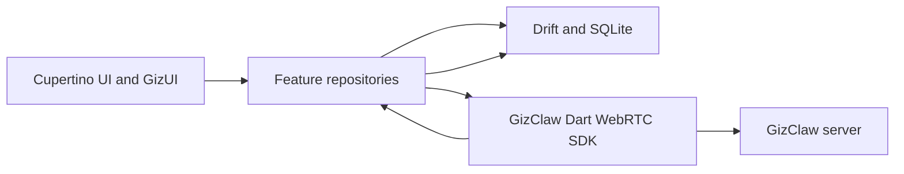

# GizClaw Mobile App Design Proposal

Status: Draft

This document defines the initial application architecture and dependency
choices for the GizClaw Flutter client in `apps/gizclaw-app`. It records design
decisions for implementation and does not describe the current prototype as a
completed product.

## Product Scope

The mobile app is a client-only GizClaw experience for iOS and Android. It
connects to a GizClaw server through the Dart WebRTC SDK, lets users discover
workflows, opens the workspaces available for a workflow, and supports
conversation inside a selected workspace.

The primary tab structure is:

```text
Browse
Chats
Friends
Pet
Me
```

`Chats` contains two top-level views:

```text
Workspace
Group Chat
```

The initial Browse hierarchy is:

```text
Browse
├── Featured banners -> Collection or promotional detail
├── Jump Back In -> Recent workspace
└── All Workflows -> Full workflow list
    └── Workflow detail
        └── Available workspaces
            └── Workspace chat
```

## Confirmed Technology Choices

### Flutter Presentation: Cupertino and GizUI

The app uses Flutter's Cupertino widgets as the presentation base on both iOS
and Android. Platform switching to Material is not required.

Application-specific components belong to a `GizUI` layer built on top of
Cupertino primitives. `GizUI` owns visual tokens and reusable behavior such as
colors, typography, spacing, list rows, navigation bars, press feedback,
transitions, cards, empty states, loading states, and error states.

Feature pages should consume `GizUI` components instead of styling Cupertino
widgets independently. Direct Material dependencies should be avoided unless a
Flutter infrastructure API has no practical Cupertino-neutral alternative.

### Routing: go_router 17.3.0

Navigation uses `go_router` version `17.3.0` with `CupertinoApp.router`.
`go_router` provides declarative routes, deep links, redirects, nested
navigation, and multiple Navigator stacks while allowing pages to use
`CupertinoPage` transitions.

Each bottom tab keeps an independent navigation stack. The intended shell is a
`StatefulShellRoute.indexedStack`, with one branch for each of Browse, Chats,
Friends, Pet, and Me. Switching tabs must preserve the current route and scroll
position in each branch.

Initial route ownership should follow this shape:

```text
/browse
/browse/collections/:collectionId
/browse/workflows
/browse/workflows/:workflowName
/browse/workflows/:workflowName/workspaces/:workspaceName

/chats/workspaces
/chats/workspaces/:workspaceName
/chats/groups
/chats/groups/:groupId

/friends
/pet
/me
```

Route paths carry stable identifiers only. Full workflow, workspace, group, or
message objects must be loaded through repositories rather than passed as the
sole route state, so deep links and process restoration remain valid.

### Persistence: SQLite and Drift

Local structured data uses SQLite through `drift`. `drift_flutter` provides the
Flutter database setup. Drift is selected for typed queries, schema migrations,
transactions, joins, batched writes, and reactive query streams.

The server remains the authoritative data source. The local database is an
offline-readable cache and UI query index, not a second source of business
truth.

The initial dependency baseline is:

```yaml
dependencies:
  drift: ^2.34.1
  drift_flutter: ^0.3.0
  go_router: 17.3.0
```

Drift code generation will also require compatible `drift_dev` and
`build_runner` development dependencies. Their versions should be selected and
tested when the database implementation begins. Committed lockfiles remain the
reproducible version authority for application builds.

## Application Architecture

Feature widgets do not call the WebRTC SDK or Drift directly. Repositories
coordinate remote reads, local writes, and cache policy. The UI observes local
query streams so cached content can render immediately and network refreshes do
not create a second competing UI data path.



Suggested application boundaries are:

```text
lib/
├── app/             # CupertinoApp.router, shell, bootstrap
├── giz_ui/          # tokens and reusable presentation components
├── routing/         # go_router configuration and route identifiers
├── data/
│   ├── database/    # Drift tables, DAOs, migrations
│   ├── repositories/
│   └── cache/       # refresh and asset-cache policy
├── connection/      # WebRTC client lifecycle and connection state
└── features/        # browse, chats, friends, pet, me
```

## Local Data Boundaries

Structured metadata and text history belong in Drift. Large binary content such
as audio, workflow covers, pet Pixa files, and promotional images belongs in the
application file cache; Drift stores the local path and cache metadata.

The initial database model should cover:

| Table | Purpose |
| --- | --- |
| `servers` | Connected server identity, display name, endpoint, and last connection time |
| `workflow_cache` | Workflow metadata used by Browse and workflow detail views |
| `workspace_cache` | Workspace metadata, workflow relation, and activity timestamps |
| `history_entries` | Workspace conversation history and replay metadata |
| `asset_cache` | Local file path, media type, version or checksum, size, and last access time |
| `sync_state` | Per-resource cursor and last successful refresh information |

Every server-owned row must include a stable `serverId` in its key. Names such
as `workspaceName` are not globally unique because the client can connect to
different GizClaw servers.

Generated protobuf values should be preserved as serialized bytes when lossless
round-tripping is useful. Fields required for filtering, ordering, relationships,
or direct rendering should also be stored in typed columns. The persistence
layer should not reinterpret protobuf messages through ad hoc JSON conversion.

Credentials, device identity, and session secrets do not belong in Drift or
plain preferences. A secure-storage dependency will be selected separately.
Small non-sensitive UI preferences may use a key-value preferences package,
also to be selected separately.

## WebRTC Boundaries

The Dart GizClaw SDK owns signaling, peer connection setup, transport framing,
and typed remote operations. The application connection layer owns lifecycle
coordination and exposes connection state to repositories and features.

The following values remain memory-only:

- peer connections and data channels
- SDP and ICE candidates
- in-flight requests and response completers
- streaming response and typing state
- temporary audio buffers

Successful remote reads are normalized and written to Drift in a transaction.
The UI then updates through Drift streams. Connection loss must not erase valid
cached content.

## Cache Behavior

The default read policy is stale-while-revalidate:

1. Render available Drift data immediately.
2. Refresh the relevant resource after WebRTC becomes ready.
3. Upsert the response transactionally.
4. Record the successful refresh cursor and timestamp.
5. Keep the previous cache when refresh fails and expose offline or stale state
   separately from the content.

Paginated history is upserted by stable history entry identifier and scoped by
server and workspace. Missing rows must only be deleted when the remote API
explicitly guarantees that a response is a complete snapshot. Asset cleanup
uses a bounded least-recently-used policy based on total bytes.

Offline message sending is not part of the initial cache. An outbox requires a
server contract for idempotency, retry, ordering, and conflict handling and
should be designed separately before implementation.

## Open Decisions

The following choices remain intentionally unresolved:

- application state-management package, if one is needed beyond repositories
  and Flutter listenable or stream primitives
- secure-storage package for credentials and device identity
- key-value preferences package for non-sensitive settings
- cache size limits and resource-specific refresh intervals
- repository contract for live streaming messages versus persisted history
- workflow display schema for banners, covers, categories, featured placement,
  and localized presentation content
- deep-link authentication and server-selection behavior

These decisions should be documented before adding their dependencies. New
packages should solve an established application boundary rather than become
the boundary themselves.

## Implementation Order

1. Introduce the `GizUI` foundation and remove feature-level Material styling.
2. Add `go_router` and the five-branch Cupertino navigation shell.
3. Add Drift, the initial schema, migrations, and repository interfaces.
4. Connect workflow and workspace repositories to the GizClaw WebRTC SDK.
5. Replace fixture Browse and workspace data with stale-while-revalidate data.
6. Integrate workspace history and live conversation state.
7. Add Friends, Group Chat, Pet, and Me data incrementally as their server
   contracts are finalized.

Each step should retain an independently runnable iOS and Android application.
