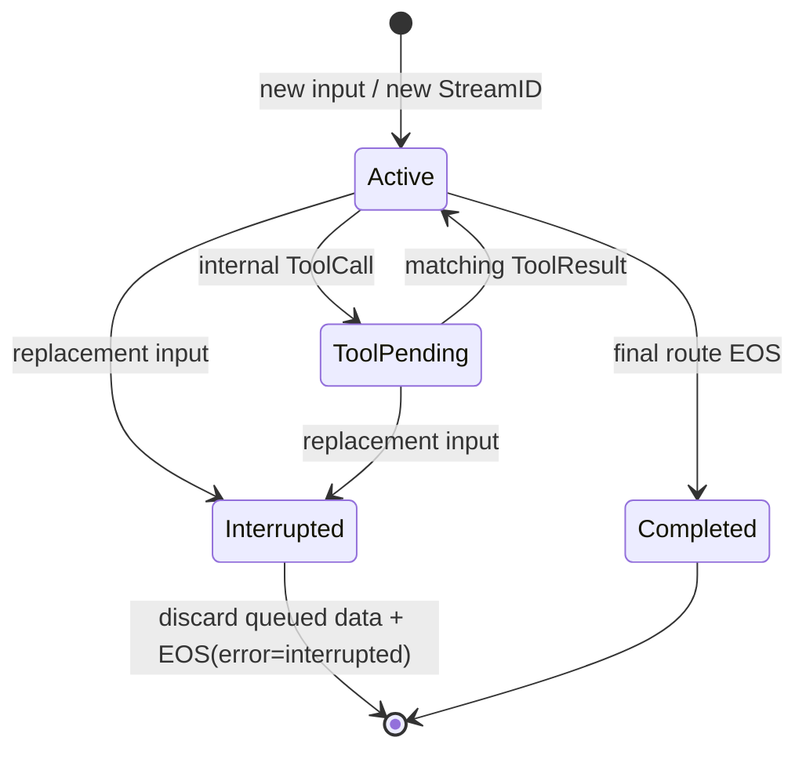

# Agent Runtime

[`pkgs/agent`](https://pkg.go.dev/github.com/GizClaw/gizclaw-go/pkgs/agent) defines AI Agents that own a complete model reasoning turn. An Agent keeps the `genx.Transformer` input/output contract while internally running model calls, ToolCalls, ToolResults, continuation, and final output.

Chatroom, AST Translate, ASR, TTS, and ordinary media pipelines transform streams without owning a model reasoning turn, so they remain Transformers. GizClaw Agent Host keeps separate Agent and Transformer registries; using the same outer workspace stream host does not reclassify them.

## Package boundaries

| Package | Responsibility |
| --- | --- |
| `pkgs/agent` | Agent interface, executable Toolkit, pull-output buffer, StreamID, and interruption contract. |
| `pkgs/agent/flowcraft` | GizClaw-owned Flowcraft graph, GenX model adapter, LogStore history, and Memory integration. |
| `pkgs/agent/eino` | Eino ReAct graph, native Eino Tool adapter, LogStore history, and Memory integration. |
| `pkgs/agent/doubaorealtime` | Doubao Realtime Duplex `1.2.6.0` function-call session. |
| `pkgs/agent/dashscoperealtime` | Typed Qwen3.5 Omni Realtime function-call session. |
| `pkgs/gizclaw/services/runtime/agenthost` | Resolves Workspaces, authorizes Toolkits, constructs and reuses Agents, and adapts optional product APIs. |

`pkgs/agent` does not depend on GizClaw Resources, ACL, Workspace, Peer, RPC, or generated APIs. The product layer resolves models, stores, authorization, and device-bound executors before passing those dependencies through an implementation-specific typed Config. There is no cross-provider union Config.

## Toolkit and ToolCalls

The Agent-facing Toolkit owns an immutable Tool declaration snapshot and the matching `Invoke` boundary. GizClaw includes a Tool only after enabled state, Workflow/Workspace policy, ACL `use`, executor availability, and device binding checks, and an invocation name must be present in that snapshot. Invocation rechecks ACL and live availability, but it never executes a Tool that appeared only after Agent construction and was not declared to the model.

A Tool-capable turn runs in this order:

```text
model round -> ordered ToolCalls -> Toolkit.Invoke -> ordered ToolResults
            -> same model turn -> final text/audio
```

- ToolCalls and ToolResults are internal control flow and never leak through Agent output.
- Multiple calls execute strictly in provider/model order, without parallel execution or automatic retry.
- The original call ID is preserved through ToolResult submission.
- `MaxToolCalls` counts calls across every model round in the same user turn, not only one provider batch.
- Business failures become structured error ToolResults; cancellation, corrupt protocol identity, or inability to form a valid result terminates the turn.
- Waiting for a device-backed Tool pauses only the turn worker; input reading, interruption, and delivery of already buffered output continue.

## Stream lifecycle

Every assistant response gets a fresh, non-empty StreamID. Text and audio routes for that response share its StreamID, while each MIME route has its own EOS. A Tool-only model round does not create an external EOS.

The Agent owns a growable buffer between provider readers and pull-based `Stream.Next()`. Provider output does not depend on consumer pulls for backpressure. A configured byte limit accounts for payload bytes and returns an observable error instead of silently dropping or reordering chunks.



Replacement input linearizes these actions:

1. Cancel the old turn context and request provider response cancellation when supported.
2. Prevent late provider chunks and Tool results from the old epoch from re-entering model context or output.
3. Remove every unpulled chunk for the old StreamID.
4. Return `EOS(error=interrupted)` with that old StreamID for each still-open MIME route.
5. Assign a new StreamID to the replacement response.

Tool executor cancellation is best effort. A device side effect that already committed is not rolled back or retried automatically, but its late result is discarded.

## History and Memory

A successful Agent output `Next()` is the visibility boundary for canonical assistant history. Provider-generated content still queued in the buffer has not been delivered:

- a completed response stores the content actually pulled by the consumer;
- an interrupted response stores only its pulled prefix and an interrupted status;
- content removed from the buffer by interruption is not added to history;
- this boundary proves delivery to the immediate consumer, not physical device playback.

Flowcraft and Eino can receive `logstore.MutableStore` directly for implementation-owned ordered conversation schemas and can independently receive `memory.Store`. History maintains turn, ToolCall, and ToolResult continuity. Memory recalls long-term facts before model invocation and observes completed, pulled user/assistant turns. A nil Memory disables only long-term memory, not live continuity or History.

Once assistant content has crossed the pull-visible boundary, a History or Memory write failure cannot retract delivered content. Flowcraft and Eino therefore report those failures through their Config's `OnBackgroundError`; when no callback is configured they log the error. A synchronously returned failed Memory operation follows the same policy, while a pending operation remains owned by the Memory Store and completes asynchronously without blocking the response.

## Implementations

| Agent | Model/runtime | Tool continuation | History / Memory |
| --- | --- | --- | --- |
| Flowcraft | Owned lower-level Flowcraft graph and GenX resolver | Owned sequential registry middleware | Flowcraft schema-v1 LogStore; optional Memory |
| Eino | Eino ReAct and GenX `ToolCallingChatModel` adapter | Native Eino ToolsNode with `ExecuteSequentially` | Eino-owned LogStore schema; optional Memory |
| Doubao Realtime | Realtime Duplex `1.2.6.0` | Provider handler waits for actual Toolkit results | Provider session continuity |
| DashScope Realtime | Typed Qwen3.5 Omni Realtime SDK | Output-index order, submit results, then `response.create` | Provider session continuity |

Flowcraft product composition does not generate Cloud/Claw configuration files and does not use the external Claw or its Memory lifecycle. The `flowcraft-history/message` schema version 1 remains readable so existing history does not silently disappear.

## Validation

Run at least:

```sh
go test -race ./pkgs/agent/...
go test ./pkgs/genx/... ./pkgs/gizclaw/services/runtime/agenthost/...
go test ./...
git diff --check
```

Workflow OpenAPI or RPC schema changes also require regeneration and tests for every committed Go and JavaScript consumer.
