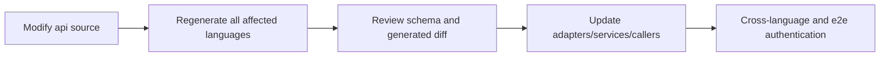

# API generation and changes

API changes must start from the source schema of the root `api/`. Direct modification of `*.pb.go`, OpenAPI Go output, JavaScript generated client, or C nanopb output generated by third-party tools is prohibited. `rpcapi/generated.go` is a manually maintained wrapper left over from history and does not belong to the third-party generated output; the source proto, `rpcproto` and codec tests must be checked at the same time when modifying.

## Generate link

| Source | Main Output | Commands |
| --- | --- | --- |
| HTTP OpenAPI + shared schemas | Go HTTP server/client/models | `go generate ./pkgs/gizclaw/api/adminhttp ./pkgs/gizclaw/api/apitypes ./pkgs/gizclaw/api/peerhttp` |
| `api/proto/rpc/**/*.proto` | Go Protobuf | `go generate ./pkgs/gizclaw/api/rpcproto` |
| RPC descriptors/wrappers | Manually maintained `rpcapi` committed surface | `go test ./pkgs/gizclaw/api/rpcapi` (currently `go generate` only performs this verification and will not regenerate the file) |
| HTTP + RPC schemas | JavaScript SDK | `npm --prefix sdk/js run gen:sdk` |
| RPC Protobuf | C nanopb SDK | `go generate ./sdk/c/gizclaw` |
| Telemetry Protobuf | Go/JavaScript telemetry | `go generate ./pkgs/gizclaw/api/telemetry` and `npm --prefix sdk/js run gen:telemetry` |

The standalone C SDK release archive copies the committed nanopb output after this generation check. Packaging does not run a second generator or treat the archive as another protocol source. The archive also copies the nanopb runtime at the exact submodule gitlink of the selected GizClaw commit.

The full Go API is available:

```sh
go generate ./pkgs/gizclaw/api/...
```

The `api` Go package embeds the complete repository-owned `api/http` and `api/proto` source trees. Runtime contract consumers, including offline Resource validation, read those original definitions from the embedded filesystem instead of committing another resolved schema copy. `pkgs/gizclaw/api/apitypes/types_resolved.json` remains an ignored intermediate used only to generate `apitypes/generated.go`. Refresh the generated Go output with `go generate ./pkgs/gizclaw/api/apitypes`; a clean generation followed by `git diff --exit-code -- pkgs/gizclaw/api/apitypes/generated.go` verifies freshness.

The repository-owned OpenAPI generators invoke the `oapi-codegen` tool declared in the root Go module. The tool version must remain compatible with the module's `kin-openapi` version; upgrading either dependency requires regenerating and reviewing every affected committed Go output.

## A complete change



The review cannot just look at the generated files. You should first confirm whether the source contract is correct, then confirm that each generated surface is fresh and consistent, and finally verify the call point and business implementation.

## Minimum verification

Select by scope of change, but include at least:

```sh
go test ./pkgs/gizclaw/api/... ./pkgs/gizclaw/... ./sdk/go/... -count=1
npm --prefix sdk/js test
git diff --check
```

Add C generation/build tests when the RPC/C surface changes; add resource manager and CLI e2e when the management resources change; overwrite the success and user-visible error paths of the strict adapter when the HTTP endpoint changes.

If a large number of irrelevant diffs appear after building, check tool version, ordering, and template first instead of commit noise. Generated output must be consistent with the source schema in the same commit.

## Generator ownership

- `rpcproto/*.pb.go` is generated directly by a third party `protoc-gen-go`.
- The Go output of `adminhttp`, `apitypes` and `peerhttp` is generated by the third party `oapi-codegen`; the tools in the repository can prepare the input, but do not therefore have the generation template. The OpenAI-compatible protocol is supplied by AI Server Shell and is not part of this generation graph.
- The alias, helper signature or import qualifier generated by the third-party generator keeps the generated result, and does not manually change the local style rules, fork the generator or append the AST normalizer.
- The repository's handwritten code and the repository's own generator directly use the package to which the type belongs, and do not add cross-package alias that are only used for renaming or re-export.

Monitor OpenAPI (`api/http/monitor.json`) generates the strict Go server/client/models in `pkgs/monitor/api/generated.go` through `go generate ./pkgs/monitor/api`. The configuration lives in `pkgs/monitor/api/codegen_config.yaml`. `npm --prefix sdk/js run gen:sdk` uses `sdk/js/openapi-ts.config.ts` to generate the console client in `web/monitor/src/generated/monitor/`. These committed outputs belong to the Monitor surface and are consumed by `pkgs/monitor/monitor.go` and `web/monitor/src/api.ts`; they are not exported by the Public/Admin SDK packages.
