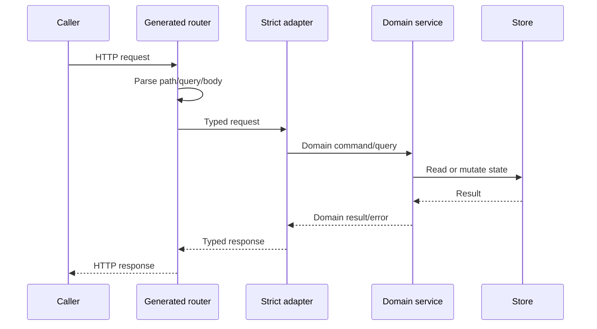

# HTTP API

GizClaw Server maintains two repository-owned OpenAPI surfaces plus one limited OpenAI-compatible surface supplied by AI Server Shell. Their callers, authentication methods, and business boundaries remain independent.

## Surface

| Contract owner | Caller and Responsibilities | Go surface |
| --- | --- | --- |
| `admin.json` | Administrator manages resources, Peer, Telemetry and operation and maintenance actions | `pkgs/gizclaw/api/adminhttp` |
| `peer.json` | Server info, WebRTC offer, and the API-key-bound device key management, device, control, and contact surface | `pkgs/gizclaw/api/peerhttp` |
| `github.com/idy/ai-server-shell` | OpenAI-compatible model, chat and audio subset | `services/ai/openaiapi` backend adapter |

## Request flow

For repository-owned surfaces, OpenAPI has path, method, parameters, wire DTO and response status. For OpenAI compatibility, AI Server Shell owns those protocol details and dispatches a protocol-neutral backend request. Adapters map either boundary to domain calls; services retain authorization decisions, resource rules, and persistence.

## Change rules

- For the new endpoint, first select the correct surface, and then define a stable operation ID.
- The cross-surface DTO points to `shared.json` through `$ref`; the Admin declarative resource is defined in `resources/*.json` and aggregated by the generation entry of `shared.json`. Specs with only one Resource owner are directly defined in the corresponding Resource file.
- Make it clear that success and all user-visible error responses cannot only generate happy path.
- After modifying the schema, strict server/client must be regenerated, and the actual handler must meet the new interface.
- Authentication middleware and endpoint Self-authentication boundaries must be explicitly implemented by server composition; OpenAPI security declaration cannot replace runtime verification.

`/webrtc/v1/offer` belongs to the signaling entry. When its identity is verified by the Offer contract itself, it should no longer implicitly rely on another set of HTTP session preconditions.

## Subdocument

- [Admin API](./admin): Administrator resources, Peer management and operation and maintenance surface.
- [Public API](./public): WebRTC front entry point and Peer's own surface.
- [OpenAI Compatible](./openai-compatible): OpenAI-compatible model, Chat and Audio surface.

Design information: [Shared and Resources](./shared-resources) · [Dependency Rules](./type-dependencies)
