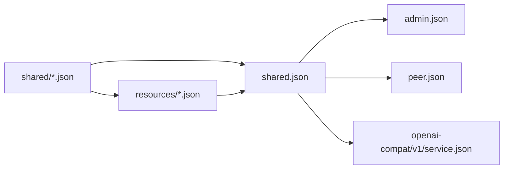

# HTTP Schema dependency rules

HTTP schema is divided into Shared, Resources and three API surfaces by ownership. The current generation entry uses a `shared.json` that aggregates Shared values ​​and Resource graph; `shared/` and `resources/` remain independent by ownership.

## Directory

```text
api/http/
├── admin.json
├── peer.json
├── openai-compat/
│   └── v1/
│       └── service.json
├── shared.json
├── shared/
│   └── ...
└── resources/
    └── ...
```

## Depends on direction



Dependencies must remain one-way:

```text
shared/ ← resources/ ← shared.json ← admin
shared.json ← public
shared.json ← openai-compatible
```

`shared/` Do not quote `resources/`. `resources/` can quote `shared/`. `shared.json` is the generation entry, and exports two layers of stable schema at the same time; its file name does not indicate that the Resource belongs to Shared ownership.

## Shared Rules

Schema can only be entered `shared/` if at least one of the following conditions is met:

- Used directly by more than two HTTP surfaces;
- Used by two or more domain owners;
- It is a stable value contract shared by multiple Resources.

The need to generate Go or JavaScript symbols does not constitute a reason for Shared. There is only one owner schema and the owner is placed in the same file.

### Shared closed list

`shared/` Only the following files are allowed:

| file | owned schema |
| --- | --- |
| `error.json` | `ErrorPayload`, `ErrorResponse` |
| `device.json` | `DeviceInfo`, `HardwareInfo`, `PeerIMEI`, `PeerLabel` |
| `runtime.json` | `Runtime` and across surface runtime values |
| `acl.json` | Permission, Policy, ACL Resource, Subject, Role/View public values |
| `configuration.json` | `Configuration`, firmware/agent selection and other common configuration values |
| `gameplay.json` | Gameplay metadata, Pet, Badge, Points, Game Result and common rule values |
| `firmware.json` | Firmware, slot, artifact and selection public values |
| `credential.json` | Credential body and credential values used across Resource/API |
| `model.json` | Model kind, capabilities, provider, source and provider data |
| `voice.json` | Voice provider, source and provider data |
| `tool.json` | Tool executor, trigger, source and JSON schema values |
| `workflow.json`, `workflow_i18n.json`, `workflow_locale.json` | Workflow identity, i18n, locale, driver and workflow variants |
| `workspace.json` | Workspace parameters, input mode and common workspace values |
| `provider-tenants.json` | Provider tenant enums and values shared by Model/Voice |

This is a closed list, not an example. Schemas not listed must be defined in their owner file:

- Public-only DTO put in `peer.json`.
- Admin endpoint exclusive DTO is placed in `admin.json`.
- OpenAI-compatible DTO put in `openai-compat/v1/service.json`.
- Resource, exclusive `*Spec` and nested values ​​are put into corresponding `resources/<kind>.json`.
- Resource envelope, metadata, kind, Apply contract and union are placed in `resources/resource.json`.

To add `shared/*.json`, you must first prove the existence of multiple independent consumers and update this list simultaneously. You cannot create a file first and then leave it in Shared on the grounds of "possible reuse".

## Resource rules

Each `resources/<kind>.json` also has:

- The specific kind of Resource envelope;
- This Resource is exclusive to Spec;
- Only serve the nested values of this Resource;
- Explicit reference to Shared schema.

`resources/resource.json` owns `ResourceAPIVersion`, `ResourceKind`, `ResourceMetadata`, Apply contract and Resource union. Resource exclusive Spec does not include `shared/`.

## Surface rules

- `admin.json` refers to Shared values and Resource graph via `shared.json`.
- `peer.json` only quotes `shared.json`, not Admin Resources. Public-only DTO is defined directly at `peer.json`.
- OpenAI-compatible models stay in their own `service.json`; only contracts that are actually shared with other GizClaw HTTP surfaces reference `shared.json`.
- Desktop application contract belongs to `apps/wails` and does not enter the Server HTTP API schema graph.

## File boundaries

File boundaries are determined by common owners and common changes:

- `*Spec` of a single Resource is inlined into the corresponding Resource file.
- The parent, enum and nested value in a field are merged into the same Shared file.
- Split out new Shared files only if independent reuse and stable semantics exist.

Schema file merging must not change JSON properties, required/nullable semantics, enum values, discriminators, or OpenAPI operation IDs.
