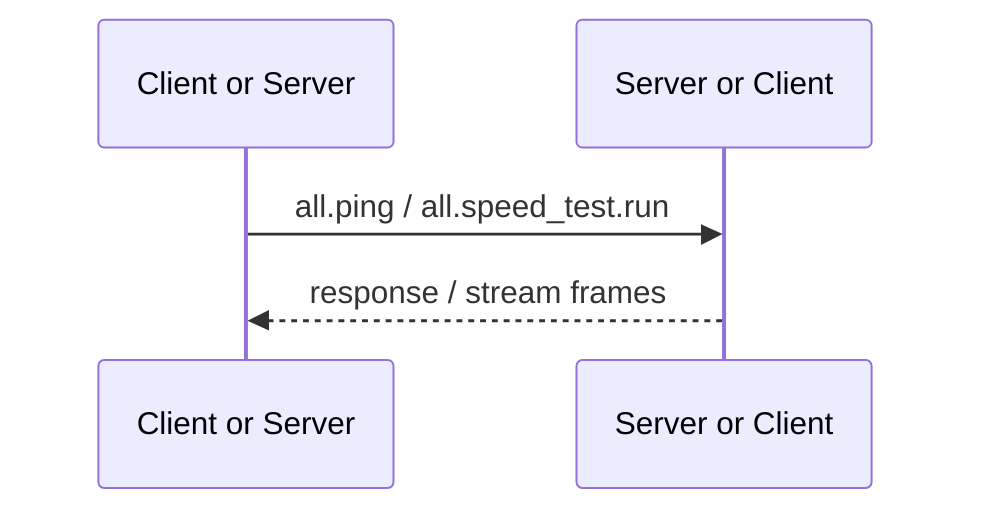

# Both Provided

Both Provided RPC is implemented by both sides of the connection. Either Client or Server can be used as caller or provider, which is used for connection diagnosis and transport measurement without reading the unique product resources of one end.

The [RPC API Reference](/references/rpc#连接诊断与设备信息) is the single list of exact method IDs, names, and purposes. This page only explains the `all.*` provider direction and implementation constraints.

## Calling relationship

`all.*` Only suitable for truly symmetrical basic abilities. Data or behavior owned only by one end must use `client.*` or `server.*`, and cannot be placed in `all.*` for the purpose of reusing the handler.
