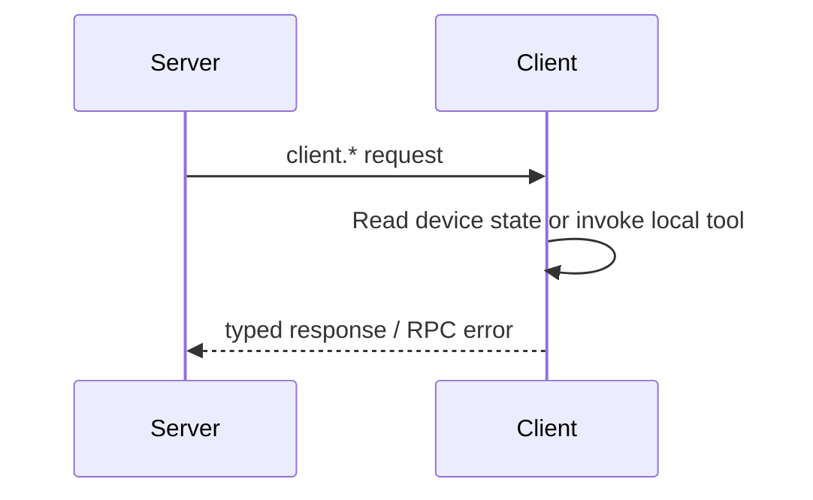

# Client Provided to Server

This set of capabilities is implemented by Client/Device and called by Server on Peer connection. Server uses it to read the device's own information or request the device to perform local capabilities.

The [RPC API Reference](/references/rpc) is the single list of exact method IDs, names, and purposes. This page only explains the `client.*` provider direction and ownership.

## Calling relationship

A Client provider can only return data that is owned or executable by the Client. Server resource-access decisions, cross-peer lookup, and persistence management cannot be implemented as `client.*`.

Go Client's provider dispatch is located at `sdk/go/gizcli`'s RPC Client implementation; the server side calls these methods through online Peer connection.
