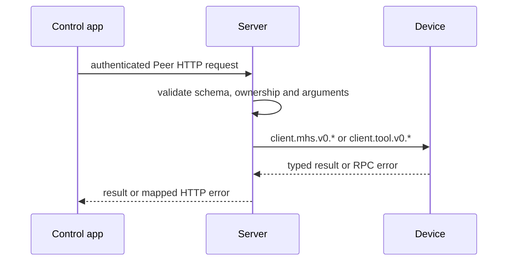

# Client Provided to Server

A device provides a small RPC base plus two versioned families: MHS v0 for hardware state and tool/v0 for procedures. The [RPC reference](/references/rpc) lists every method and every predefined `ClientTool` value. These calls run over the online Peer connection; `GET /gizclaw/v1/device/status` reads a Server snapshot and does not call the device.

```mermaid
sequenceDiagram
    participant Control as Control app
    participant Server
    participant Device
    Control->>Server: authenticated Peer HTTP request
    Server->>Server: validate schema, ownership and arguments
    Server->>Device: client.mhs.v0.* or client.tool.v0.*
    Device-->>Server: typed result or RPC error
    Server-->>Control: result or mapped HTTP error
```

## Protocol discovery

`client.rpc.methods.list` (137) returns `RpcMethod` numbers, including only the MHS operations installed by the device. It identifies protocol families and versions; it does not enumerate procedures. `client.tool.v0.list` (136) returns only the `ClientTool` values whose handlers the device has installed. A caller ignores unknown future enum values. The list excludes `CLIENT_TOOL_UNSPECIFIED`.

`client.tool.v0.invoke` (135) carries one `ClientTool` enum value and protobuf `payload` encoded as the request message declared on that enum value in `payload/tool.proto`. Its response carries the declared response message. Empty messages use an empty payload. An uninstalled tool returns `UNIMPLEMENTED`; a malformed payload returns `INVALID_PARAMS`. Device errors travel in the RPC envelope.

## MHS v0 states

The bound RuntimeProfile's `spec.mhs.v0` manifest defines product-owned `(device_id, state)` keys, types, limits and access. `client.mhs.v0.read` (133) reads requested keys; `client.mhs.v0.write` (134) writes keys declared `read_write` and returns the actual applied values. The Server checks the manifest and the complete batch before contacting the device. The device validates the entire batch and its own safety limits before applying anything. An unknown or unimplemented key returns `NOT_FOUND`; a failed precondition or invalid value rejects the batch.

`MhsValue` sets exactly one of `bool_value`, `int_value`, `double_value`, or `string_value`. False, zero and empty string retain presence. Enum values use semantic strings in `string_value`. Requests and responses contain 1–32 states. Keys are at most 64 ASCII bytes and strings at most 256 UTF-8 bytes without NUL. Integers are JSON safe and doubles finite. A timed-out write should be followed by a read to confirm state.

Volume, brightness, locale, alert mode, Wi-Fi connection status, and other product hardware states belong in manifest keys. The manifest declares keys; it does not automatically install device handlers.

## tool/v0 procedures

The 21 predefined tools are `info.get`, `identifiers.get`, `device.status.get`, `device.reboot`, `device.factory_reset`, `device.find`, `sound.play`, `wifi.scan`, `wifi.connect`, `wifi.saved.list`, `wifi.saved.forget`, `firmware.update`, seven `audioplayer.*` tools, `run.workspace.set`, and `social.ping`. Their exact enum numbers and request/response messages are in [the RPC reference](/references/rpc#clienttool-v0). Devices advertise the installed subset through `client.tool.v0.list`. Product-defined device-local tools are not callable by the Agent in tool/v0.

- `device.status.get` returns live `PeerStatus` and refreshes the Server snapshot. Device identity and telemetry fields outside the MHS manifest remain in this status.
- `sound.play` accepts a device-defined sound name of at most 32 UTF-8 bytes and optional non-negative duration. `device.find` rings the built-in find-me sound with an optional duration. `device.reboot` acknowledges before rebooting. `device.factory_reset` acknowledges before erasing local state; `keep_network` can preserve Wi-Fi and cellular settings. A device that also deletes its Peer invalidates its API keys.
- `wifi.scan` uses a bounded 1–15 second timeout and returns at most 32 access points. `wifi.connect` accepts an SSID of at most 32 UTF-8 bytes and an optional 8–63 byte passphrase, acknowledges before switching networks, and must not log or echo the passphrase. `wifi.saved.list` reports saved SSIDs; `wifi.saved.forget` returns `NOT_FOUND` for an absent SSID.
- `firmware.update` accepts optional channel and SHA-256 digest, acknowledges before OTA, and rejects a digest that differs from the package resolved by the device. The device reports its running digest in `PeerStatus.firmware_sha256`.
- `run.workspace.set` receives a resolved `workspace_name` and optional `kickoff`. The Server resolves collection and workflow targets before calling the device. The device acknowledges, then switches through `server.run.workspace.reload-with-options`; the acknowledgement does not mean the Workspace is ready.
- `social.ping` delivers a Friend or Friend Group notification with sender public key and optional display and group names. The device acknowledges promptly; the Server treats timeout or a missing handler as not delivered and does not retry.

## Music player

One device player exposes seven `audioplayer.*` tools: `get`, `playlist.get`, `playlist.set`, `playlist.append`, `play`, `stop`, and `mode.set`. The playlist holds at most 32 items. `playlist.set` validates and atomically replaces the list, stopping playback; `playlist.append` preserves ordering and duplicates and never retries automatically. `play` requires a zero-based index and acknowledges acceptance; playback state and progress arrive through audioplayer telemetry. `stop` is idempotent, and `mode.set` selects `off`, `one`, or `all`. A list item has an HTTPS audio URL without credentials or fragments and optional title and source reference. The Server does not download audio. `playlist_revision` changes on list mutation, and `playlist.get` reads the device after reconnect.

## Provider and error contract

Go providers install handlers on `gizcli.DeviceControlHandlers` or per `ClientTool`; JavaScript, Flutter and C install the corresponding typed handlers. Each SDK derives discovery from installed handlers. The C provider decodes the invoke bytes through nanopb callbacks, keeping payload storage bounded by its caller buffer.

The Server validates typed Peer HTTP arguments before opening an RPC stream. Offline maps to `409 DEVICE_OFFLINE`; an uninstalled tool to `501 DEVICE_UNSUPPORTED`; timeout to `504 DEVICE_TIMEOUT`; device `INVALID_PARAMS` to `400 DEVICE_REJECTED`; other device errors to a redacted `502 DEVICE_ERROR`. A missing saved SSID uses the route's not-found mapping. Device handlers must not leak credentials in status or errors.
