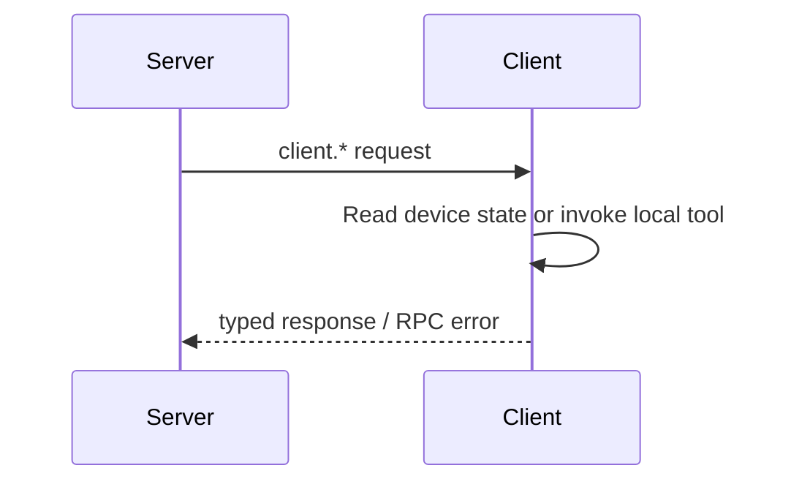

# Client Provided to Server

This set of capabilities is implemented by Client/Device and called by Server on Peer connection. Server uses it to read the device's own information or request the device to perform local capabilities.

The [RPC API Reference](/references/rpc) is the single list of exact method IDs, names, and purposes. This page only explains the `client.*` provider direction and ownership.

## Calling relationship

```mermaid
sequenceDiagram
    participant Server
    participant Client
    Server->>Client: client.* request
    Client->>Client: Read device state or invoke local tool
    Client-->>Server: typed response / RPC error
```

A Client provider can only return data that is owned or executable by the Client. Server resource-access decisions, cross-peer lookup, and persistence management cannot be implemented as `client.*`.

Go Client's provider dispatch is located in the `sdk/go/gizcli` RPC Client implementation. A C Client registers the same provider direction through `gzc_client_config_t.rpc_provider`; the callback supplies borrowed Protobuf response bytes or a stable RPC error before returning. The server side calls these methods through the online Peer connection.

## Device control providers

`client.device.status.get` (100), `client.device.volume.set` (101), `client.device.sound.play` (102), `client.device.reboot` (103), `client.wifi.status.get` (104), `client.wifi.saved.list` (105), and `client.wifi.saved.forget` (106) are implemented by the device `rpc_provider`; the Server calls them while serving Public HTTP `/gizclaw/v1/device*` control requests with a 5-second timeout. Provider responsibilities:

- `volume.set` applies an absolute `level` (0–100) and `muted` and returns the complete post-change `PeerStatus`; `status.get` returns the current `PeerStatus`. Repeating a call with equal input yields the same result.
- `sound.play` takes a device-defined `sound` string (at most 32 UTF‑8 bytes) that the device validates; unknown values answer `INVALID_PARAMS`. `duration_ms` is optional.
- `reboot` must send its response before rebooting; `delay_ms` is optional.
- `wifi.status.get` returns `WifiStatus { connected, ssid, rssi_dbm, ip, bssid }`; `wifi.saved.list` returns the saved network `ssid`s; `wifi.saved.forget` answers `NOT_FOUND` for an unknown `ssid`, including a network that was already forgotten. `ssid` is at most 32 UTF‑8 bytes and nanopb bounds the field.
- A device returns only results it can execute itself: invalid parameters answer `INVALID_PARAMS`, unimplemented methods answer `METHOD_NOT_FOUND`, and other failures answer `INTERNAL_ERROR` with a short message. The Server maps these to `400 DEVICE_REJECTED`, `501 DEVICE_UNSUPPORTED`, and a redacted `502 DEVICE_ERROR`.

The C SDK `inbound_is_client_method` accepts these seven methods and dispatches them to `gzc_client_config_t.rpc_provider`; a missing provider or an unhandled method answers `METHOD_NOT_FOUND`. The Go SDK installs providers with `gizcli.Client.HandleDeviceControl(gizcli.DeviceControlHandlers{...})`, where a handler returning `gizcli.ErrDeviceRejected` / `gizcli.ErrDeviceResourceNotFound` maps to `INVALID_PARAMS` / `NOT_FOUND`; the Flutter SDK installs them through `GizClawPeerRpcHandlers.deviceControl` (`GizClawDeviceControlHandlers`), where a handler throws `GizClawDeviceControlException` to choose the RPC error code. Both answer `METHOD_NOT_FOUND` for an uninstalled handler.
