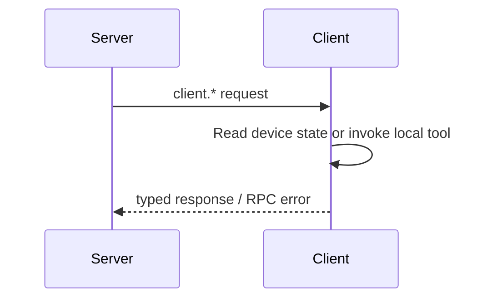

# Client Provided to Server

This set of capabilities is implemented by Client/Device and called by Server on Peer connection. Server uses it to read the device's own information or request the device to perform local capabilities.

The [RPC API Reference](/references/rpc) is the single list of exact method IDs, names, and purposes. This page only explains the `client.*` provider direction and ownership.

## Calling relationship

```mermaid
sequenceDiagram
    participant Server
    participant Client
    Server->>Client: client.* request
    Client->>Client: Read device state or invoke local tool
    Client-->>Server: typed response / RPC error
```

A Client provider can only return data that is owned or executable by the Client. Server resource-access decisions, cross-peer lookup, and persistence management cannot be implemented as `client.*`.

Go Client's provider dispatch is located in the `sdk/go/gizcli` RPC Client implementation. A C Client registers the same provider direction through `gzc_client_config_t.rpc_provider`; the callback supplies borrowed Protobuf response bytes or a stable RPC error before returning. The server side calls these methods through the online Peer connection.

## Device control providers

`client.device.status.get` (100), `client.device.volume.set` (101), `client.device.sound.play` (102), `client.device.find` (126), `client.device.reboot` (103), `client.wifi.status.get` (104), `client.wifi.saved.list` (105), `client.wifi.saved.forget` (106), `client.wifi.scan` (108), `client.wifi.connect` (109), and `client.firmware.update` (111) are implemented by the device `rpc_provider`; the Server calls them while serving Public HTTP `/gizclaw/v1/device*` control requests. Controls use a 5-second timeout except scan, which uses the requested 1–15 second bound. Provider responsibilities:

- `volume.set` applies an absolute `level` (0–100) and `muted` and returns the complete post-change `PeerStatus`; `status.get` returns the current `PeerStatus`. Repeating a call with equal input yields the same result.
- `sound.play` takes a device-defined `sound` string (at most 32 UTF‑8 bytes) that the device validates; unknown values answer `INVALID_PARAMS`. `duration_ms` is optional.
- `find` rings the device so a user can locate it: the device plays its own built-in local find-me sound with a rising volume ramp and does not fetch any URL or catalog track. `duration_ms` is optional and non-negative; when it is absent the device picks the ring time. The device acknowledges once ringing has started, and a repeated call restarts the ring.
- `reboot` must send its response before rebooting; `delay_ms` is optional.
- `firmware.update` must send its response before running the OTA. `channel` names the channel to install and defaults to the channel the device already uses; `sha256` is the digest the caller saw, and the device answers `INVALID_PARAMS` when it does not match the package the device resolves. The device downloads, verifies, writes, and restarts on its own, and answers success outright when it already runs the target package. It reports the package it currently runs as `PeerStatus.firmware_sha256`, which `status.get` and `volume.set` responses write back to the Server.
- `wifi.status.get` returns `WifiStatus { connected, ssid, rssi_dbm, ip, bssid }`; `wifi.saved.list` returns the saved network `ssid`s; `wifi.saved.forget` answers `NOT_FOUND` for an unknown `ssid`, including a network that was already forgotten. `ssid` is at most 32 UTF‑8 bytes and nanopb bounds the field.
- `wifi.scan` returns `WifiScanResult` entries within `timeout_ms`, sorted by descending `rssi_dbm` and deduplicated by SSID to the strongest entry. `security` is a lowercase device-reported identifier that the Server does not enumerate.
- `wifi.connect` accepts an open network or an 8–63 byte PSK. The device must return `ClientWifiConnectResponse` before disconnecting and switching networks, and fall back to the old network on failure. It must never persist or log the passphrase or include it in errors.
- A device returns only results it can execute itself: invalid parameters answer `INVALID_PARAMS`, unimplemented methods answer `METHOD_NOT_FOUND`, and other failures answer `INTERNAL_ERROR` with a short message. The Server maps these to `400 DEVICE_REJECTED`, `501 DEVICE_UNSUPPORTED`, and a redacted `502 DEVICE_ERROR`.

The C SDK `inbound_is_client_method` accepts these device control methods and dispatches them to `gzc_client_config_t.rpc_provider`; a missing provider or an unhandled method answers `METHOD_NOT_FOUND`. The Go SDK installs providers with `gizcli.Client.HandleDeviceControl(gizcli.DeviceControlHandlers{...})`, where a handler returning `gizcli.ErrDeviceRejected` / `gizcli.ErrDeviceResourceNotFound` maps to `INVALID_PARAMS` / `NOT_FOUND` (the OTA provider is `UpdateFirmware`); the Flutter SDK installs them through `GizClawPeerRpcHandlers.deviceControl` (`GizClawDeviceControlHandlers`), where a handler throws `GizClawDeviceControlException` to choose the RPC error code. Both answer `METHOD_NOT_FOUND` for an uninstalled handler.

## Device settings and capability discovery

`client.device.settings.get` (128), `client.device.settings.set` (129),
`client.device.factory_reset` (130), and `client.rpc.methods.get` (131) are implemented by the
device `rpc_provider` as well, and read or change the device's own options.

Every member of `DeviceSettings` is optional in both directions, which is what lets one message
serve devices with different hardware instead of adding an RPC method per option:

| Member | Type | Meaning |
| --- | --- | --- |
| `cellular_enabled` | `optional bool` | Whether the cellular (4G) modem is powered and allowed to carry traffic. |
| `screen_off_timeout_ms` | `optional int64` | Idle time before the screen turns off; `0` keeps it always on. |
| `screen_brightness` | `optional int64` | Screen backlight level in [0, 100]. |
| `led_brightness` | `optional int64` | Indicator light level in [0, 100]. |
| `locale` | `optional string` | UI language as a BCP 47 tag, such as `zh-CN`. |
| `default_interaction_mode` | `optional DeviceInteractionMode` | Default input mode, `push-to-talk` or `realtime`, sharing the `WorkspaceInputMode` vocabulary. |
| `key_feedback` | `optional DeviceKeyFeedback` | Key press feedback: `none`, `sound`, `vibrate`, `sound_and_vibrate`. |

Provider responsibilities:

- `settings.get` reports only the members this device really supports. An option with no matching
  hardware stays absent rather than carrying a placeholder value, because absent versus present-and-off
  is exactly how a caller tells "unsupported" from "turned off".
- `settings.set` applies only the members present in the request and leaves the rest unchanged; the
  response is the full `DeviceSettings` after the change, so the caller sees what was accepted. A member
  the device does not support is ignored rather than rejected, so a newer Server can talk to an older
  device. A member outside its range answers `INVALID_PARAMS` before any member is applied, so the
  device is never left half-configured.
- `factory_reset` erases device-local state and is irreversible on the device; `keep_network` retains
  saved Wi-Fi and cellular configuration so the device can reconnect without being re-provisioned. The
  Server's own peer records are unaffected. Like `reboot`, it must send its response first.
- `rpc.methods.get` returns the method names the device implements, so a caller can hide or skip a
  control the device would only reject. Names are registry names such as `client.device.reboot`, and a
  reader must ignore unknown names rather than rejecting the response.

The Go SDK installs providers through `GetSettings`, `SetSettings`, and `FactoryReset` on
`gizcli.DeviceControlHandlers`; the JavaScript and Flutter SDKs use `getSettings`, `setSettings`, and
`factoryReset` on `GizClawDeviceControlHandlers`; the C SDK's `inbound_is_client_method` accepts all four
methods and hands them to `gzc_client_config_t.rpc_provider`. The Go, JavaScript, and Flutter SDKs derive
the `client.rpc.methods.get` answer from the handlers the device actually registered, so that list cannot
drift from what the device will accept, and they answer it even with no device-control handlers installed.

## Music player

A device's single player provides seven `client.device.audioplayer.*` methods: `get` (113), `playlist.get` (114), `playlist.set` (115), `playlist.append` (116), `play` (117), `stop` (118), and `mode.set` (119). There is no `play_id`. The device's `playlist_revision` identifies a list version, not an append retry token.

| Method | Device behavior |
| --- | --- |
| `get` | Return the complete player status |
| `playlist.get` | Read the actual device playlist and revision |
| `playlist.set` | Validate, atomically replace, and stop; an empty list clears; failure preserves playback and the old list |
| `playlist.append` | Atomically append in order, allowing duplicates, without interrupting or starting playback |
| `play` | Require a zero-based `index`; start the selected track from its beginning, replacing current playback |
| `stop` | Stop idempotently while retaining the list and repeat mode |
| `mode.set` | `off` stops after the list, `one` repeats the track, `all` repeats the list; do not interrupt the current track |

A playlist contains at most 32 items. Each item has an HTTPS audio `url` without credentials or fragments (at most 1024 UTF-8 bytes), plus optional `title` and opaque `source_ref` (128 bytes each). The Server neither resolves the catalog nor downloads audio. The device downloads, decodes, plays, validates the complete request and reserves capacity before changing the list. Download or format failures appear in player status. List mutations increment `playlist_revision`; playback and mode changes do not. Persistence is device-owned; read `playlist.get` after reconnecting to discover the actual list.

A successful `play` only acknowledges acceptance. Devices report telemetry `audioplayer` observations (field 15) for `stopped`, `buffering`, `playing`, `ended`, and `error`, with the current index, actual playout `position_ms`, optional `duration_ms`, repeat mode, list length, and revision. Omit unknown duration. Millisecond integers must fit JavaScript's safe integer range. Only the error state carries `error_code` (128 bytes) and `error_message` (512 bytes); diagnostics must not contain URL credentials. Report transitions promptly and progress periodically while playing.

The Server stores `PeerStatus.audioplayer` in the existing KV snapshot, rejects older observations overwriting newer ones, and creates no player metric series in Prometheus. RPC status responses update the same snapshot; an omitted device wall clock uses server receipt time. Read `/device/status` for the snapshot; player `get` contacts the online device. Go providers use `DeviceControlHandlers.AudioPlayer`; JavaScript and Flutter use `deviceControl.audioplayer`; C uses the existing `rpc_provider` and bounded nanopb messages. Go, JavaScript, and C telemetry interfaces support the player observation.

## Social ping

`client.social.ping` (127) tells the device that a Friend pinged it (`server.friend.ping`) or a Friend Group member rallied the group (`server.friend_group.ping`). The request carries `from_peer_public_key`, the sender's optional self-chosen `from_display_name`, and, for a rally only, `friend_group_name`, which is the receiving device's own local name for the group so it matches that device's `server.friend_group.list`. The device alerts the user and acknowledges promptly with an empty `ClientSocialPingResponse`: the Server waits at most 3 seconds and counts a timeout, `METHOD_NOT_FOUND`, or any other error as not delivered, without retrying. The Server never pushes a ping the caller is not entitled to send; the device does not need to recheck the relationship.

The C SDK `inbound_is_client_method` accepts `client.device.find` and `client.social.ping` and dispatches them to `rpc_provider`, with bounded nanopb messages (`from_display_name` 256 bytes, `friend_group_name` 255 bytes). The Go SDK exposes `DeviceControlHandlers.Find` and `gizcli.Client.HandleSocialPing`; JavaScript uses `deviceControl.find` and the top-level `socialPing` handler; Flutter uses `GizClawDeviceControlHandlers.find` and `GizClawPeerRpcHandlers.socialPing`. Every SDK answers `METHOD_NOT_FOUND` when the handler is unset, and `INVALID_PARAMS` for a negative `duration_ms` or an empty `from_peer_public_key`. For find-my-device, the control SDKs expose `device.find` (JavaScript), `findDevice` (Flutter), and `gzc_control_find_device` (C).
