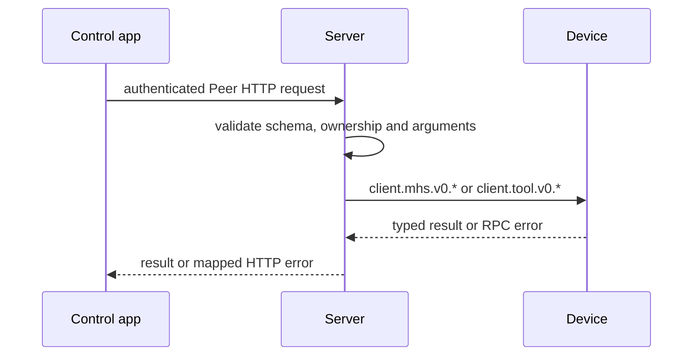

# Client Provided to Server

A device provides a small RPC base plus two versioned families: MHS v0 for hardware state and tool/v0 for procedures. The [RPC reference](/references/rpc) lists every method and every predefined `ClientTool` value. These calls run over the online Peer connection; `GET /gizclaw/v1/device/status` reads a Server snapshot and does not call the device.


```mermaid
sequenceDiagram
    participant Control as Control app
    participant Server
    participant Device
    Control->>Server: authenticated Peer HTTP request
    Server->>Server: validate schema, ownership and arguments
    Server->>Device: client.mhs.v0.* or client.tool.v0.*
    Device-->>Server: typed result or RPC error
    Server-->>Control: result or mapped HTTP error
```

## Protocol discovery

`client.rpc.methods.list` (137) returns `RpcMethod` numbers, including only the MHS operations installed by the device. It identifies protocol families and versions; it does not enumerate procedures. `client.tool.v0.list` (136) returns only the `ClientTool` values whose handlers the device has installed. A caller ignores unknown future enum values. The list excludes `CLIENT_TOOL_UNSPECIFIED`.

`client.tool.v0.invoke` (135) carries one `ClientTool` enum value and protobuf `payload` encoded as the request message declared on that enum value in `payload/tool.proto`. Its response carries the declared response message. Empty messages use an empty payload. An uninstalled tool returns `UNIMPLEMENTED`; a malformed payload returns `INVALID_PARAMS`. Device errors travel in the RPC envelope.

## MHS v0 HWDs

`ClientHwd` in `payload/mhs_v0.proto` binds each HWD to one read response message. Display, led and speaker also bind a write request and applied-value response; wifi, ble, modem, battery and mic have no write messages. The bound RuntimeProfile manifest lists `{id,hwd}` instances only.

`client.mhs.v0.read` (133) carries an instance ID and HWD; its payload is the HWD's read protobuf. `client.mhs.v0.write` (134) additionally carries that HWD's write protobuf and returns an applied-value protobuf. Each call addresses one instance. The Server verifies the manifest instance and type before forwarding. The device returns NOT_FOUND for absent physical hardware and INVALID_ARGUMENT for invalid values; errors use the RPC envelope. Read back after a timed-out write.

## tool/v0 procedures

The 26 predefined tools are `info.get`, `identifiers.get`, `device.status.get`, `device.reboot`, `device.factory_reset`, `device.find`, `sound.play`, `wifi.scan`, `wifi.connect`, `wifi.saved.list`, `wifi.saved.forget`, `firmware.update`, seven `audioplayer.*` tools, `run.workspace.set`, `social.ping`, three `lua.app.*` tools, and two `gnss.reporting.*` tools. Their exact enum numbers and request/response messages are in [the RPC reference](/references/rpc#clienttool-v0). Devices advertise the installed subset through `client.tool.v0.list`. Product-defined device-local tools are not callable by the Agent in tool/v0.

- `device.status.get` returns live `PeerStatus` and refreshes the Server snapshot. Device identity and telemetry fields outside the MHS manifest remain in this status.
- `sound.play` accepts a device-defined sound name of at most 32 UTF-8 bytes and optional non-negative duration. `device.find` rings the built-in find-me sound with an optional duration. `device.reboot` acknowledges before rebooting. `device.factory_reset` acknowledges before erasing local state; `keep_network` can preserve Wi-Fi and cellular settings. A device that also deletes its Peer invalidates its API keys.
- `wifi.scan` uses a bounded 1–15 second timeout and returns at most 32 access points. `wifi.connect` accepts an SSID of at most 32 UTF-8 bytes and an optional 8–63 byte passphrase, acknowledges before switching networks, and must not log or echo the passphrase. `wifi.saved.list` reports saved SSIDs; `wifi.saved.forget` returns `NOT_FOUND` for an absent SSID.
- `firmware.update` accepts optional channel and SHA-256 digest, acknowledges before OTA, and rejects a digest that differs from the package resolved by the device. The device reports its running digest in `PeerStatus.firmware_sha256`.
- `run.workspace.set` receives a resolved `workspace_name` and optional `kickoff`. The Server resolves a `workflow_name` target to one Workspace before calling the device. The device acknowledges, then switches through `server.run.workspace.reload-with-options`; the acknowledgement does not mean the Workspace is ready.
- `social.ping` delivers a Friend or Friend Group notification with sender public key and optional display and group names. The device acknowledges promptly; the Server treats timeout or a missing handler as not delivered and does not retry.

## GNSS reporting switch

`gnss.reporting.get` (25) and `gnss.reporting.set` (26) read and write the device-owned
reporting switch through the existing `client.tool.v0.invoke`. HTTP callers use
`POST /gizclaw/v1/device/tool/v0/invoke`:

```json
{"tool":"gnss.reporting.get","args":{}}
```

```json
{"tool":"gnss.reporting.set","args":{"enabled":false}}
```

Both calls return a result such as `{"result":{"enabled":false}}`. The value comes from
the device: the current value for get, or the applied value for set. Set requires an explicit
boolean; `false` is valid, while omission, null, numbers and strings are invalid. The
Protobuf set request and both responses use optional bool to retain presence. The Server
rejects a set request or device response without `enabled`. Repeating set assigns the same
value rather than toggling it.

Device handlers own reads, application, defaults, persistence and actual reporting behavior.
The Server validates and forwards the calls without persisting the switch, adding a
`PeerStatus` member or changing GNSS telemetry ingestion or storage. Go providers use
`DeviceControlHandlers.GNSSReportingGet/Set`; JavaScript/Flutter use `gnssReportingGet/Set`.
Generic ClientTool handlers are also supported. C providers register the enum through
`gzc_tool_handler_t` and encode the corresponding `ClientGnssReporting*` message. Discovery
advertises installed handlers only. Control-side JavaScript callers use
`device.getGnssReporting()` / `device.setGnssReporting(enabled)`; Dart callers use
`getDeviceGnssReporting()` / `setDeviceGnssReporting(enabled)`. C callers use
`gzc_control_get_device_gnss_reporting` / `gzc_control_set_device_gnss_reporting`. Each returns the device-provided boolean. An absent handler returns `UNIMPLEMENTED`, mapped to
HTTP `501 DEVICE_UNSUPPORTED`.

## Lua applications

`lua.app.list` returns installed applications that the device can launch. Each entry contains the package's stable `app_id`, independent SemVer, and optional `display_name` and `description`. The catalog has at most 32 entries with unique IDs. `app_id` retains the GizOS package identity; it is neither a Server Peer resource ID nor a filesystem path.

`lua.app.install` accepts an HTTP(S) `url` for a complete `.lua-app.tar.zlib` package and an optional expected compressed-archive `sha256`. HTTP(S) URLs are at most 1024 UTF-8 bytes without credentials or fragments. Canonical Base64 data URLs with `data:application/zlib;base64,` or `data:application/octet-stream;base64,` are also accepted, capped at 262144 ASCII bytes including the prefix. This accommodates approximately 192 KiB compressed archives, including the 164484-byte application fixture, with envelope headroom below the C SDK receive cap; larger packages use Binary upload. The Server validates and forwards the request without downloading it, with a 120-second installation RPC deadline. The device streams the download and zlib/USTAR decoding, validates the format-1 `lua-app` manifest and every file's length and SHA-256, and bounds decompressed size, file count, paths and available storage. It stages the complete app and publishes it only after validation succeeds; failure preserves the previous application and user data. Insufficient storage or an unavailable installer returns `UNIMPLEMENTED`, mapped to HTTP `501 DEVICE_UNSUPPORTED`. A successful response's `app` means installation has completed, not merely been queued. Callers must not automatically replay timed-out installation requests.

The package format is defined by the [pinned public GizOS packager](https://github.com/GizClaw/gizos/blob/604492cc10e2b86b730a365288694d4bf1fc76ab/libs/lua/app_package.py). USTAR must end with two complete 512-byte zero blocks after a file boundary; subsequent padding must also consist of whole zero blocks. A valid zlib checksum does not establish tar completeness.

`lua.app.run` accepts `app_id` and optional `params`. Parameters form a string-to-string object mapped directly to GizOS `h2_lua_arg_t` and the Lua global `args` table. Omission means an empty object; callers need not encode the whole object as one JSON string. There are at most 16 entries, with 1–64 UTF-8 bytes per key, at most 1024 bytes per value, and at most 4096 key-plus-value bytes in total. NUL is forbidden. Applications define how to interpret numbers or structured content. A missing app returns `NOT_FOUND`, mapped to HTTP `404 LUA_APP_NOT_FOUND`. The device acknowledges launch acceptance before handing over its UI or disconnecting; this does not mean the game has completed.

For example, `{"tool":"lua.app.run","args":{"app_id":"tetris","params":{"mode":"single","difficulty":"easy"}}}` exposes `args.mode` and `args.difficulty` in Lua. Conversation agents opt into `lua.app.list` and `lua.app.run` through RuntimeProfile `client_tool` bindings and Workflow `toolkit.tool_names`, resolve the user's game name to a device-returned ID, and pass only supported string parameters. SDK discovery advertises installed handlers only; adding this protocol does not implement those handlers in existing firmware.

## Music player

One device player exposes seven `audioplayer.*` tools: `get`, `playlist.get`, `playlist.set`, `playlist.append`, `play`, `stop`, and `mode.set`. The playlist holds at most 32 items. `playlist.set` validates and atomically replaces the list, stopping playback; `playlist.append` preserves ordering and duplicates and never retries automatically. `play` accepts an optional zero-based index; omission selects the device default and acknowledges acceptance; playback state and progress arrive through audioplayer telemetry. `stop` is idempotent, and `mode.set` selects `off`, `one`, or `all`. A list item has an HTTPS audio URL without credentials or fragments and optional title and source reference. The Server does not download audio. `playlist_revision` changes on list mutation, and `playlist.get` reads the device after reconnect.

## Provider and error contract

Go providers install handlers on `gizcli.DeviceControlHandlers` or per `ClientTool`; JavaScript, Flutter and C install the corresponding typed handlers. Each SDK derives discovery from installed handlers. The C provider decodes the invoke bytes through nanopb callbacks, keeping payload storage bounded by its caller buffer.

The Server validates typed Peer HTTP arguments before opening an RPC stream. Offline maps to `409 DEVICE_OFFLINE`; an uninstalled tool to `501 DEVICE_UNSUPPORTED`; timeout to `504 DEVICE_TIMEOUT`; device `INVALID_PARAMS` to `400 DEVICE_REJECTED`; other device errors to a redacted `502 DEVICE_ERROR`. A missing saved SSID uses the route's not-found mapping. Device handlers must not leak credentials in status or errors.

## Explicit runtime Tool capabilities

`client.rpc.methods.list.mhs_v0` optionally reports concrete `id/hwd` instances and supported `write_fields`. The Go SDK obtains this from `DeviceControlHandlers.MhsCapabilities`. Missing information is unknown; a generic HWD field never proves hardware support. `client.mhs.v0.read.write_capabilities` can report writable fields for the returned instance. Device handlers still validate their own safety constraints.

## Binary Lua application upload

RPC 139, `client.lua.app.install`, is separate from tool/v0. A small `ClientLuaAppInstallStreamRequest` supplies `uint32 content_length` (1–524288 compressed bytes) and required `sha256` (64 hex digits). The same ordered stream carries multiple Binary body frames (at most 65535 bytes each), request EOS, then the final `ClientLuaAppInstallResponse` and response EOS. The total deadline is 120 seconds. Binary uploads are capped at 512 KiB; larger archives must use the lua.app.install HTTP(S) URL tool. Devices still enforce storage and inflation limits. No archive-sized protobuf field, Base64 envelope, replay or multi-request assembly is used.

The device reuses its URL installer, inflates into staging files without storing the compressed archive, validates compressed length/SHA, manifest, file lengths/digests, tar end blocks and zlib EOS, then atomically publishes. Failure/cancellation aborts staging and preserves the previous app and user data. An early error may terminate an incomplete upload.

`POST /gizclaw/v1/device/lua-app/install?content_length=N&sha256=HEX` accepts an `application/octet-stream` body, including chunked HTTP. API Key owner authorization and device error mapping are shared with other controls. Server and Edge forward bytes and do not unpack archives. Oversized declared uploads return HTTP 413 LUA_APP_PACKAGE_TOO_LARGE before contacting the device. Success returns `{ "app": ... }` only after installation; list/run still use tool/v0.

C registers a borrowed `gzc_rpc_stream_provider_t` through `gzc_client_config_t.lua_app_install`. `begin` receives borrowed protobuf metadata and creates an owner; `write` borrows a full chunk until return; `finish` validates compressed SHA and installation before responding; `close` releases the owner exactly once after success or abort. `write` and an unresponded `finish` may return `GZC_ERR_WOULD_BLOCK`: the SDK retains and retries the frame from poll. Pending writes pause backend polling; pending finish keeps polling to observe cancellation. `begin` cannot block this way. Callbacks must return promptly and cannot reenter the client; asynchronous workers copy into bounded storage. Disconnect, client close and the 120-second deadline abort unfinished owners. Discovery advertises 139 only when the provider is installed.

Go `DeviceControlHandlers.InstallLuaApp`, JS `GizClawPeerRPCHandlers.installLuaApp` and Flutter `GizClawPeerRpcHandlers.installLuaApp` expose device-owned install sessions. They verify compressed length and SHA before finish. JS receives an AbortSignal and Flutter a LuaAppInstallCancellation. Go `rpcapi.UploadLuaApp`, JS `WebRTCRPCClient.installLuaApp` and Flutter `PeerRpcClient.installLuaApp` send incremental chunks using transport backpressure and request EOS. HTTP control wrappers expose the same upload; the C HTTP wrapper borrows an existing archive buffer without copying it into scratch.
