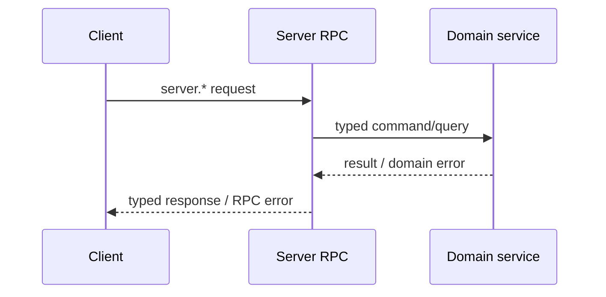

# Server Provided to Client

This set of capabilities is implemented by Server and called by Client/Device through Peer connection. It is the main RPC surface for Clients to access Server runtime, resources and product services.

## Method groups

| Prefix | Main capabilities |
| --- | --- |
| `server.info.*` | Reading and updating Server/Peer information |
| `server.runtime.*`, `server.status.*` | Runtime and status query |
| `server.run.*` | Agent, Workspace, history, memory, recall, say, reload and stop |
| `server.firmware.*` | Compatibility surface only: list is empty and get/download return not found; Firmware is Admin-managed and is not projected by registration |
| `server.workspace.*` | Workspace CRUD, history and history audio |
| `server.workflow.*` | Source-qualified Workflow list/get and owned Workflow CRUD |
| `server.model.*` | Model CRUD |
| `server.voice.*` | Voice list/get |
| `server.credential.*` | Credential CRUD |
| `server.contact.*` | Contact CRUD |
| `server.friend.*` | Friend and invite-token operations |
| `server.friend_group.*` | Group, member, message and invite-token operations |
| `server.register` | Select the current connection's RuntimeProfile with a RegistrationToken |
| `server.pet.*` | Pet resource CRUD and drive |
| `runtime.adopt` | Adopt a Pet from the current connection's RuntimeProfile |
| `server.pet.actions.get` | Press Pet to get available actions, without returning the complete PetDef |
| `server.pet.pixa.download` | Press Pet to download PIXA metadata and materials without exposing PetDef API |
| `server.badge.*` | Badge resource query |
| `server.badge_def.pixa.download` | Download the PIXA material associated with Badge Definition; Badge Definition CRUD is not provided |
| `server.points.*` | Points account and transactions |
| `server.game_result.*`, `server.reward_grant.*` | Gameplay result and reward query |
| `server.tool.*` | Tool CRUD |

`server.peer.lookup`, `server.peer.assign` and `server.route.resolve` do not belong to this page; they are only available to Edge-node.

## Workflow sources

`server.workflow.list` and `server.workflow.get` require a `source` of `runtime` or `owned`. Runtime results use the current RuntimeProfile alias as the RPC `id`; the Server resolves that alias to the concrete Workflow and exposes it read-only. A missing RuntimeProfile target is skipped by list and returns not found from get. Owned results use the concrete, globally unique Workflow name as `id`; create, put, and delete are available only for the current Peer's owned Workflows.

Workspace create and put include the same Workflow `source`, so runtime aliases and owned names are unambiguous. Workflow carries no icon, display name, or i18n. Clients map stable RuntimeProfile aliases to their own localized presentation.

## Calling relationship

RPC adapter is responsible for payload decoding, method dispatch and stable error mapping; domain service is responsible for authorization, resource rule, storage and lifecycle. These business behaviors cannot be implemented in the generated RPC package.
