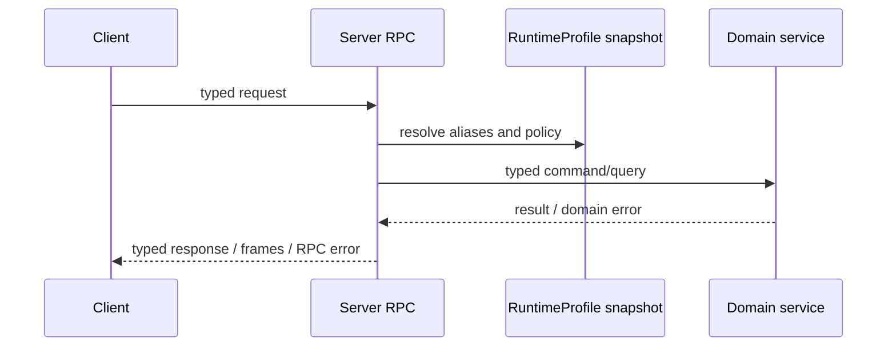

# Server Provided to Client

These methods are implemented by Server and called by a Client/Device through its Peer connection.

## Method groups

| Prefix | Main capabilities |
| --- | --- |
| `server.info.*`, `server.runtime.*`, `server.status.*`, `server.peer.delete` | Peer information, runtime status, and caller-scoped retirement |
| `server.run.*` | Workspace selection, history, memory, speech output, reload and stop |
| `server.workspace.*` | Peer-owned Workspace CRUD and history; list requires Collection |
| `server.workflow.*` | RuntimeProfile Workflow alias list/get; list requires Collection |
| `server.model.*`, `server.voice.*`, `server.tool.*` | Safe RuntimeProfile alias list/get |
| `server.speech.*` | Standalone streaming transcription and synthesis |
| `server.register` | Select the required RuntimeProfile and persist/return the RegistrationToken's optional Firmware release-line ID; channel selection remains device-owned |
| `runtime.adopt`, `server.pet.*`, `server.badge.*`, `server.points.*` | Gameplay and Peer-owned Pet state |
| `server.friend.*`, `server.friend_group.*`, `server.contact.*` | Social state |
| `server.firmware.*` | Get the Peer's bound Firmware and download a file from a device-selected channel; no list method |

`server.peer.lookup`, `server.peer.assign`, and `server.route.resolve` belong only to Edge-node RPC.

## RuntimeProfile resource projection

Canonical Workflow, Model, Credential, Voice, and Tool resources are Admin-managed. Peer RPC has no Workflow, Model, Credential, or Tool create/put/delete methods and no `source=runtime|owned` selector.

Workflow aliases are grouped under RuntimeProfile Collections. `server.workflow.list` requires a Collection; `server.workflow.get` uses the globally unique alias. Model, Voice, and Tool list/get also address RuntimeProfile aliases. Responses contain only safe alias metadata and include the RuntimeProfile name and revision; canonical IDs, provider configuration, credentials, ownership, and executor routing stay on the Server.

Workspace create requires `collection` and `workflow_alias`. The Server records Collection through an internal Workspace label. Workspace list requires Collection and performs exact filtering, but generic labels are not part of the Peer response. Removing an alias does not hide or delete an existing Workspace; reload/run reports not found until the alias exists again.

## Calling relationship

The RPC adapter owns payload decoding, framing, lifecycle, and stable error mapping. Domain services own storage, resource validation, authorization, and execution.

`server.peer.delete` has empty request and response messages and never accepts a target public key. After atomically removing the caller's active Peer and writing its pending-deletion handoff, the Server immediately marks the current connection retiring and rejects new work, then attempts to flush the response and EOS. The full connection closes even if either write fails. `server.workspace.delete` performs the same fast handoff only for a caller-owned user Workspace; system Workspaces remain non-deletable. `server.pet.delete` removes the Pet and writes Pet pending work while retaining its bound system Workspace.
