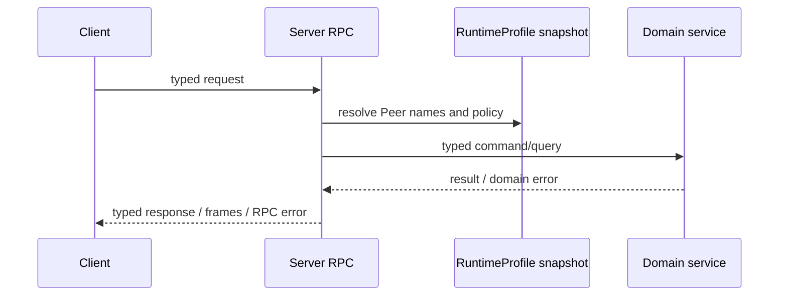

# Server Provided to Client

These methods are implemented by Server and called by a Client/Device through its Peer connection.

The [RPC API Reference](/references/rpc) is the single list of exact method IDs, names, groups, and purposes. This page only explains Server-provided resource projection, call flow, and implementation ownership. See [Server Provided to Edge-node](./server-provided-to-edge-node) for the authorization boundary of Edge-node-only methods.

## RuntimeProfile resource projection

Canonical Workflow, Model, Credential, Voice, and Tool resources are Admin-managed. Peer RPC has no Workflow, Model, Credential, or Tool create/put/delete methods and no `source=runtime|owned` selector.

RuntimeProfile binding aliases are grouped under Collections, but the Peer boundary projects each binding as an immutable `name`. `server.workflow.list` requires a Collection; Workflow, Model, Voice, and Tool get/list requests and responses consistently use names. Responses retain the legacy `runtime_profile_name` wire field, but its value is the canonical RuntimeProfile ID, alongside the revision; other canonical IDs, provider configuration, credentials, ownership, and executor routing stay on the Server.

Workspace create requires `collection` and `workflow_name`. The Server resolves that Peer name to the current RuntimeProfile binding and records Collection through an internal Workspace label. Workspace list requires Collection and performs exact filtering, but generic labels are not part of the Peer response. Removing the binding does not hide or delete an existing Workspace; reload/run reports not found until the name resolves again.

## Calling relationship

```mermaid
sequenceDiagram
    participant Client
    participant RPC as Server RPC
    participant Profile as RuntimeProfile snapshot
    participant Service as Domain service
    Client->>RPC: typed request
    RPC->>Profile: resolve Peer names and policy
    RPC->>Service: typed command/query
    Service-->>RPC: result / domain error
    RPC-->>Client: typed response / frames / RPC error
```

The RPC adapter owns payload decoding, framing, lifecycle, and stable error mapping. Domain services own storage, resource validation, authorization, and execution.

Friend Group messages are a read-only projection of the group's bound Workspace History. List/get/audio requests accept the authenticated member's local `friend_group_name` (and History ID where needed); the Server resolves it once to the canonical group ID, verifies membership, and carries only that ID internally. The response projects the same local name. Conversation is the only write path. Audio get uses the standard metadata, binary frames, and EOS response and never exposes canonical group, Workspace, or asset locators.

`server.peer.delete` has empty request and response messages and never accepts a target public key. It atomically creates or reuses the caller's pending-deletion handoff while retaining the active Peer, then the Server immediately marks the current connection retiring and rejects new work, and attempts to flush the response and EOS. The full connection closes even if either write fails. `server.workspace.delete` creates or reuses the same transparent handoff only for a caller-owned user Workspace; system Workspaces remain non-deletable. `server.pet.delete` retains the Pet and writes or reuses Pet pending work while retaining its bound system Workspace.
