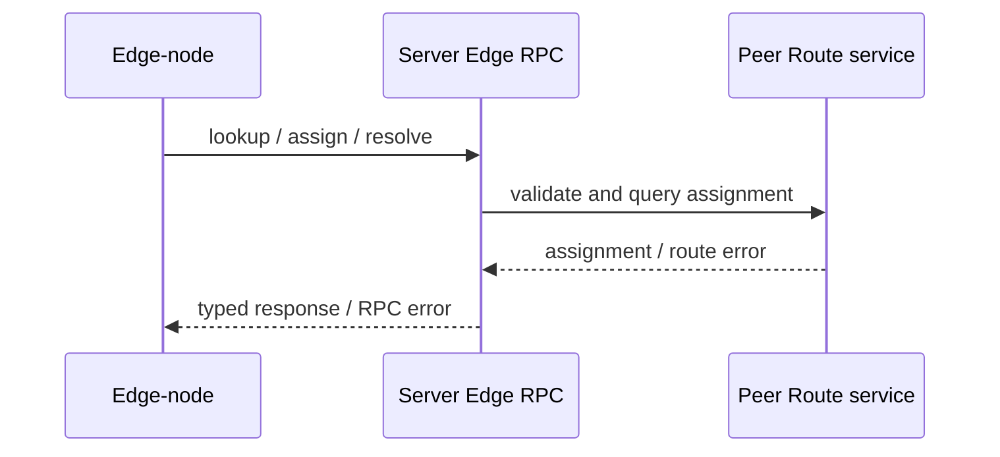

# Server Provided to Edge-node

This set of capabilities is implemented by Server and is only provided to connections with Edge-node role. Edge-node uses it to query Peer assignments and resolve upstream routes, without exposing control plane capabilities to ordinary clients.

The [RPC API Reference](/references/rpc#edge-rpc) is the single list of exact method IDs, names, and purposes. This page only explains the Edge-node role, call flow, and authorization boundary.

## Calling relationship

Server uses independent Edge RPC dispatch and only accepts the above three methods. Even if the ordinary Client RPC surface shares the same `rpc.proto` registry, it cannot obtain the calling permission because the method can be decoded; role authorization and service exposure must limit the Edge control plane at the same time.
