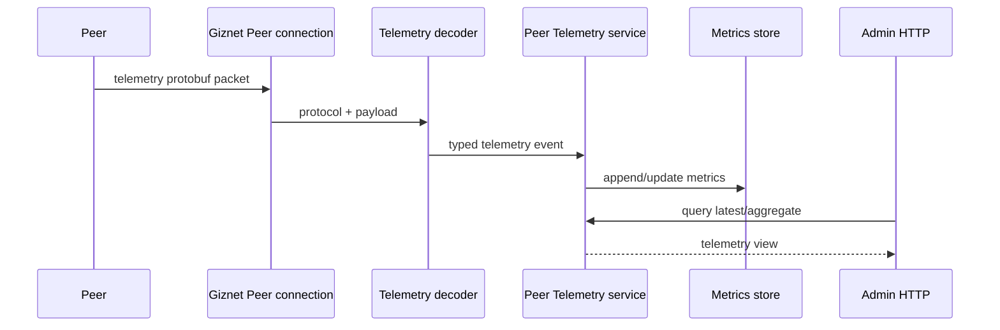

# Telemetry API

`api/proto/telemetry/peer_telemetry.proto` Defines the telemetry event wire format sent by Peer to Server. It is a high-frequency one-way event stream, not an RPC method, and not an Admin HTTP resource.

See the [Streams Reference](/references/streams#direct-packets) for the direct-packet protocol, reliability, and transport boundary.

## Data path

Telemetry Protobuf owns the wire fields reported by the device. Metrics store has save and query semantics; Admin HTTP has a response contract for administrators. Do not directly use the storage model as a telemetry wire message for convenience, and do not let the device depend on the Admin response DTO.

## Design rules

- The high frequency field should remain compact, stable and backward compatible.
- New fields must have explicit units, time semantics, and default values; they cannot just rely on guesswork from Go annotations.
- Decoder treats malformed or out-of-limit input as untrustworthy boundaries.
- Aggregation, retention and query filtering belong to service/store and not to wire schema.
- Regenerate Go and JavaScript telemetry code after Schema changes, and verify the real packet decode and service ingestion.

## Network reporting

`Observation.network` (field 12) carries `NetworkObservation`, describing signal strength and the cellular identity of the current default packet-data route:

| Field | Number | Type | Meaning and validation |
| --- | --- | --- | --- |
| `rssi_dbm` | 1 | `optional double` | Received signal strength in dBm; must be finite. Stored as the `network.rssi_dbm` metric. |
| `signal_level` | 2 | `optional double` | Device-defined signal level; must be finite. Stored as the `network.signal_level` metric. |
| `rat` | 3 | `optional string` | Radio access technology such as `lte`, `nr` or `wifi`. Used for validation only; not persisted. |
| `operator` | 4 | `optional string` | Operator name. Used for validation only; not persisted. |
| `connected` | 5 | `optional bool` | Whether the route is connected. Stored as the `network.connected` metric. |
| `imei` | 6 | `optional string` | Modem hardware IMEI: exactly 15 ASCII digits (`^[0-9]{15}$`). Devices without a modem leave it unset. |
| `imsi` | 7 | `optional string` | IMSI of the SIM serving the default packet-data route: 6 to 15 ASCII digits (`^[0-9]{6,15}$`). Unset when no SIM is readable. |

`imei` and `imsi` are only meaningful on a cellular route. A frame whose `rat` is
`wifi` (case-insensitive) with either field set is rejected as `ErrInvalidFrame`, as is
any value that does not match its pattern; a rejected frame produces no partial status
write. Frames without fields 6 and 7, produced by SDKs built before these fields
existed, decode and store exactly as before.

The identity strings are not metrics. They never enter the metrics store, the
`PeerTelemetryField` enum, or Prometheus-style labels. Instead they are merged with
their observation time into the owner-scoped `PeerStatus.network_imei` /
`PeerStatus.network_imsi`, recording `network_imei_at_unix_ms` /
`network_imsi_at_unix_ms` under `details.telemetry_status`. Per-field ordering follows
battery and GNSS: an older observation never overwrites a newer stored value; an
observation equal to the stored value only refreshes its `_at` timestamp and does not
bump `reported_at` beyond the existing rule; when neither the value nor the timestamp
changes, the status is not rewritten. Telemetry never clears the identity: a device that
loses its SIM simply stops sending `imsi`. Clearing is an admin operation outside
telemetry.

`PeerStatus` is already returned by the Peer RPC `server.status.get`,
`GET /gizclaw/v1/device/status`, and the other existing status surfaces, so both fields
ride along without new endpoints. Side-control and monitor projections treat them as
opaque strings.

Privacy scope: IMEI and IMSI are owner-scoped status like GNSS. They must not appear in
Server, Edge, or SDK logs, traces, or error messages; validation errors report the field
name only. Devices report `imsi` only for the SIM currently serving traffic and never
report cached values from a removed SIM. The telemetry IMEI and
`DeviceIdentifiers.imeis` from `client.identifiers.get` stay independent sources: they
are not merged and the `by-imei` index is unaffected.

Go sets `Imei` / `Imsi` on `telemetrypb.NetworkObservation`; JavaScript uses
`networkTelemetry({ imei, imsi })`; C sets `has_imei` / `imei` and `has_imsi` / `imsi` on
`gzc_telemetry_network_t`, which validates the length and digit rules before encoding and
returns `GZC_ERR_INVALID_ARGUMENT` when `rat` is `wifi`. Strings are borrowed during the
call. Flutter has no telemetry sending surface and only reads `network_imei` /
`network_imsi` through the generated `PeerStatus`.

## OTA reporting

`Observation.ota` (field 14) carries `OtaObservation` for one device-owned update attempt:

| State | Value | Meaning |
| --- | --- | --- |
| `OTA_STATE_STARTED` | 1 | The device started the update attempt. |
| `OTA_STATE_DOWNLOADING` | 2 | Downloading; `download_percent` is required. |
| `OTA_STATE_SUCCEEDED` | 3 | The device confirmed update success; a 100% download is not success. |
| `OTA_STATE_FAILED` | 4 | The attempt failed; optional `error_code` and `error_message` describe it. |

`update_id` is a required device-supplied attempt identifier of 1–128 UTF-8 bytes;
use a new identifier for a retry. Optional `target_version` is at most 128 UTF-8 bytes.
`download_percent` is finite and in [0, 100]; absent means unreported, while explicit
zero means zero download progress. Error fields are allowed only for failure and
are limited to 128 (`error_code`) and 512 (`error_message`) UTF-8 bytes. Devices must
supply safe diagnostics without credentials, signed URLs, or secrets. Observation
time is the frame timestamp plus its observation delta in milliseconds.

Go exposes `Client.SendOTATelemetry(*telemetrypb.OtaObservation)`; JavaScript exposes
`otaTelemetry` and `OtaState` with the existing send APIs. C exposes
`gzc_telemetry_ota_frame_t`, `gzc_telemetry_encode_ota_frame`, and
`gzc_client_send_ota_telemetry`. Each C OTA frame carries one observation and borrows
strings during the call, preserving existing frame/observation layouts. Go and
JavaScript can mix observation types in one frame. Flutter currently has no
telemetry sending surface; this contract does not add a Flutter transport.

SDKs encode and send the wire message; the server validates the semantics above,
rejecting unspecified or unsupported states. After validating the entire frame,
the server updates runtime status. OTA payloads, including diagnostic strings, are
never logged and do not write numerical metrics or use telemetry latest/aggregate
queries. Bounded diagnostic strings are retained as supplied, without heuristic
secret detection, and returned only through the existing authenticated device
status access. Devices must avoid including secrets in diagnostics.

The latest OTA snapshot is persisted in the device runtime KV Store and exposed
as `PeerStatus.ota`. LiteLink and other API-key clients read
`GET /gizclaw/v1/device/status` for `state` (`started`, `downloading`, `succeeded`,
`failed`), `update_id`, `observed_at`, and optional version, download percentage,
and error fields. Peer RPC `server.status.get` returns the same snapshot. Status
SDKs preserve unknown future state strings. The last snapshot remains readable
while the device is disconnected; connection statistics at `/device/runtime` do
not carry OTA state.

The runtime atomically compares a dedicated per-peer OTA record. Older timestamps
cannot overwrite newer snapshots. Terminal states and download percentages cannot
regress within one attempt; equal timestamps may advance only the same attempt.
A new attempt requires a different `update_id` and later time and replaces the
whole snapshot, clearing previous errors and progress. Omitted version/progress
retain their latest values within an attempt. Control/status writes such as volume
changes cannot overwrite OTA.

Delivery retains direct-packet semantics without application acknowledgement,
retries, or exactly-once delivery. The server maintains the latest snapshot with the ordering rules above. Devices
should limit the frequency of progress reports.
