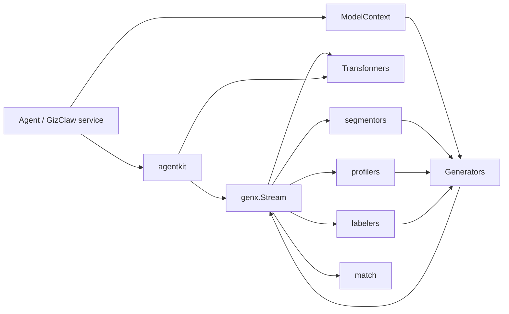

# pkgs/genx Overview

`pkgs/genx` is GizClaw’s general multi-modal AI stream processing layer. It defines message, model context, tool, generator, transformer and stream contract so that Agent and product services can combine model capabilities without directly relying on a certain provider's protocol.

[Go API References](https://pkg.go.dev/github.com/GizClaw/gizclaw-go@v0.0.0-20260707135347-b9bf1fb24b9f/pkgs/genx)

## Package structure

```text
pkgs/genx/
├── agentkit/      # reusable Agent stream composition such as Audio Dock
├── generators/    # Generator registration, selection, and invocation
├── transformers/  # ASR, TTS, Realtime, and stream transformation
├── segmentors/    # conversation segmentation and entity-relation extraction
├── profilers/     # entity profile updates
├── labelers/      # Recall query-label selection
└── match/         # rule- and model-based message matching
```

## Core Interfaces

### Generator

[`Generator`](https://pkg.go.dev/github.com/GizClaw/gizclaw-go@v0.0.0-20260707135347-b9bf1fb24b9f/pkgs/genx#Generator) is the unified entry point to model generation capabilities:

```go
type Generator interface {
    GenerateStream(context.Context, string, ModelContext) (Stream, error)
    Invoke(context.Context, string, ModelContext, *FuncTool) (Usage, *FuncCall, error)
}
```

- `GenerateStream` Generate multi-modal output streams based on model pattern and Model Context.
- `Invoke` requires the model to generate calling parameters specifying `FuncTool`, which is suitable for structured generation.
- OpenAI, Gemini or other provider adapter implement this interface; the upper layer chooses to implement it through `generators.Mux`.

### Transformer

[`Transformer`](https://pkg.go.dev/github.com/GizClaw/gizclaw-go@v0.0.0-20260707135347-b9bf1fb24b9f/pkgs/genx#Transformer) Express stream-to-stream conversion:

```go
type Transformer interface {
    Transform(context.Context, string, Stream) (Stream, error)
}
```

It does not change the calling model: both input and output use `Stream`. ASR can convert audio stream to text stream, TTS can do the opposite conversion, and Realtime and speech translation also respect the same boundary.

### ModelContext

[`ModelContext`](https://pkg.go.dev/github.com/GizClaw/gizclaw-go@v0.0.0-20260707135347-b9bf1fb24b9f/pkgs/genx#ModelContext) is a read-only view of the context required for a model call:

```go
type ModelContext interface {
    Prompts() iter.Seq[*Prompt]
    Messages() iter.Seq[*Message]
    CoTs() iter.Seq[string]
    Tools() iter.Seq[Tool]
    Params() *ModelParams
}
```

It exposes system prompts, historical messages, inference context, callable tools and model parameters respectively. `ModelContextBuilder` is used to assemble a single context, `MultiModelContext` is used to assemble multiple context sources sequentially.

### Stream

[`Stream`](https://pkg.go.dev/github.com/GizClaw/gizclaw-go@v0.0.0-20260707135347-b9bf1fb24b9f/pkgs/genx#Stream) is the common transport protocol between all generation and transformation capabilities:

```go
type Stream interface {
    Next() (*MessageChunk, error)
    Close() error
    CloseWithError(error) error
}
```

- `Next` Gets the next `MessageChunk` in sequence until the stream ends or an error is returned.
- `Close` Terminate normally and release producer resources.
- `CloseWithError` Terminates the flow with the failure reason, allowing errors to be propagated upstream and downstream in the pipeline.

`Merge`, `Split`, `Tee`, `CompositeSeq` and `Iter` provide combining, splitting and consuming capabilities on this minimal interface.

#### StreamCtrl

[`StreamCtrl`](https://pkg.go.dev/github.com/GizClaw/gizclaw-go@v0.0.0-20260707135347-b9bf1fb24b9f/pkgs/genx#StreamCtrl) is optional control information on `MessageChunk`, used to describe chunk The logical subflow it belongs to and the status of the subflow:

| Fields | Semantics |
| --- | --- |
| `StreamID` | Logical route identifier. Correlated text, audio, transcription, or tool chunks can share the same ID while retaining independent MIME-channel lifecycles. |
| `Label` | A substream usage tag, such as `transcript`, `assistant`, or `history.user_audio`; it supplements the StreamID and does not replace the unique identifier. |
| `Error` | The termination error text of the current substream. Usually used together with `EndOfStream`, it is not equivalent to closing the entire Stream. |
| `BeginOfStream` | The current chunk is a starting boundary. A chunk with a Part begins or announces that MIME channel; a control-only chunk begins the StreamID route. |
| `EndOfStream` | The current chunk is an end boundary. A chunk with a Part ends that MIME channel; a control-only chunk ends the whole StreamID route. It can also carry final data or Error. |
| `Timestamp` | The millisecond timestamp of the Chunk for `RealtimeStream` sorting and delayed processing; when the value is zero, `RealtimeStream` will supplement the monotonically increasing value based on the current time. |

`StreamCtrl.ErrorCause` preserves the typed terminal cause only within this process, including across `MessageChunk.Clone`; JSON and Peer wire formats exclude it. Domain owners can implement `PublicError` to supply stable, sanitized code/message/retryable details. `SetStreamError` records the cause and these details; `StreamError` returns the retained cause, or an ordinary error for untyped wire text. Composition layers preserve causes through terminal routes without interpreting domain codes or parsing error strings.

Composition layers may also attach a process-local response epoch to `StreamCtrl`. The epoch captures the exact input route that owned a response before any response chunk is published, survives `MessageChunk.Clone`, and is excluded from JSON and every Peer/API conversion. Audio Dock uses one immutable epoch for the response's source text or direct audio, TTS siblings, interruptions, and synthesized terminals. `StreamCtrl.ResponseEpochEnd` is the payload-free completion signal: it is false on every earlier chunk and true only on the final EOS after all declared MIME routes have ended. Error and interruption paths prevent further sibling publication and perform their bounded TTS cleanup before publishing that marker when output remains publishable. Cancellation, abandonment, or teardown that prevents publication emits no synthetic success boundary and retains its actual lifecycle result. A response created before any input BOS is deliberately unowned; a later input never adopts it.

`Ctrl == nil` means that the current chunk does not have explicit routing or boundary control information. Consumers should judge the boundaries through `MessageChunk.IsBeginOfStream()` and `IsEndOfStream()` and do not directly assume that `Ctrl` must exist.

#### StreamID, MIME channels, and EOS

`MessageChunk.Ctrl.StreamID` identifies a logical route. One route can carry multiple MIME channels with independent completion boundaries:

- `Text` uses the canonical `text/plain` MIME channel. `Blob` uses its parsed and canonicalized MIME type, including semantically relevant parameters such as `codecs=opus`; case, parameter order, and insignificant spacing do not create a second channel.
- An EOS chunk with a Part ends only that Part's MIME channel on the route. For example, `text/plain` EOS does not end `audio/opus` with the same StreamID.
- A control-only EOS with `Part == nil` ends the whole StreamID route and all of its outstanding MIME channels. It still does not close the enclosing `Stream`.
- The component that creates a StreamID owns that route's boundaries. If a Transformer creates a MIME channel on an existing StreamID, it likewise owns that channel: it emits a MIME-bearing BOS before or with the first data chunk and exactly one matching EOS, including for an empty successful or failed channel.
- A Transformer passes through routes it does not create without adding, removing, or reinterpreting their BOS/EOS. Downstream composers and consumers must not repair a producer that emits data before BOS or closes without EOS.
- A producer that may add a MIME channel after all currently observed channels complete must announce it with a MIME-bearing BOS before that completion, or keep the route open until a control-only EOS.
- The same `Stream` can carry multiple StreamIDs in an interleaved manner. `Stream.Close` and `CloseWithError` terminate the enclosing transport and all outstanding routes.
- `Iter` aggregates content readers until the enclosing Stream ends; it does not expose route-aware EOS through `StreamElement`.
- Adapters must preserve StreamID, role, label, MIME type, BOS/EOS, and error semantics instead of keeping boundaries only in private session state.

### Tool

[`Tool`](https://pkg.go.dev/github.com/GizClaw/gizclaw-go@v0.0.0-20260707135347-b9bf1fb24b9f/pkgs/genx#Tool) is a restricted collection of tool types. Currently implemented by [`FuncTool`](https://pkg.go.dev/github.com/GizClaw/gizclaw-go@v0.0.0-20260707135347-b9bf1fb24b9f/pkgs/genx#FuncTool) and `SearchWebTool`. `FuncTool.Parameters` holds a caller-declared JSON Schema that adapters send instead of `Argument` without their own normalization; `Strict` asks the provider to enforce that schema, and an adapter that cannot enforce it rejects the tool.

`ToolInvoker` is the two-method runtime boundary used by Transformers. `ResolveTools` returns the currently available function names, descriptions, and JSON Schemas, while `InvokeTool` accepts only a function name and raw JSON arguments and returns raw JSON. RuntimeProfile lookup, authorization, availability, argument validation, and executor dispatch remain implementation details of the injected invoker.

Provider call IDs never cross the `ToolInvoker` boundary. The consuming Transformer owns correlation, ordering, duplicate-ID rejection, and the call budget for one invocation. `Toolkit` is an immutable standalone implementation backed by executable `FuncTool` values; it snapshots declarations, validates arguments, executes the paired function, and serializes the result. Other implementations may resolve tools from product resources without exposing those internals to GenX Transformers.

Eino attaches a `ToolConversation` snapshot when executing an internal ToolCall. `ContinuationStart`
separates input/history from this invocation's new proposals and results. Audio turns use the
transcript actually reported by the component. The snapshot contains the
actual current user input, conversation and continuation, with no provider call IDs. Messages and
arguments are independently owned, and consumers receive a copy. Product invokers can use it for
pre-execution checks; GenX does not interpret product authority or select another Tool.

Tool-result arguments are associated with the matching native call ID and function name before
IDs are omitted; names alone cannot distinguish calls. Unmatched results receive no invented arguments.

### Usage metering

Provider adapters call [`RecordUsage`](https://pkg.go.dev/github.com/GizClaw/gizclaw-go@v0.0.0-20260707135347-b9bf1fb24b9f/pkgs/genx#RecordUsage) as soon as the provider reports usage, handing a [`UsageRecord`](https://pkg.go.dev/github.com/GizClaw/gizclaw-go@v0.0.0-20260707135347-b9bf1fb24b9f/pkgs/genx#UsageRecord) to the recorder that [`WithUsageRecorder`](https://pkg.go.dev/github.com/GizClaw/gizclaw-go@v0.0.0-20260707135347-b9bf1fb24b9f/pkgs/genx#WithUsageRecorder) put in the context. Generators and Transformers call it from their own goroutines, so the recorder must be safe for concurrent use and must not block; without a recorder the records are dropped. The terminal `Usage` of a stream remains informational for the direct caller; metering uses `UsageRecord`.

Each record carries the provider, the provider model, version, or resource ID, the modality (`text` or `audio`), and the billing unit. `Input`, `CachedInput`, and `Output` are disjoint: `CachedInput` is input billed at the cache rate and is not part of `Input`. A provider model always reports in the same unit; units of different provider models are not comparable and GenX does not convert them.

| Provider capability | Unit | Source |
| --- | --- | --- |
| OpenAI-compatible and Gemini Generators | `token` | Response usage. Streaming requests set `stream_options.include_usage`, and the terminal state waits for the trailing usage chunk. Gemini tool-use prompt tokens count as input and thought tokens as output. |
| Volc realtime dialog, realtime duplex, AST, DashScope realtime | `token`, split into text and audio | The per-response usage event or `response.done`. |
| Volc Seed/ICL TTS | `character` | `text_words` of the final frame, one per Unicode character. |
| MiniMax TTS | `character` | `extra_info.usage_characters` of the final frame; CJK characters count as two. |
| Volc streaming ASR | `millisecond` | The largest `audio_info.duration` the provider reported for the session, including audio without recognized text. |

Usage a provider never reports, such as a response the caller canceled before the provider's usage event, is not estimated.

## Core data structures

| Structure | Responsibility |
| --- | --- |
| [`Message`](https://pkg.go.dev/github.com/GizClaw/gizclaw-go@v0.0.0-20260707135347-b9bf1fb24b9f/pkgs/genx#Message) | Express a complete multi-modal input or output, consisting of role and contents. |
| [`MessageChunk`](https://pkg.go.dev/github.com/GizClaw/gizclaw-go@v0.0.0-20260707135347-b9bf1fb24b9f/pkgs/genx#MessageChunk) | Incremental messages passed in Stream, carrying content, tool calls, status or flow events. |
| [`ModelParams`](https://pkg.go.dev/github.com/GizClaw/gizclaw-go@v0.0.0-20260707135347-b9bf1fb24b9f/pkgs/genx#ModelParams) | Unify model parameters such as max tokens, temperature, top-p, and allow provider extra fields. |
| [`Usage`](https://pkg.go.dev/github.com/GizClaw/gizclaw-go@v0.0.0-20260707135347-b9bf1fb24b9f/pkgs/genx#Usage) | Prompt, cache, and generated token usage carried by a stream terminal state. |
| [`UsageRecord`](https://pkg.go.dev/github.com/GizClaw/gizclaw-go@v0.0.0-20260707135347-b9bf1fb24b9f/pkgs/genx#UsageRecord) | Billable usage of one provider response, request, or session, by provider, model, modality, and unit. |
| [`State`](https://pkg.go.dev/github.com/GizClaw/gizclaw-go@v0.0.0-20260707135347-b9bf1fb24b9f/pkgs/genx#State) | Generate final state such as expression completion, truncation, rejection or error. |

## Calling relationship



`genx.Stream` is the common data boundary of capability combination. Generators generate streams; Transformers rewrite streams; Segmentors, Profilers, and Labelers use Generators to complete structured reasoning.

## Placement rules

- Common message, stream, model, and tool contracts are placed in the `pkgs/genx` root package.
- Capabilities that can be selected by name are registered through the mux of the corresponding sub-package, and the second set of routing tables is not maintained by the product service.
- Provider SDK adapter is placed in the package with this specific capability; provider credential and product model resource still belong to `pkgs/gizclaw/services/ai`.
- Product Agent instances, workspaces, HTTP/RPC, and credential ownership do not belong to `genx`. A reusable Graph Transformer may accept generic Store interfaces, but it must not depend back on the GizClaw product runtime.

`ErrInvalidToolArguments` identifies malformed model ToolCall JSON. A Transformer may request bounded regeneration while preserving non-execution and without substituting parameters.
