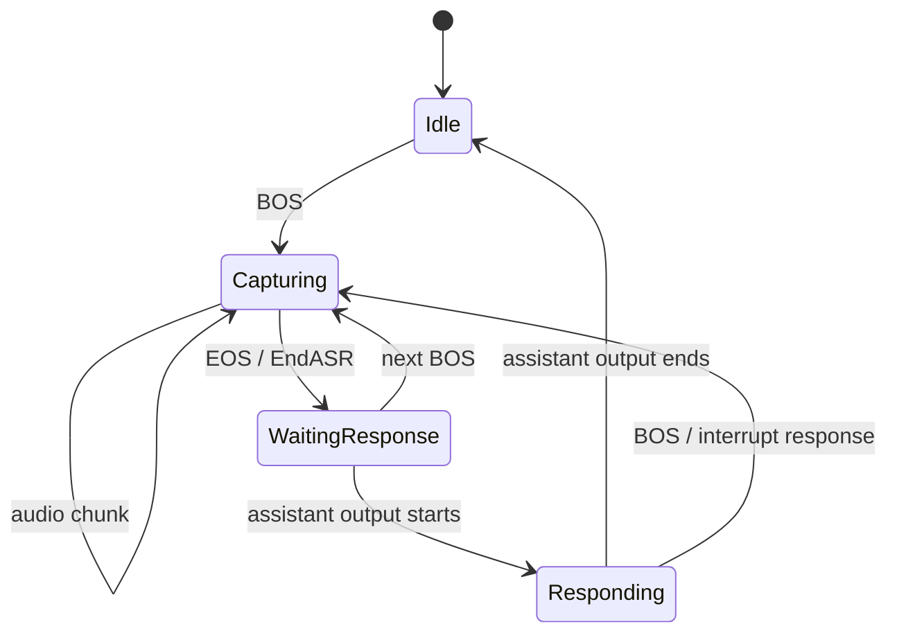

# Doubao Speech Adapter

Doubao Speech Adapter adapts Doubao speech protocol to `genx.Transformer`, covering one-way recognition, speech generation, real-time dialogue, duplex real-time dialogue and voice translation.

Each adapter uses a package-owned typed constructor:

```go
doubaoasr.New(doubaoasr.Config{Client: client})
doubaotts.NewSeedV2(doubaotts.SeedV2Config{Client: client, Speaker: speaker})
doubaotts.NewICLV2(doubaotts.ICLV2Config{Client: client, Speaker: speaker})
doubaoast.New(doubaoast.Config{Client: client})
doubaorealtime.New(doubaorealtime.Config{Client: client})
doubaorealtimeduplex.New(doubaorealtimeduplex.Config{Client: client})
```

Constructors do not open provider sessions; each concurrent `Transform` call owns its session and runtime state. ASR, TTS, AST, and Realtime Dialogue do not accept Toolkit configuration. Realtime Duplex is agent-capable because its provider protocol supports function-call output continuation.

## Abilities

| Transformer | Input and Output |
| --- | --- |
| `doubaoasr.Transformer` | Audio Stream → transcription Stream. |
| `doubaotts.SeedV2` | Text Stream → generated audio Stream. |
| `doubaotts.ICLV2` | Text Stream → ICL voice audio Stream. |
| `doubaorealtime.Transformer` | Adapts the Doubao Realtime Dialogue API (`volc.speech.dialog`), explicitly handles ASR, Chat, and TTS events, and supports Push-to-Talk, continuous voice, and text input. |
| `doubaorealtimeduplex.Transformer` | Adapts the independent Realtime Duplex API, which handles continuous duplex audio and its transcription, response text/audio, function call, and response cancellation events. |
| `doubaoast.Transformer` | Speech input → translated text/audio Stream. |

Each Transformer's typed Config defines stable configuration, while the context passed to `Transform` controls one request's lifecycle. The Adapter must internally convert provider events, audio formats, usage, terminal states, and errors to GenX Stream.

## AST Translate input modes

`doubaoast.Transformer` supports realtime and Push-to-Talk audio input while keeping provider upload and event reception concurrent:

| Mode | Output boundary |
| --- | --- |
| Realtime | Normalized transcript, translation, and TTS chunks are forwarded as provider events arrive. |
| Push-to-Talk | Provider events are drained while input is active, but normalized transcript, translation, history, and TTS chunks remain unpublished until the matching input audio EOS. |

For Push-to-Talk, input audio EOS commits the unpublished chunks once in their original order. A provider failure recorded before that commit discards the entire unpublished turn and returns the provider error without exposing retained data or control chunks. The commit gate is scoped to the input StreamID and provider session epoch so late events from an interrupted session cannot affect a reused StreamID.

Unpublished assistant TTS output is limited to two minutes of normalized Opus packet duration per turn. Exceeding the limit discards the unpublished turn and emits one error EOS for that StreamID without closing the shared transformer output; input and history audio do not count toward this limit.

## Two sets of Realtime API

| Boundary | Realtime Dialogue | Realtime Duplex |
| --- | --- | --- |
| Go Adapter | `doubaorealtime.Transformer` | `doubaorealtimeduplex.Transformer` |
| Provider session | `Client.Realtime.Connect` | `Client.RealtimeDuplex.OpenSession` |
| Input method | Push-to-Talk, continuous realtime, text | Continuous full-duplex audio |
| Provider events | ASR, Chat, TTS, Session | Transcription, Response text/audio, Function call, Session |
| Interrupt operation | `Interrupt` | `CancelResponse` |
| Tool result | Not provided by this session contract | `SendFunctionCallOutputs` |

The two Adapters can share GenX Stream, audio conversion, StreamID, and lifecycle infrastructure, but cannot merge provider session interface or event mapping. Push-to-Talk belongs only to the Realtime Dialogue API and should not be emulated by the Realtime Duplex Adapter.

## Realtime Dialogue input mode

`doubaorealtime.Transformer` supports three input modes:

| Mode | Input Boundaries |
| --- | --- |
| Push-to-Talk | BOS starts a push-to-talk, the audio chunks belong to the current turn, EOS ends the input and triggers `EndASR`. |
| Realtime | Continuously sends audio, and the user utterance is divided by provider VAD; entering EOS only closes the local segment. |
| Text | Sends text chunks, does not accept audio input. |

The transformer owns the long-lived lifecycle. It starts connecting when `Transform` starts and reuses one healthy Realtime Dialogue session across input turns, BOS/EOS boundaries, and `Interrupt`. A provider terminal event, transport error, or session I/O error closes that provider session and starts serialized reconnect attempts with capped exponential backoff. Attempts continue until the transform context or output stream ends, and every replacement uses the same configured `DialogID`.

Input already handed to a failed session is not replayed. Unread input remains behind the bounded stream backpressure and is consumed by the replacement session. In Push-to-Talk mode, provider loss invalidates the active turn: retained transcript and assistant output are discarded, the remaining chunks are consumed locally through that turn's audio EOS, and the next BOS starts a fresh turn.

Realtime mode treats BOS, MIME EOS, and route EOS as local stream boundaries. They do not call `EndASR`, inject silence, commit audio, close the provider session, or trigger reconnect. Input EOF remains terminal for the transform: it stops reconnecting and closes the current session after draining the matching Chat/TTS response for a submitted finite Push-to-Talk or Text turn; it closes immediately when no response is pending and never triggers a rebuild. Provider `ASRInfo` interrupts a pending or active assistant response at most once; duplicate speech-detection events and speech detection while no response is active are no-ops on the same healthy session.

### doubaorealtime Push-to-Talk state machine

This section only describes `doubaorealtime.Transformer`'s adaptation to the Realtime Dialogue API's native Push-to-Talk mode. `doubaorealtimeduplex.Transformer` does not support Push-to-Talk and does not use this state machine.



`doubaorealtime.Transformer`'s Push-to-Talk adaptation must explicitly track the current turn: the Idle state cannot receive audio or EOS; each turn in Capturing can only accept EOS once; after EOS, it cannot continue to send audio to the same turn. When the new BOS arrives, if the previous assistant is still outputting, `Interrupt` of the Realtime Dialogue session should be called, and then the input boundary for the new turn should be established.

Push-to-Talk retains the latest ASR hypothesis and all assistant output until both input audio EOS and provider `ASREnded` have occurred. It then publishes one final transcript plus transcript EOS before releasing assistant chunks in provider order. Retained assistant Opus is limited to two minutes of normalized packet duration; exceeding the limit discards the uncommitted turn, emits one assistant error EOS, and keeps the transformer available for later turns.

All `OpenSession`, `SendAudio`, `SendText`, `EndASR`, interrupt/cancel and function-call output operations must use the context received by `Transform`. Cancel Transform must be able to terminate provider I/O, event receiver and input reader, and cannot start `context.Background()` requests that are out of the calling life cycle.

## Public Realtime Pipeline

Realtime and Realtime Duplex can use different provider event adapters, but should share the following basic components:

- audio MIME normalization, PCM/MP3/Opus decode, Opus encode/transcode and frame preparation;
- per-stream audio input lifecycle;
- StreamID, segment and response ID management;
- assistant interruption epoch, BOS/EOS and growable output buffering;
- pending input, session restart, context cancellation and error shutdown.

Provider-specific event enum, session method and config conversion remain in their respective Adapters. Public media and stream lifecycle cannot be copied into two sets of realtime/duplex implementations.

## Change and regression constraints

Doubao Transformers handle provider session, concurrent event receiver, audio codec, StreamID and BOS/EOS at the same time. Any modification must first fix the behavior contract and then change the implementation.

### Bug fix process

1. First add a regression test that can stabilize failure at the minimum level to prove the input, status and error results of the bug.
2. If the problem exists in both Realtime and Duplex, first add the same test case to the public contract test; you cannot only repair one copy of the implementation.
3. Only modify the layer with this responsibility: provider event mapping, public media pipeline or GenX Stream lifecycle, and cannot be easily rewritten across layers.
4. Keep the mapping of provider event, GenX chunk, StreamID, role, label, BOS/EOS and error compatible; expected changes must update the contract document in the same change.
5. After fixing, run target tests, full package tests, and race tests, and do a new code review.

### Must-test behavior matrix

| Dimensions | Required boundaries |
| --- | --- |
| Input format | PCM, MP3, raw Opus; supported sample rates and channels; illegal MIME and corrupt frames. |
| Stream contract | BOS, data, EOS; duplicate/out-of-order marker; StreamID, role, label and terminal error. |
| Lifecycle | normal close, context cancel, provider EOF/error, blocked Send/Recv, session restart and repeated Close. |
| Realtime Dialogue | Push-to-Talk legal state transitions, single EndASR per turn, Realtime VAD, text mode and Interrupt. |
| Realtime Duplex | continuous input, transcription, text/audio response, function call output and CancelResponse. |
| Barge-in | pending response, text is being output, audio is being output; only one interrupted EOS is generated, and old epochs must not continue to be output. |
| Output buffering | Provider audio drains immediately into a growable buffer; a slow consumer must not backpressure the provider session. |

Realtime and Duplex's public media and Stream lifecycle must use the same set of table-driven contract tests. Provider-specific fake session only supplements the differences of respective events/session and cannot replicate the entire set of common tests.

### Required verification

```sh
go test ./pkgs/genx/transformers -count=1
go test -race ./pkgs/genx/transformers -count=1
go test ./pkgs/genx/... -count=1
```

Credential-protected integration tests must also be run when real provider contracts, SDK upgrades, or event schema changes are involved; unit test fakes cannot replace the real session's cancel, Close/Recv concurrency, and event ordering verification.
