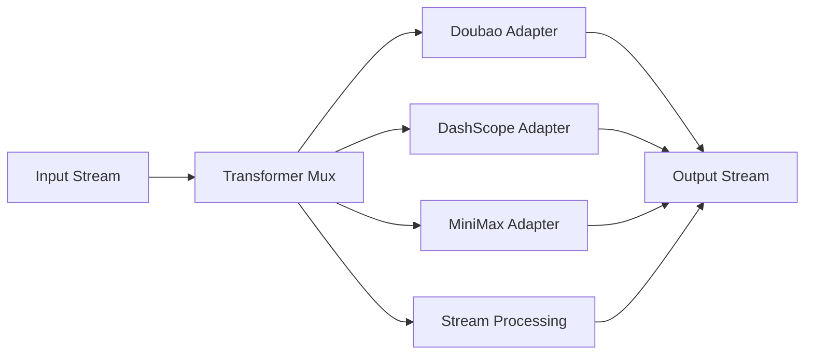

# Transformers Overview

`pkgs/genx/transformers` Converts a `genx.Stream` to another Stream. Provider Adapters are responsible for external speech/realtime protocols; Stream Processing is responsible for provider-neutral TTS normalization, segmentation and combination.

[Go API References](https://pkg.go.dev/github.com/GizClaw/gizclaw-go@v0.0.0-20260707135347-b9bf1fb24b9f/pkgs/genx/transformers)

## Adapter structure

| Adapter | Capabilities |
| --- | --- |
| [Doubao Speech](./doubao) | ASR, TTS, Realtime, Realtime Duplex and speech translation. |
| [DashScope](./dashscope) | Realtime multimodal conversation. |
| [MiniMax](./minimax) | Streaming TTS. |
| [Stream Processing](./stream-processing) | Provider-neutral mux, Stream lifecycle, TTS normalization, and text segmentation. |

Provider implementations and the shared internal Stream lifecycle use independent packages:

```text
pkgs/genx/transformers/
├── internal/streamkit/
├── doubaoasr/
├── doubaotts/
├── minimaxtts/
├── doubaoast/
├── doubaorealtime/
├── doubaorealtimeduplex/
└── dashscoperealtime/
```

Each provider package supplies a typed constructor such as `doubaoasr.New`, `doubaotts.NewSeedV2`, or `minimaxtts.New`. Constructors only resolve immutable configuration and do not connect to the provider; each `Transform(ctx, input)` call creates and owns its provider session. Provider adapters are no longer exposed through flat `transformers.New*` constructors.

ASR, TTS, AST, and Doubao Realtime Dialogue are Stream-to-Stream Transformers, not agent-capable runtimes. Doubao Realtime Duplex and DashScope Realtime are the current provider packages whose protocols can support Toolkit continuation. StreamKit is independent of that classification and never owns tools.



## Core structure and main function

| Symbol | Function |
| --- | --- |
| [`Mux`](https://pkg.go.dev/github.com/GizClaw/gizclaw-go@v0.0.0-20260707135347-b9bf1fb24b9f/pkgs/genx/transformers#Mux) | Universal Transformer registry. |
| [`Transform`](https://pkg.go.dev/github.com/GizClaw/gizclaw-go@v0.0.0-20260707135347-b9bf1fb24b9f/pkgs/genx/transformers#Transform) | Select and execute the Transformer via the default mux. |
| [`Handle`](https://pkg.go.dev/github.com/GizClaw/gizclaw-go@v0.0.0-20260707135347-b9bf1fb24b9f/pkgs/genx/transformers#Handle) | Register a universal Transformer. |

ASR, TTS, Realtime and other capabilities all implement the same `genx.Transformer` and are registered through the same `Mux`. Guide does not define additional facade, session factory, or registry APIs for capability classes.
