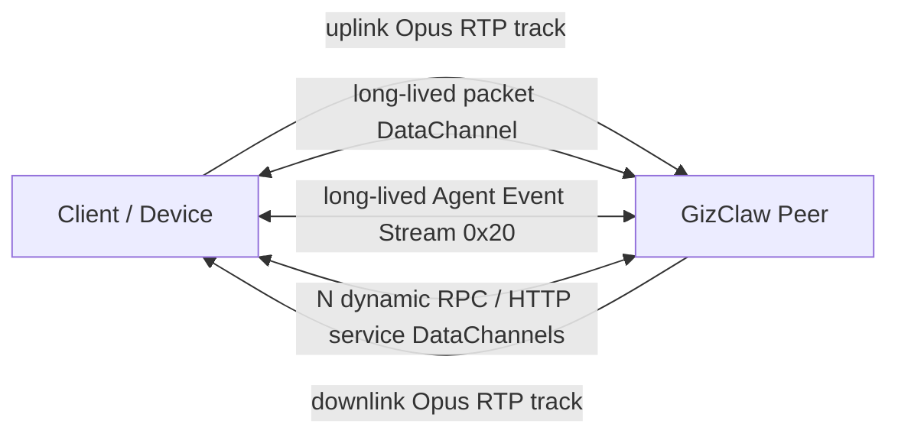

# Connection

`Implementation files: peer_conn.go, peer_conn_openai.go`

`peer_conn` The prefix has the product-level life cycle of a single Peer connection.

| Documentation | Features included |
| --- | --- |
| `peer_conn.go` | `PeerConn` Main life cycle; accept Giznet service and packet; start normal RPC and Edge RPC; initialize audio mixer, Agent Host, Peer GenX and resource view; process event stream, direct packet, telemetry packet and mixed audio output; close connection-scoped resources uniformly. |
| `peer_conn_openai.go` | Provide OpenAI-compatible HTTP service on the current Peer connection; assemble the RuntimeProfile and owner resource view; expose OpenAI API and voice-list compatibility entry points. |

Universal WebRTC, packet transport and service stream belong to `pkgs/giznet`; universal audio codec belongs to `pkgs/audio`; persistent runtime state belongs to `services/runtime`.

## Transport topology inside one Peer connection

A Giznet WebRTC connection does not carry one fixed "data stream." It carries bidirectional media, one long-lived packet DataChannel, an optional long-lived Agent Event Stream, and request-scoped service DataChannels created dynamically.

| Payload | Direction | Lifetime and count | WebRTC carrier | Semantics |
| --- | --- | --- | --- | --- |
| Uplink Opus media | Client / Device → Server | One connection-scoped RTP track | WebRTC audio RTP | Realtime microphone audio. |
| Downlink Opus media | Server → Client / Device | One connection-scoped RTP track | WebRTC audio RTP | Agent playback audio after `MixerOutput` mixing. |
| Direct packet | Bidirectional | One long-lived connection-scoped channel | Unordered, `maxRetransmits=0` DataChannel | A one-byte protocol identifies each packet. Telemetry `0x40` is a high-frequency Client → Server event, not a service stream. The Giznet API exposes Opus as `ProtocolOpusPacket`, but the WebRTC implementation carries it on the RTP tracks above rather than writing it to the packet DataChannel. |
| Agent Event Stream `0x20` | Bidirectional | Opened by the Client and normally kept alive; accepted by the Server and subscribed to the broker | Reliable, ordered service DataChannel | Uplink BOS, EOS, text, and related events enter Agent input. Downlink BOS, EOS, text, and workspace-history updates are broadcast from Agent output. It does not carry realtime Opus payloads. |
| Peer / Edge RPC | Bidirectional | One new stream per round trip, closed on completion or failure; N may exist concurrently | Reliable, ordered service DataChannel | `ServicePeerRPC 0x00` or `ServiceEdgeRPC 0x31`. Unary and server-streaming RPC use RPC frames in the same request-scoped channel; RPC EOS is not an Agent Event Stream `type=eos`. The Server may also open reverse Peer RPC streams to call Client providers. |
| HTTP service | Requester ↔ provider | One dynamically opened service stream per HTTP round trip | Reliable, ordered service DataChannel | Peer HTTP `0x01`, OpenAI-compatible `0x02`, Admin HTTP `0x10`, or Edge HTTP `0x30`. |

Consequently, there is no constant answer to "how many streams are active." A typical connected session with an open Agent Event Stream and no active RPC or HTTP request has two directional audio RTP tracks, one packet DataChannel, and one Event Stream DataChannel on the wire. Every concurrent RPC or HTTP round trip adds one temporary service DataChannel.

BOS and EOS in the Agent Event Stream are business boundaries scoped by `stream_id`. Closing one business stream does not close the Event Stream DataChannel or the Peer connection. A DataChannel EOF, by contrast, terminates that transport stream.

## Core structure and main function

| Symbol | Function |
| --- | --- |
| [`PeerConn`](https://pkg.go.dev/github.com/GizClaw/gizclaw-go@v0.0.0-20260707135347-b9bf1fb24b9f/pkgs/gizclaw#PeerConn) | Holds Giznet connection, PeerService, RPC Server, Agent Host, audio mixer and connection-scoped services. |
| [`PeerConn.CreateAudioTrack`](https://pkg.go.dev/github.com/GizClaw/gizclaw-go@v0.0.0-20260707135347-b9bf1fb24b9f/pkgs/gizclaw#PeerConn.CreateAudioTrack) | Create a track written to the current Peer audio mixer. |
| `serve` | Parallel services Giznet services, direct packets, Agent output and mixed audio. |
| `serveService` | Accept and distribute the Giznet service stream currently opened by Peer. |
| `servePackets` / `serveDirectPackets` | Receive ordinary and direct packets, and distribute telemetry/media. |
| `serveRPC` / `serveEdgeRPC` | Start Peer RPC or Edge RPC service loop. |
| `init` / `initRPC` / `initMixer` / `initAgentHost` / `initPeerGenX` | Assemble connection-scoped runtime dependencies. |
| `serveEvents` / `handleEventStream` | Accept event stream and push Agent input. |
| `processTelemetryPackets` / `handleTelemetryPacket` | Decode telemetry and synchronize Peer status. |
| `streamMixedAudio` | At each 20 ms pacing opportunity, read one frame from the mixed PCM stream, encode Opus once, and write once to the WebRTC audio track. |
| `close` | Close all connection-scoped resources in lifecycle order. |

Before any RPC, HTTP, Event, packet, or audio loop starts, `PeerConn` atomically ensures its durable Peer generation and publishes the exact connection in `Manager`; therefore an immediate `server.register` cannot precede connection activation. When `server.peer.delete` starts, that exact connection enters retiring and its Manager entry enters deleting before the durable mutation runs. New work, registration, and replacement activation for that public key are rejected, while unrelated Peers are not blocked by the store operation. A successful mutation conditionally detaches the same generation; a failed mutation restores it only when it is still current. The current delete RPC transport remains available until the acknowledgement and EOS write attempt finishes. The terminal action closes the full Giznet connection even when the response or EOS write fails.

`streamMixedAudio` is the sole send-pacing owner for generated audio. When an ordinary Go ticker is late, the sender continues with the next frame without dropping, reordering, or batch-replaying PCM and without creating a provider epoch. Pion owns SSRC, RTP sequence numbers, and timestamps for the live WebRTC track; each 20 ms Opus sample advances the 48 kHz RTP clock by 960 ticks, and a new connection starts an independent RTP timeline. Arrival jitter, adaptive playout delay, packet-loss concealment, and Opus FEC belong to the WebRTC receiver.
