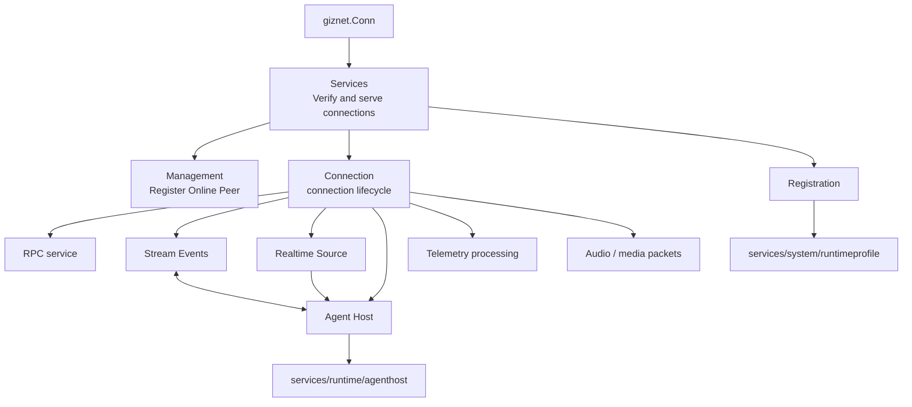

# Peer Runtime

Peer Runtime is responsible for connecting the established `giznet.Conn` to the GizClaw product runtime. Entries are organized by responsibility module; implementation files are only used to locate the code.

## Module

| Module | Responsibilities | Implementation files |
| --- | --- | --- |
| [Management](./manager) | Online Peer, connection replacement, runtime query and device information refresh. | `peer_manager.go` |
| Registration | Resolve a RegistrationToken into a connection-scoped RuntimeProfile snapshot. | `rpc_server.go`, `peer_conn.go` |
| [Connection](./conn) | The service, packet, Agent, telemetry and media life cycle of a single connection. | `peer_conn.go`, `peer_conn_openai.go` |
| [Services](./service/overview) | Provides Admin, Public HTTP, WebRTC and other Giznet services on connection. | `peer_service.go`, `peer_service_*.go` |
| [Agent Host](./agent-host) | Assemble the Agent Host for the current Peer. | `peer_agent_host.go` |
| [Realtime Source](./realtime-source) | Connect Peer realtime input to GenX stream. | `peer_realtime_source.go` |
| [Stream Events](./stream-event) | Convert between Agent chunks, product events, and media packets. | `peer_stream_event.go` |

## Calling relationship

WebRTC, DataChannel and service stream multiplexing belong to `pkgs/giznet`; Peer's persistent resources, route, run state and telemetry aggregation belong to `services/runtime`. Peer Runtime has connection-scoped product wiring.

## Downlink audio pacing

The Peer Mixer produces downlink audio in 20 ms Opus frames. `PeerConn` obtains
and encodes a frame before sending it against an absolute deadline instead of
waiting for a complete frame period after each encode or network write, so
encoding and `Conn.Write` latency do not accumulate into every packet interval.
The first packet is immediate, the next nine intervals use a 15 ms warm-up
period, and later intervals use a 19 ms steady period. This builds about 45 ms
of receiver playback surplus and retains a small amount of clock headroom
during steady delivery.

When a deadline has passed, the pacer sends only the current packet immediately
and re-establishes warm-up deadlines from the current time. The following packet
waits again, so overdue packets cannot form a burst. Tests can inject pacing
ticks into `PeerConn` for deterministic one-tick-per-packet coverage. A real
clock test and Giztest E2E additionally verify that write latency is not
accumulated and measure receiver-side intervals, drift, and buffer surplus.
