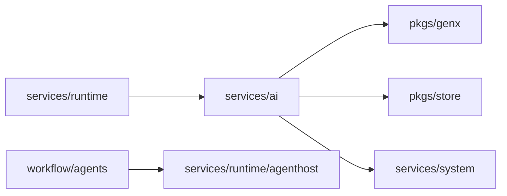

# services/ai

`pkgs/gizclaw/services/ai` Has configurable AI resources and provider integration in GizClaw, including credential, model, voice, workflow and workspace. It organizes these resources into product capabilities that can be consumed by the Agent Runtime, but is not responsible for the online life cycle of the Agent instance.

## Directory structure

```text
services/ai/
├── credential/        # Provider credential resources
├── memorylayout/      # Portable Memory provider-policy resources
├── model/             # Model resources and GenX model resolution
├── openaiapi/         # OpenAI-compatible product service
├── peergenx/          # Peer-backed GenX provider integration
├── providertenants/   # Provider tenant resources and provider-specific configuration
├── voice/             # Voice resources and provider voice resolution
├── workflow/          # Workflow resources and driver selection
│   └── agents/        # concrete workflow agent integrations
└── workspace/         # Workspace resources, runtime stores, and history
```

## Subdirectory responsibilities

### [credential](https://pkg.go.dev/github.com/GizClaw/gizclaw-go@v0.0.0-20260707135347-b9bf1fb24b9f/pkgs/gizclaw/services/ai/credential)

Have the credential resources required to call external AI providers and their persistence boundaries. Credentials are protected product resources and should not leak into workflow definitions, workspace history, or generic GenX abstractions.

### [model](https://pkg.go.dev/github.com/GizClaw/gizclaw-go@v0.0.0-20260707135347-b9bf1fb24b9f/pkgs/gizclaw/services/ai/model)

Owns the GizClaw model catalog and has the ability to parse persistent model definitions into models that GenX can use. The general model interface belongs to `pkgs/genx`; the specific GizClaw model resources and selection logic belong here.

### memorylayout

Owns the connection-free `MemoryLayout` Admin resource. One Layout declares Flowcraft, Mem0, and `volc_mem0` policy together. The RuntimeProfile memory binding selects the concrete driver, endpoint, API key, project, DSN, or directory. See [Memory Store](/en/developing/stores/memory).

### [openaiapi](https://pkg.go.dev/github.com/GizClaw/gizclaw-go@v0.0.0-20260707135347-b9bf1fb24b9f/pkgs/gizclaw/services/ai/openaiapi)

Implements the GizClaw `ai-server-shell/backend` adapter for the supported model, chat, speech, and transcription operations. AI Server Shell owns the standard wire contract and transport; root `pkgs/gizclaw` owns exact route gating, verified Peer binding, and the voices extension.

### [peergenx](https://pkg.go.dev/github.com/GizClaw/gizclaw-go@v0.0.0-20260707135347-b9bf1fb24b9f/pkgs/gizclaw/services/ai/peergenx)

Connect GizClaw peer or provider-backed generation capabilities to the unified GenX abstraction. Provider SDK integration and provider-specific resolution stay here and should not go into generic `pkgs/genx`.

### [providertenants](https://pkg.go.dev/github.com/GizClaw/gizclaw-go@v0.0.0-20260707135347-b9bf1fb24b9f/pkgs/gizclaw/services/ai/providertenants)

Have product resources for each AI provider tenant, such as provider endpoint, account-level configuration, and information required for voice synchronization. It can rely on specific provider SDKs, but it cannot allow provider-specific fields to proliferate into unrelated areas.

Server configuration assigns ProviderTenants one root Store; generic, MiniMax, DeepSeek, and Volc tenant records use code-owned internal scopes. The Credential and Voice capabilities it consumes are supplied by their owning Services instead of repeating their backing Stores under `services.provider_tenants`; the unused legacy `model_store` binding is removed.

### [voice](https://pkg.go.dev/github.com/GizClaw/gizclaw-go@v0.0.0-20260707135347-b9bf1fb24b9f/pkgs/gizclaw/services/ai/voice)

Have voice resources and provider voice mappings available to Agent/GenX for selection. Common capabilities such as Audio codec, resampling and playback belong to `pkgs/audio` and do not belong to the voice catalog.

### [workflow](https://pkg.go.dev/github.com/GizClaw/gizclaw-go@v0.0.0-20260707135347-b9bf1fb24b9f/pkgs/gizclaw/services/ai/workflow)

Owns workflow definition, driver selection, and workflow resource persistence. `workflow/agents` stores the integration between specific workflow engines and GizClaw Agent Host, including Flowcraft, Chatroom, AST Translate, DashScope Realtime, Doubao Realtime, Doubao Realtime Duplex, and Eino.

Workflow describes how to run an Agent, but does not own the online state and stream lifecycle of the Agent instance.

#### Doubao Realtime composition boundary

The Doubao Realtime factory owns product precedence, not provider model-family mapping. A non-empty Workspace `parameters.instructions` replaces the Workflow instruction; the values are never concatenated. The exact canonical Workspace ID is the provider `dialog_id`, so replacing a connection or reloading the same Workspace continues the same provider dialog without separate random runtime metadata. The provider session remains connection-scoped; deleting a Workspace and creating another canonical ID starts a different dialog. The factory passes the resolved instruction, selected RuntimeProfile model, and audio configuration to the immutable GenX transformer. `peergenx` maps the semantic value to `Config.Instructions`; `doubao-speech-go` alone selects O20 `dialog.system_role` or SC20 `dialog.character_manifest`. Exact provider fields remain explicit independent options and `prompt.system` is not a fallback for Workflow instructions.

#### Flowcraft composition boundary

The Flowcraft workflow factory composes flattened `spec.flowcraft.graph`, `conversation`, `max_iterations`, and `voice_adapter` configuration with the Workspace owner's RuntimeProfile aliases, History, State, Memory, and Audio Dock. Workspace `input` defaults to `push-to-talk`, where client audio EOS completes a turn. `realtime` reuses the ASR Transformer's definite-utterance transcript EOS to complete a turn while the outer audio input remains open. An explicit client audio-route EOS finalizes the current ASR provider session, and the next route opens a replacement; continuous audio without a route EOS retains provider VAD segmentation. Audio Dock and Flowcraft preserve and sequentially combine ASR text deltas without reinterpreting provider segmentation. Flowcraft payload does not repeat `id` or `name`; they are derived from Workspace and Workflow metadata.

The public `FlowcraftWorkflowSpec` requires an explicit `graph` with at least one node and an `entry` that names a defined node. In addition to `llm`, inline `script`, and `passthrough`, `memory_recall` and `memory_observe` nodes own Memory consumption and writes. LLM node models and `voice_adapter` ASR, default-voice, and per-node voice values are complete RuntimeProfile aliases. They use the 1-63-byte dot-separated lowercase kebab-case grammar and resolve as exact opaque flat keys without prefix, segment, or fallback lookup. Workflow top-level `memory` is a RuntimeProfile memory alias. Provider extraction, embedding, rerank, lane, and write policy belongs to the referenced `MemoryLayout`, not the Flowcraft payload.

All streams for one Workspace share one Agent instance. The factory constructs or borrows one Store generation for the selected RuntimeProfile binding and uses the Workspace name as AppID. Reload closes the old generation and reconstructs from the new snapshot, but a Layout policy change does not rewrite durable identity or delete canonical facts.

#### DashScope, Doubao Duplex, and Eino boundaries

`dashscope-realtime`, `doubao-realtime-duplex`, and `eino` are persisted Workflow and Workspace drivers. Their factories resolve typed RuntimeProfile Model and Voice aliases and construct the existing GenX Transformers. DashScope requires a DashScope realtime Model; Doubao Duplex requires a Volc `realtime-duplex` Model; Eino resolves each `chat_model` node independently.

Flowcraft and Eino share the same `VoiceAdapter` contract. An Eino Workflow remains text-only when `eino.voice_adapter` is omitted. When present, `asr_model` converts audio input through a RuntimeProfile ASR Model alias, while `default_voice` and `node_voices` synthesize declared `text/plain` Graph outputs through RuntimeProfile Voice aliases. `node_voices` is keyed by the Graph node ID referenced by an output and takes precedence over `default_voice`. Eino Workspace `input` accepts `push-to-talk` or `realtime` and defaults to `push-to-talk`; realtime ASR emits interim transcripts. The factory validates all aliases before constructing the Agent and composes the Eino Transformer with AudioDock, without moving audio behavior into the provider-neutral Eino package.

Eino Graphs consume the same Workflow memory alias through typed `memory_recall` and `memory_observe` nodes. There is no Eino-specific Memory block or Server Config binding. `conversation.starts: agent` enables proactive opening. Workspace conversation parameters select `on_reload` or once when history is empty; concurrent streams permit only one successful claim, a failed opening is retryable, and user input interrupts through the existing interruption path. History remains persistent while Graph state remains invocation-local.

#### Pet composition boundary

The `pet` driver remains in GizClaw only as a domain wrapper. It resolves the Workspace Pet, PetDef, and current Gameplay on every turn and provides transient `tmp_*` Board inputs to the nested Workflow. `spec.pet` uses the same reusable driver plus matching payload shape as an ordinary non-Pet Workflow, including the three new drivers, but cannot select `pet` recursively.

The nested driver owns Graph, conversation, model, voice, and toolkit configuration and is constructed through the normal registered factory. Memory may be configured only once on the outer Workflow; the Pet nested spec rejects another `memory` or driver selection and receives the same already-resolved Store binding. All symbolic references resolve through the system Workspace owner's RuntimeProfile snapshot.

### [workspace](https://pkg.go.dev/github.com/GizClaw/gizclaw-go@v0.0.0-20260707135347-b9bf1fb24b9f/pkgs/gizclaw/services/ai/workspace)

Has workspace resources, workspace runtime storage and history. The Workspace is the persistence boundary for instantiating the Agent environment; the running Agent, input and output, and connection streams are the responsibility of the Runtime domain.

Workspace configuration explicitly assigns one resource Store and one asset ObjectStore. Workflow lookup is supplied by the Workflow Service instead of repeating its backing Store under `services.workspace`.

Workspace also owns the immutable `system` lifecycle classification. Generic creation stores `system: false`; domain-owned creation stores `system: true` together with one immutable `owner_public_key`. Generic put may change only a Chatroom system Workspace's input mode; it rejects changes to the owner, Workflow, domain mode, history/transcript policy, labels, or toolkit, and Pet system Workspaces therefore have no mutable execution configuration. Generic delete always rejects system Workspaces. Deleting a user Workspace atomically creates or reuses one `kind=workspace` PendingDeletion and immediately rejects selection, runtime, history/icon access, and mutations for that Workspace; Admin Workspace get/list can still inspect the retained record. The production handler quiesces runtime, removes exact Gameplay/History/runtime/icon/object/filesystem artifacts, verifies absence, and atomically removes the Workspace, indexes, and mutable task state. The internal system lifecycle surface remains restricted to the owning Social or Gameplay service; Social relationship or Peer retirement creates the same handoff for selected system Workspaces.

Background consumers resolve a retained Workspace through `GetAvailableWorkspaceByID`, which preserves the exact Workspace or owner `PendingDeletion` error instead of treating the Admin projection as runnable state. Once physical cleanup has removed the canonical Workspace record, the same boundary returns a Workspace-owned deleted terminal result rather than exposing a raw Store not-found. Runtime and background Memory resolution use this availability gate; Admin get/list intentionally remain diagnostic views of retained rows.

## Dependencies and boundaries



Should be placed at `services/ai`:

- Product resources for AI provider, credential, model, voice, workflow and workspace.
- Provider integration and GizClaw-specific GenX resolution.
- Adaptation of Workflow engine and GizClaw Agent Runtime.

Shouldn't be placed here:

- Generic GenX interface, audio codec or transport.
- Agent instance, peer connection and online operation life cycle.
- Provider credential plain text log or cross-domain replication.
- Wiring codes that belong only to the Admin/Peer HTTP route registration.
