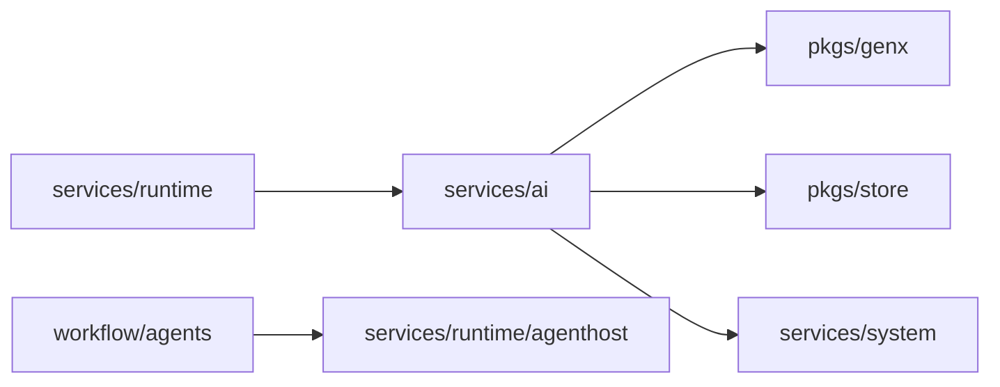

# services/ai

`pkgs/gizclaw/services/ai` Has configurable AI resources and provider integration in GizClaw, including credential, model, voice, workflow and workspace. It organizes these resources into product capabilities that can be consumed by the Agent Runtime, but is not responsible for the online life cycle of the Agent instance.

## Directory structure

```text
services/ai/
├── credential/        # Provider credential resources
├── memorylayout/      # Portable Memory provider-policy resources
├── model/             # Model resources and GenX model resolution
├── openaiapi/         # OpenAI-compatible product service
├── peergenx/          # Peer-backed GenX provider integration
├── providertenants/   # Provider tenant resources and provider-specific configuration
├── voice/             # Voice resources and provider voice resolution
├── workflow/          # Workflow resources and driver selection
│   └── agents/        # concrete workflow agent integrations
└── workspace/         # Workspace resources, runtime stores, and history
```

## Subdirectory responsibilities

### [credential](https://pkg.go.dev/github.com/GizClaw/gizclaw-go@v0.0.0-20260707135347-b9bf1fb24b9f/pkgs/gizclaw/services/ai/credential)

Have the credential resources required to call external AI providers and their persistence boundaries. Credentials are protected product resources and should not leak into workflow definitions, workspace history, or generic GenX abstractions.

Credential uses the local SQL `credentials` table. ID, Provider, description, timestamps, revision, and creation identity have separate columns; secret configuration remains JSON. The table and `(provider, id)` index are initialized at startup, and Provider filtering and pagination run directly in SQL. Updates compare revision and creation identity. When a request omits the secret, conflict retries reread the latest configuration so concurrent secret rotation is preserved. Recreated records or persistent contention reject the old update with `CREDENTIAL_CONFLICT`.

### [model](https://pkg.go.dev/github.com/GizClaw/gizclaw-go@v0.0.0-20260707135347-b9bf1fb24b9f/pkgs/gizclaw/services/ai/model)

Owns the GizClaw model catalog and has the ability to parse persistent model definitions into models that GenX can use. The general model interface belongs to `pkgs/genx`; the specific GizClaw model resources and selection logic belong here.

Model uses the local SQL `models` table. ID, model kind, source, Provider kind and ID, display fields, and timestamps have separate columns; Provider configuration remains JSON. Tables and source/Provider indexes are initialized at startup. Lists apply the cursor, all filters, ordering, and limit in SQL and fetch complete records in one query. Updates preserve creation and synchronization timestamps, conditionally reject synchronized models, and cannot recreate deleted records.

Volc Ark `chat_completions` Models accept an optional `provider_data.service_tier`: `fast` requests low-latency inference, `auto` prefers a TPM guarantee package, `default` uses regular inference, and `flex` uses lower-priority inference. Omitting the field leaves the upstream default unchanged. Resource validation rejects invalid values and use outside `kind: llm`, `provider.kind: volc-tenant`, and `api_mode: chat_completions`. Streaming generation and structured `Invoke` both send the tier, including through the audio-input adapter.

```yaml
apiVersion: gizclaw.admin/v1alpha1
kind: Model
metadata:
  id: doubao-fast
spec:
  kind: llm
  source: manual
  provider:
    kind: volc-tenant
    id: volc-main
  provider_data:
    upstream_model: doubao-seed-2-0-lite-260215
    api_mode: chat_completions
    service_tier: fast
```

Enable low-latency service for the selected model and inference endpoint in the Volc console. See the [official low-latency inference documentation](https://docs.volcengine.com/docs/ark/online-inference-low-latency?lang=zh) for supported models. Ark can fall back to regular inference when fast limits or traffic protection are triggered; `fast` does not guarantee low-latency resources for every request.

### memorylayout

Owns the connection-free `MemoryLayout` Admin resource. One Layout declares Mem0 Cloud, self-hosted Mem0, and `volc_mem0` policies. The RuntimeProfile memory binding selects the driver, endpoint, API key, and project. See [Memory Store](/en/developing/stores/memory).

### [openaiapi](https://pkg.go.dev/github.com/GizClaw/gizclaw-go@v0.0.0-20260707135347-b9bf1fb24b9f/pkgs/gizclaw/services/ai/openaiapi)

Implements the GizClaw `ai-server-shell/backend` adapter for the supported model, chat, speech, and transcription operations. AI Server Shell owns the standard wire contract and transport; root `pkgs/gizclaw` owns exact route gating, verified Peer binding, and the voices extension.

### [peergenx](https://pkg.go.dev/github.com/GizClaw/gizclaw-go@v0.0.0-20260707135347-b9bf1fb24b9f/pkgs/gizclaw/services/ai/peergenx)

Connect GizClaw peer or provider-backed generation capabilities to the unified GenX abstraction. Provider SDK integration and provider-specific resolution stay here and should not go into generic `pkgs/genx`.

### [providertenants](https://pkg.go.dev/github.com/GizClaw/gizclaw-go@v0.0.0-20260707135347-b9bf1fb24b9f/pkgs/gizclaw/services/ai/providertenants)

Have product resources for each AI provider tenant, such as provider endpoint, account-level configuration, and information required for voice synchronization. It can rely on specific provider SDKs, but it cannot allow provider-specific fields to proliferate into unrelated areas.

ProviderTenants uses the local SQL `provider_tenants` table with a composite `(provider_kind, id)` primary key, allowing independent IDs across all six Provider kinds. Credential ID, description, creation/update timestamps, and synchronization time have separate columns; Provider configuration remains JSON. Startup creates the table and credential lookup index. Lists apply Provider scope, ID cursor, and limit in SQL. Configuration updates preserve creation and synchronization timestamps. Sync completion updates only synchronization metadata and checks configuration identity to avoid modifying an updated or recreated tenant. Credential and Voice capabilities come from their respective business services.

### [voice](https://pkg.go.dev/github.com/GizClaw/gizclaw-go@v0.0.0-20260707135347-b9bf1fb24b9f/pkgs/gizclaw/services/ai/voice)

Have voice resources and provider voice mappings available to Agent/GenX for selection. Common capabilities such as Audio codec, resampling and playback belong to `pkgs/audio` and do not belong to the voice catalog.

Voice uses the local SQL `voices` table, with separate source, Provider kind and ID, upstream voice ID, display fields, and timestamps; Provider configuration remains JSON. Lists use indexes for the selected filters and ID range. Synchronization locks the target Provider within one transaction, writes batches of 64 while preserving existing IDs and creation timestamps, then removes synchronized voices missing from that batch generation. Manual voices are preserved. Any batch failure rolls back the entire synchronization. Tables and indexes are initialized at startup; legacy voice fields are not read.

### [workflow](https://pkg.go.dev/github.com/GizClaw/gizclaw-go@v0.0.0-20260707135347-b9bf1fb24b9f/pkgs/gizclaw/services/ai/workflow)

Owns workflow definition, driver selection, and workflow resource persistence. `workflow/agents` stores the integration between specific workflow engines and GizClaw Agent Host, including SFU, AST Translate, DashScope Realtime, Doubao Realtime, Doubao Realtime Duplex, and Eino.

Workflow uses the local SQL `workflows` table, with separate ID, driver, and configuration JSON columns, through the Server database connection pool. The table is initialized at startup. Lists apply the ID range, limit, and built-in exclusion in SQL. Updates affect existing records only, and deletes atomically return the removed record, preventing concurrent updates from recreating a deleted Workflow. The built-in SFU Workflow is materialized idempotently at startup and retains its Admin create, update, and delete restrictions.

Workflow describes how to run an Agent, but does not own the online state and stream lifecycle of the Agent instance.

#### Doubao Realtime composition boundary

The Doubao Realtime factory owns product precedence, not provider model-family mapping. A non-empty Workspace `parameters.instructions` replaces the Workflow instruction; the values are never concatenated. The exact canonical Workspace ID is the provider `dialog_id`, so replacing a connection or reloading the same Workspace continues the same provider dialog without separate random runtime metadata. The provider session remains connection-scoped; deleting a Workspace and creating another canonical ID starts a different dialog. The factory passes the resolved instruction, selected RuntimeProfile model, and audio configuration to the immutable GenX transformer. `peergenx` maps the semantic value to `Config.Instructions`; `doubao-speech-go` alone selects O20 `dialog.system_role` or SC20 `dialog.character_manifest`. Exact provider fields remain explicit independent options and `prompt.system` is not a fallback for Workflow instructions.

#### Eino composition boundary

The Eino factory constructs a typed Graph from `spec.eino.graph` and binds the Workspace owner's Model, Voice, and Memory aliases, SQL State, internal History, and Audio Dock. `state_persistence.fields` explicitly selects fields; `services.agent_host.persistence.state_store` and `history_store` select SQL and mutable Log. MemoryLayout owns provider policy while Graph owns Recall/Observe and direct Fact mappings. Workspace metadata supplies stable Agent identity; complete RuntimeProfile aliases resolve as exact opaque flat keys.

#### DashScope, Doubao Duplex, and Eino boundaries

`dashscope-realtime`, `doubao-realtime-duplex`, and `eino` are persisted Workflow and Workspace drivers. Their factories resolve typed RuntimeProfile Model and Voice aliases and construct the existing GenX Transformers. DashScope requires a DashScope realtime Model; Doubao Duplex requires a Volc `realtime-duplex` Model; Eino resolves each `chat_model` node independently.

Eino's `VoiceAdapter` configures reply Voices. The RuntimeProfile Workflow binding selects external input ASR independently through `ptt_asr_model` and `realtime_asr_model`; legacy `eino.voice_adapter.asr_model` is accepted but ignored. Workspaces cannot override the selection, and business Graphs declare no `audio_transcript` flag.

Without PTT ASR, the factory selects native audio capability from the bound `chat_model` Models. One audio-capable Model resource is selected automatically, including multiple aliases for that resource. Text-only Models do not participate. Distinct audio-capable resources are ambiguous and fail reload; the Profile must bind a consistent input Model.

For Graphs with leading Scripts, Memory or control logic, the runtime first obtains the current transcription from that same audio Model after PTT EOS, then executes the original Graph. `input.text` and `input.messages` contain the current utterance, preserving text-turn semantics for Recall, Observe and History. Transcription inherits no business prompts, history, Tools or CoT, and starts no unused reply request. Failure or cancellation prevents Graph execution; an empty transcript ends the turn without a reply. Simple Graphs containing only Prompts and one ChatModel, with no `input.text` binding, pass audio directly to the ChatModel and retain parallel transcription and reply. The runtime derives both integrations without Workflow configuration.

Volc `chat_completions` Models enable the Doubao chat audio adapter with `support_text_only: false`; see [OpenAI Adapter](/en/developing/genx/generators/openai#doubao-audio-input). A text-only Model without Profile ASR still accepts text; nonempty user audio produces a non-retryable `EINO_AUDIO_INPUT_UNSUPPORTED` assistant EOS.

`default_voice`, `node_voices` and `speaker_voices` continue synthesizing replies through RuntimeProfile Voice aliases. `node_voices` is keyed by the Graph node ID referenced by an output and takes precedence over `default_voice`. The factory validates Voices before constructing an Agent and composes ASR, Eino and TTS through AudioDock.

`admin validate` runs both Schema and Eino semantic validation, including items inside ResourceList; resource availability is still checked by RuntimeProfile and the factory.

First-response latency is a property of the complete RuntimeProfile selection, not only the Eino driver. A release must qualify the exact chat Model, ASR Model, Voice, tenant, endpoint, and resource revisions through both Server and Edge. GizClaw does not silently retry, substitute, or race Providers when a selected Model misses a latency target. The E2E reference Profile selects `doubao-lite-chat` for text `llm` and `script-judge`, and `doubao-lite-audio-chat` for `audio-llm`. Both use upstream `doubao-seed-2-1-lite-260915`, request `service_tier: fast`, and disable thinking by default. Requesting fast does not establish the actual tier: the live low-latency Giztest verifies the upstream tier echo, and the first-response matrix verifies latency. Changing an alias or upstream revision requires rerunning these acceptance checks.

Eino Graphs consume the same Workflow memory alias through typed `memory_recall` and `memory_observe` nodes. There is no Eino-specific Memory block or Server Config binding. `conversation.starts: agent` enables proactive opening. Workspace conversation parameters select `on_reload` or once when history is empty; concurrent streams permit only one successful claim, a failed opening is retryable, and user input interrupts through the existing interruption path. History remains persistent while Graph state remains invocation-local.

#### Eino audio input path

Workspace `input` is `push-to-talk` (default) or `realtime`. It selects which ASR Model to read from the Profile binding:

| Input mode | Profile field | Configured alias | Omitted or null |
| --- | --- | --- | --- |
| PTT | `spec.workflows.<alias>.ptt_asr_model` | External ASR → text → Model. | Audio directly to the Model. |
| Realtime | `spec.workflows.<alias>.realtime_asr_model` | Streaming ASR segmentation → text → Model. | Audio directly to the Model. |

`agenthost` resolves the owner's Profile and puts the selected alias in internal `Spec.ASRModel`. Factories do not read Workflow ASR configuration. There is no Workspace precedence or automatic fallback. Invalid ASR aliases, Model kinds or construction errors fail reload.

Eino's native Lite audio path currently handles complete PTT recordings, not continuous realtime audio. Such bindings must configure `realtime_asr_model` to run realtime. The Doubao Realtime driver keeps the Model's native audio input, and the same Profile settings can prepend external ASR to use the Model's text input. Both ASR modes disable duplicate pacing. Realtime additionally requests interim transcription, `end_window_size=200`, and `force_to_speech_time=1000`.

Eino reports its effective `asr` or `model` path through `PeerRunWorkspaceState.audio_input`. This is read-only run state and cannot be submitted as a Workspace parameter. Text-only Agents and other drivers do not report it. Giztest `eino-audio-input.path-selection` verifies independent mode and Profile selection for the same Workflow.

#### Speaker segments within one response

Eino accepts `voice_adapter.speaker_voices`, mapping exact speaker names to RuntimeProfile Voice aliases. Names must be nonblank and contain neither `【` nor `】`. Aliases follow existing naming rules and must exist in `resources.voices`. Offline `admin validate` checks syntax; RuntimeProfile checks references.

```yaml
voice_adapter:
  default_voice: story.narrator
  speaker_voices:
    旁白: story.narrator
    孙悟空: story.wukong
    唐僧: story.tangseng
```

For `【旁白】山路很静。【孙悟空】师父小心！【唐僧】悟空莫急。`, device text omits configured markers and audio follows the three voices in order. Marker prefixes split across chunks are buffered; ordinary text is forwarded immediately without waiting for TTS. Unknown names and other brackets remain literal and restore the output's original node/default voice selection. Text before the first marker uses that selection too.

Segment inputs remain ordered. The next segment may synthesize while the current segment emits audio; output is serialized into one stream. Consecutive markers selecting the same voice reuse their session, and empty segments produce no audio. User interruption cancels current, prefetched and queued segments. An omitted or empty mapping preserves existing behavior. Prefetch hides synthesis latency when text generation and provider throughput allow continuous playback.

All segments of one reply share one audio route, and device mixers decode each audio MIME type on a route as a separate track, so a mid-reply MIME change would play segments out of order. When `speaker_voices` is non-empty, the voice adapter therefore requests `format=ogg_opus` (`peergenx.SegmentVoiceFormat`) from every Voice that can speak in the reply — speaker, node and default Voices alike — overriding each Voice's `provider_data.format`. Volc and MiniMax Voices both stream it as `audio/ogg`, so narrator and character Voices from different providers work without per-Voice format overrides. Workflow replies use `ogg_opus` as the default format for every built-in Voice provider as well; MiniMax offers no Opus container, so it requests 16 kHz mono PCM and encodes Ogg/Opus locally. Outside multi-voice replies a Voice's `provider_data.format` still applies, and the speech synthesis API still selects the media type its caller accepts. If a TTS provider still returns a different audio MIME type for a later segment, AudioDock ends that reply's audio with an error naming both MIME types instead of mixing them.

#### SFU composition boundary

`sfu` is the provider-neutral SFU Workspace driver; LiveKit is its first connector implementation (`workflow/agents/sfu`). It serves only the built-in `system-sfu` Workflow of Friend and Friend Group: the payload is an empty object, Workspace `parameters` is always null, and the driver resolves no RuntimeProfile alias and attaches no History, Memory, Tool, or ASR. The resource model, binding, activation, and revocation flows are owned by [services/social](/en/developing/gizclaw/services/social#sfu-workspace).

The Factory holds the Server-level `services.sfu` credentials and a `BindingResolver`. Each Workspace has one shared Agent per Server; every Transform attaches the calling Peer to the Room as one LiveKit participant whose identity is the Peer public key, and the Transform context owns that attachment. Before attaching, the session verifies authoritative membership through the `BindingResolver`; `ErrNotMember`, `ErrRevoked`, and `ErrNotBound` all fail closed, and a failed connect is reported as a reload failure.

Uplink: a GenX `audio/opus` chunk carries one raw Opus frame, and the session writes it frame by frame to a local 48 kHz Opus track without decoding or re-encoding. The session splits the uplink into talk utterances (opened by the first voiced frame, closed by the Device EOS or `talk_hangover`) and publishes BOS/EOS for them on the Room's reliable data channel under topic `gizclaw.sfu.talk`; Device BOS/EOS never create or destroy the Room or disconnect the participant.

Downlink: the session keeps a floor driven by the remote utterances announced on the data channel and forwards only the holder's Opus packets (through the RTP reorder buffer); every other participant's packets are dropped and counted, and nothing is forwarded while this Peer is talking (half-duplex). Forwarded packets are marked with `agenthost.OpusPassthroughMIME` (`audio/opus; passthrough=1`), use a fresh `stream_id` per floor hold and the participant identity as `label`; `MixerOutput` never decodes them and `PeerConn` writes each payload straight to the Device's Opus track. The floor is released by the holder's EOS, by `floor_idle` without a voiced packet, by the holder's track being muted or unsubscribed, by the holder leaving, or by this Peer starting to talk, and the earliest still-open remote utterance takes over; those events close only that route, never the whole Workspace output. The rules are detailed in [services/social](/en/developing/gizclaw/services/social#media-and-downlink).

Lifecycle: a network error or SFU restart triggers exponential-backoff reconnection that fails once `reconnect_timeout` elapses; while reconnecting, uplink frames are dropped, the floor is released and remote utterances are forgotten (they are learned again from their next BOS). A LiveKit disconnect caused by the same identity joining from another Server (`DuplicateIdentity`) is a normal termination without reconnect. The session re-reads its binding every `recheck_interval` and stops forwarding with `ErrRevoked` as soon as the generation changes, the membership is gone, or the resolver errors. Cancelling the Transform context (Workspace switch, Peer disconnect, revocation, Server shutdown) takes the same teardown: stop consuming GenX input, stop writing the track, close remote readers, disconnect the participant, and close the output Stream.

### [workspace](https://pkg.go.dev/github.com/GizClaw/gizclaw-go@v0.0.0-20260707135347-b9bf1fb24b9f/pkgs/gizclaw/services/ai/workspace)

Has workspace resources, workspace runtime storage and history. The Workspace is the persistence boundary for instantiating the Agent environment; the running Agent, input and output, and connection streams are the responsibility of the Runtime domain.

Workspace configuration explicitly assigns one resource Store, one mutable History LogStore, one History asset ObjectStore, and one general asset ObjectStore. Workflow lookup is supplied by the Workflow Service instead of repeating its backing Store under `services.workspace`. History text and structured metadata are written to `services.workspace.history_store`; binary replay assets such as audio are written only to `services.workspace.history_assets_store` and referenced by name from the History record. The two History Stores independently declare the same positive `ttl` (the shipped configuration uses `720h`), and startup rejects missing or unequal values. Their drivers filter expired data; Workspace does not calculate per-record or per-object deadlines. Server periodically reclaims fully expired PostgreSQL History day partitions even without new writes. See [LogStore](/en/developing/stores/logstore) for the concurrent write and missing-partition paths.

Workspace also owns the immutable `system` lifecycle classification. Generic creation stores `system: false`; domain-owned creation stores `system: true` together with one immutable `owner_public_key`. Generic put may change only a system Workspace's input mode; it rejects changes to the owner, Workflow, domain mode, history/transcript policy, labels, toolkit, or other driver parameters. Generic delete always rejects system Workspaces. Deleting a user Workspace atomically creates or reuses one `kind=workspace` PendingDeletion and immediately rejects selection, runtime, history/icon access, and mutations for that Workspace; Admin Workspace get/list can still inspect the retained record, while Peer owner-index enumeration skips it so one unfinished asynchronous deletion cannot fail the whole listing. The production handler quiesces runtime, purges the Workspace's long-term memory in its current memory binding (see [Memory Store](/en/developing/stores/memory#memorylayout-runtimeprofile-and-workflow)), removes exact History/runtime/icon/object/filesystem artifacts, verifies that memory and artifacts are absent, and atomically removes the Workspace, indexes, and mutable task state; residual memory returns retryable `memory_residual`, and the retry purges again. The internal system lifecycle surface remains restricted to the owning Social service; Social relationship or Peer retirement creates the same handoff for selected system Workspaces.

Background consumers resolve a retained Workspace through `GetAvailableWorkspaceByID`, which preserves the exact Workspace or owner `PendingDeletion` error instead of treating the Admin projection as runnable state. Once physical cleanup has removed the canonical Workspace record, the same boundary returns a Workspace-owned deleted terminal result rather than exposing a raw Store not-found. Runtime and background Memory resolution use this availability gate; Admin get/list intentionally remain diagnostic views of retained rows.

Ordinary Workspace creation is Peer-owned. Admin `PUT` updates an existing Workspace and Admin apply rejects Workspace resources, including nested `ResourceList` entries, before mutating any item. Peer RPC and OpenAI Conversation creation share the typed domain operation that resolves a RuntimeProfile Workflow alias, assigns the authenticated owner, prepares the runtime, runs an optional pre-publication initializer, and rolls back on failure.

One OpenAI Conversation maps one-to-one to one user Workspace. Text execution against a Workspace bound to the `sfu` driver is rejected explicitly because that Workspace has no Agent that can execute text input. History remains the sole transcript store; OpenAI item records contain only stable IDs, role/status/order, and exact History correlation. Conversation metadata, item indexes, immutable Response input snapshots, and Response lifecycle records share the Workspace runtime prefix and are therefore removed by normal Workspace cleanup.

Tenant retirement first deletes the observed incarnation within a SQL transaction and holds its lifecycle lock until voice cleanup completes. A stale request encountering a replacement fails before touching voices. When tenant and Voice services share a pool, voice removal joins that transaction, rolls back with it, and does not borrow a second connection. With separate databases, voice cleanup commits independently and is retryable while the tenant transaction prevents a same-ID replacement; this configuration does not provide cross-database atomic commit.

After fetching upstream voices, synchronization validates and locks the observed tenant incarnation before publishing voices or synchronization metadata. Shared pools use one transaction; separate pools hold the tenant row lock through the voice commit, in the same lock order as deletion. Configuration PUT atomically rotates the internal incarnation token. An updated, retired, or replaced tenant snapshot cannot publish voices. Workspace history activity timestamps remain monotonic; deleted or pending-deletion records return a conflict instead of reporting a skipped update as successful.

## Dependencies and boundaries


```mermaid
flowchart LR
    Runtime["services/runtime"] --> AI["services/ai"]
    AI --> GenX["pkgs/genx"]
    AI --> Store["pkgs/store"]
    AI --> System["services/system"]
    Workflow["workflow/agents"] --> AgentHost["services/runtime/agenthost"]
```

Should be placed at `services/ai`:

- Product resources for AI provider, credential, model, voice, workflow and workspace.
- Provider integration and GizClaw-specific GenX resolution.
- Adaptation of Workflow engine and GizClaw Agent Runtime.

Shouldn't be placed here:

- Generic GenX interface, audio codec or transport.
- Agent instance, peer connection and online operation life cycle.
- Provider credential plain text log or cross-domain replication.
- Wiring codes that belong only to the Admin/Peer HTTP route registration.

Workspace creation registers and drains in-flight work per owner. Runtime preparation and caller initialization run outside the coordinator mutex; retirement closes only the target owner's admission and waits for that owner's creations before snapshotting. MemoryLayout updates and deletes are atomic SQL statements, without service-level read-modify-write locks.

MemoryLayout uses the `memory_layouts` business table with an ID primary key and separate JSON columns for Mem0 Cloud, self-hosted Mem0, and VolcMem0 policy; the unexposed historical policy column retains archived data verbatim. It stores neither Memory content nor runtime connections. Server startup initializes the schema using the configured SQL pool. Lists use ID range queries and SQL limits. Atomic updates replace only an existing row and cannot recreate a concurrently deleted layout; service-level read-modify-write locks are unnecessary.

## Hourly Peer usage

Optional `services.peer_usage.store` binds a SQL pool to hourly provider model/resource quantities. Shared SQL day maintenance and a worker drain before pool closure implement retention and lifecycle. See [Peer usage](/en/developing/gizclaw/services/runtime/peerusage).
