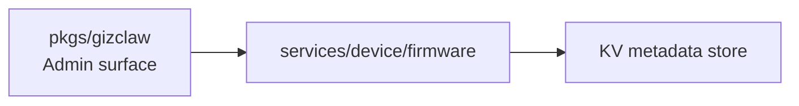

# services/device

`pkgs/gizclaw/services/device` saves server resources owned by the device domain. Currently, the directory only has `firmware/`, which is responsible for the Firmware catalog and OTA channel configuration.

## Directory structure

```text
services/device/
└── firmware/    # Firmware metadata and external channel packages
```

## firmware

`firmware` owns:

- Firmware catalog and channel metadata.
- Validation and persistence of each channel's HTTPS `.tar.zlib` URL, SHA-256, and archive size.
- Release and rollback transitions across pending, stable, and beta slots.

It does not own device connections, peer registration, runtime status, or telemetry. What transport is the device connected through, whether it is currently online, and what status is reported, which belongs to the root peer connection and `services/runtime`.

## Dependencies and boundaries



Should be placed at `services/device/firmware`:

- Domain rules for Firmware and channels.
- External package metadata and release/rollback behavior.
- Validation of firmware configuration as untrusted input.

Shouldn't be placed here:

- WebRTC connection, device signaling or telemetry transport.
- Peer identity, RegistrationToken, or generic resource ownership.
- Board-specific flash, bootloader or firmware implementation.
- Package download, proxy, unpacking, or binary storage.
- Creation of CLI storage backend and filesystem root.

When adding device domain services in the future, you should first confirm whether it has independent resources and life cycle before deciding to add `services/device/<service>`. Do not put all device-related logic into `firmware/`.
