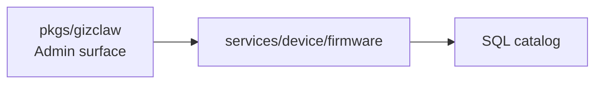

# services/device

`pkgs/gizclaw/services/device` saves server resources owned by the device domain. Currently, the directory only has `firmware/`, which is responsible for the Firmware catalog and OTA channel configuration.

## Directory structure

```text
services/device/
└── firmware/    # Firmware metadata and external channel packages
```

## firmware

`firmware` owns:

- Firmware catalog and channel metadata.
- Validation and persistence of each channel's HTTPS `.tar.zlib` URL, SHA-256, and archive size.
- Complete replacement and strict validation of stable, beta, and develop slots.

It does not own device connections, peer registration, runtime status, or telemetry. What transport is the device connected through, whether it is currently online, and what status is reported, which belongs to the root peer connection and `services/runtime`.

## Dependencies and boundaries



Should be placed at `services/device/firmware`:

- Domain rules for Firmware and channels.
- Declarative external package metadata for stable, beta, and develop.
- Validation of firmware configuration as untrusted input.

Shouldn't be placed here:

- WebRTC connection, device signaling or telemetry transport.
- Peer identity, RegistrationToken, or generic resource ownership.
- Board-specific flash, bootloader or firmware implementation.
- Package download, proxy, unpacking, or binary storage.
- Creation of CLI storage backend and filesystem root.

When adding device domain services in the future, you should first confirm whether it has independent resources and life cycle before deciding to add `services/device/<service>`. Do not put all device-related logic into `firmware/`.

The Firmware catalog uses the `firmwares` business table. ID is the primary key; description and creation/update timestamps have separate columns, while channel configuration remains JSON. Server startup initializes the schema using the configured shared SQL pool; requests never execute DDL. Lists use ID range queries and SQL limits, and updates/deletes use `RETURNING` without KV enumeration.

Package `version` is required on create, put and resource apply: strict SemVer 2.0.0 of at most 128 ASCII characters, including prerelease/build metadata, without a leading `v`, whitespace or illegal numeric leading zeros. Rejected writes preserve the stored configuration. The shared package schema and SDK models make version optional because reads also serve stored packages without versions: Admin get/list/resource show, device HTTP and RPC continue to return the package and omit `version`. Reading never backfills or infers a version. Updating such a package requires its real version; deletion remains supported. A present but invalid stored version remains an internal error, and deletion rolls back if returned-record validation fails. Empty channels may omit package. Channels may select lower versions for rollback; build metadata does not affect SemVer precedence, and SHA-256 identifies exact archive bytes.
