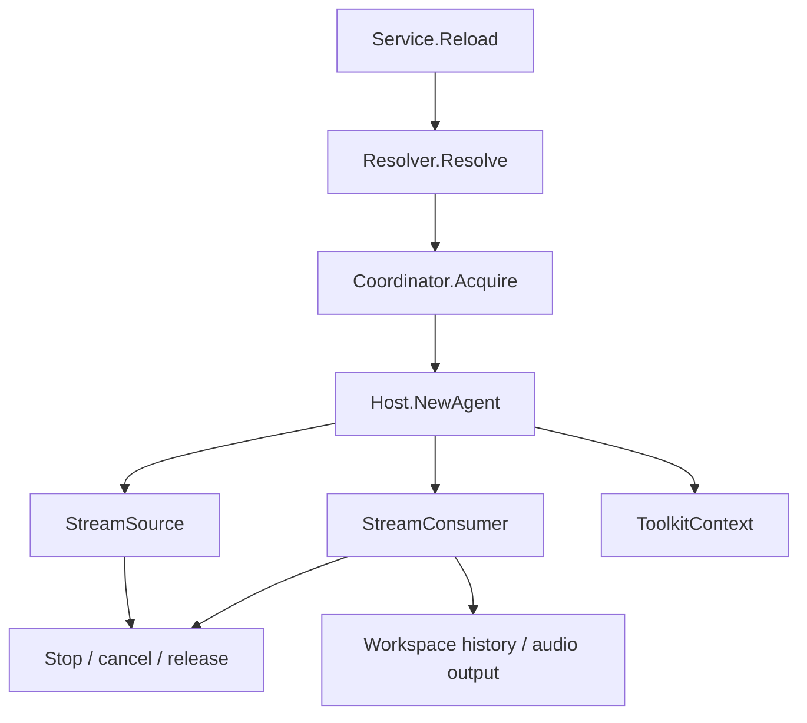

# Agent Host

[Go API Reference](https://pkg.go.dev/github.com/GizClaw/gizclaw-go/pkgs/gizclaw/services/runtime/agenthost)

`agenthost` Owns the online life cycle of Agent instance. It parses running specifications, obtains workspace lease, creates input and output streams, accesses history and ToolKit, and maintains the current runtime registry.

## Run process

## Core structure and main function

| Structure or function | Function |
| --- | --- |
| `Service.Reload` | Stop the old runtime and create a new runtime based on the current Peer run selection. |
| `Service.Status` / `Stop` | Query or terminate the current Agent runtime. |
| `Service.SetRunAgent` | Persist a pending Peer selection through the same transition boundary as reload and stop; only a selection that changes the active workspace advances the runtime revision. |
| `Service.RuntimeRevision` / `PushInputIfCurrentRevision` / `ReloadAndPushInputIfCurrentRevision` | Let connection-scoped input write or atomically recover-and-write only when it still belongs to the current stable runtime revision. |
| `Service.WorkspaceState` | Returns the running status of the current workspace. |
| `RuntimeRegistry` | Maintain the current online runtime. |
| `Coordinator` / `MemoryCoordinator` | Provide an exclusive lease for the workspace. |
| `Host` / `Registry` | Select and create an Agent based on the parsed `Spec`. |
| `InputStream` / `PushSource` | Convert continuous input into a GenX Stream consumed by the Agent. |
| `MixerOutput` | Decode Agent audio into PCM on one mixer track per `(StreamID, canonical MIME)`; MIME EOS closes only that track, while control-only EOS closes every track on the route. |
| `ToolkitContext` | ToolKit after authorization for a runtime combination. |

All runtime creation paths must have symmetric cancel, stream close, lease release, and registry cleanup. The persistence of Agent definition, Workflow, and Workspace still belongs to AI services.

Each `Service` serializes selection writes, reload, stop, and each Realtime input push for its one Peer. A transition changes the runtime revision before and after lifecycle work; only a selection that changes the active workspace is a revision-changing transition. A Realtime chunk samples that revision before it can wait behind another input write, then enters the runtime transition gate before its per-input queue, so a later workspace selection cannot overtake it. A chunk that observes a changed or in-progress revision is stale and is discarded instead of reopening or entering the new workspace. Input recovery reloads and writes the original chunk while one unchanged, stable revision remains gated. A pending selection suppresses recovery only when it changes the current workspace, so a same-workspace selection can still restore an inactive source. This boundary does not serialize unrelated Peers or replace the shared `RuntimeRegistry` ownership of workspace agents.

`RuntimeRegistry` reuses one constructed Agent per Workspace and returns an independent release function for every attachment. Reloading one Peer releases only that reference; remaining users keep the same Agent without interruption or repeated initiative. The final release removes the Agent, closes factory-owned per-Agent adapters, and releases the Workspace lease. Construction-time configuration is resolved again only on a later acquire.

Transformers and history replay drain provider output into growable stream buffers without waiting on a playback clock. Raw Opus, Ogg/Opus, MP3, and PCM audio are decoded or normalized before entering the mixed PCM stream; `PeerConn` reads one frame at each 20 ms pacing opportunity, encodes Opus, and writes it to WebRTC. Normal EOS uses `CloseWrite` so buffered PCM drains, while error EOS uses `CloseWithError` to discard the matching track and its unconsumed stream backlog.
