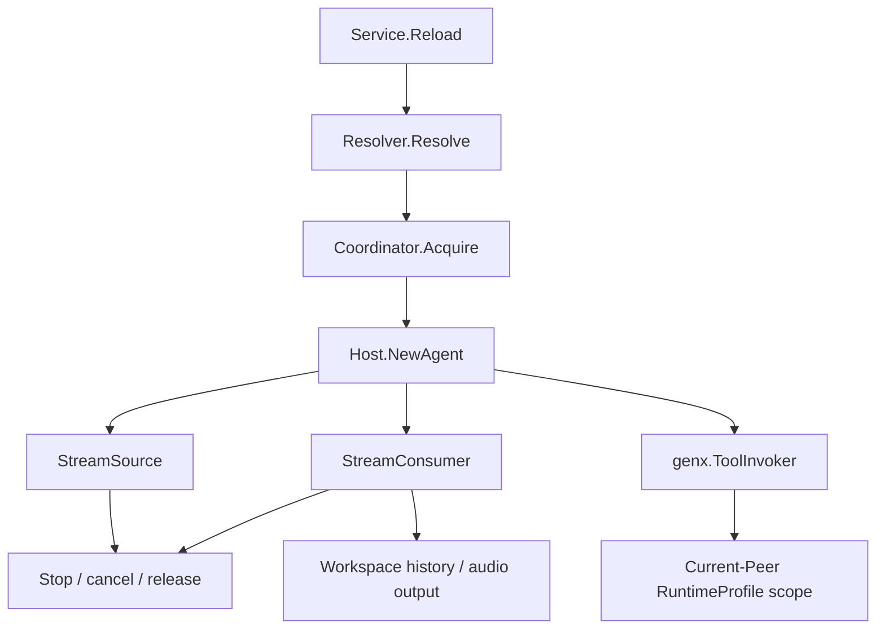

# Agent Host

[Go API Reference](https://pkg.go.dev/github.com/GizClaw/gizclaw-go/pkgs/gizclaw/services/runtime/agenthost)

`agenthost` owns the online life cycle of Agent instances. It parses running specifications, obtains Workspace leases, creates input and output streams, accesses History and Memory, composes the context-scoped ToolInvoker, and maintains the current runtime registry.

## Run process

```mermaid
flowchart TD
    Reload["Service.Reload"] --> Resolve["Resolver.Resolve"]
    Resolve --> Lease["Coordinator.Acquire"]
    Lease --> Agent["Host.NewAgent"]
    Agent --> Input["StreamSource"]
    Agent --> Output["StreamConsumer"]
    Output --> History["Workspace history / audio output"]
    Agent --> Toolkit["genx.ToolInvoker"]
    Toolkit --> Profile["Current-Peer RuntimeProfile scope"]
    Input --> Stop["Stop / cancel / release"]
    Output --> Stop
```

## Core structure and main function

| Structure or function | Function |
| --- | --- |
| `Service.Reload` | Stop the old runtime and create a new runtime based on the current Peer run selection. |
| `Service.Status` / `Stop` / `Shutdown` | Query or terminate the current Agent runtime; connection teardown permanently shuts down the service. |
| `Service.SetRunAgent` | When `PeerRun` provides the optional `PeerRunSelectionStore` capability, persist a pending selection through the same transition boundary as reload and stop; only a selection that changes the active workspace advances the runtime revision. |
| `Service.RuntimeRevision` / `PushInput` / `ReloadAndPushInputIfCurrentRevision` | Let connection-scoped input write or atomically recover-and-write only when it still belongs to the current stable runtime revision. |
| `Service.WorkspaceState` | Returns the running status of the current workspace. |
| `RuntimeRegistry` | Maintain the current online runtime. |
| `Coordinator` / `MemoryCoordinator` | Provide an exclusive lease for the workspace. |
| `Host` / `Registry` | Select and create an Agent based on the parsed `Spec`. |
| `InputStream` / `PushSource` | Convert continuous input into a GenX Stream consumed by the Agent. |
| `MixerOutput` | Decode Agent audio into PCM on one mixer track per `(StreamID, canonical MIME)`; MIME EOS closes only that track, while control-only EOS closes every track on the route. |
| `ToolkitInvoker` | Re-resolve, authorize, and dispatch canonical Tools in the current Transform's Peer scope. |

All runtime creation paths must have symmetric cancel, stream close, lease release, and registry cleanup. The persistence of Agent definition, Workflow, and Workspace still belongs to AI services.

History entries written by AgentHost carry the internal `origin=agenthost`
marker. After persistence succeeds, the callback receives the exact entry
identity rather than only a timestamp; the Gameplay Workspace-reward scheduler
uses it as a durable high-water. The callback neither blocks output consumption
nor invokes GenX, and the reward evaluator is not exposed as an Agent Tool.
Imported and legacy History lacks this origin and is not new reward activity.

## Current-Peer Tool scope

Tool execution has a separate context from Workspace-owner Resource access. The
Workspace owner continues to select Workspace, Workflow, Model, and Memory
resources, but it cannot replace the current connected Peer's Tool set.
`Service.Reload` snapshots that Peer's RuntimeProfile Tool bindings and attaches
the exact connection execution handle to the run context.

`Spec` exposes only `genx.ToolInvoker`. Flowcraft, Eino, DashScope Realtime, and
Doubao Realtime Duplex receive that interface and never receive Resource,
RuntimeProfile, Credential, policy, alias, or Peer-transport internals.
`ResolveTools` and `InvokeTool` read the Transform context on every call, so one
Workspace Agent remains safely shared by concurrent Peers with different
Profiles and handlers. The invoker never captures construction-time Peer state.

Workspace and Workflow policies contain canonical Tool resource IDs and can
only narrow the current-Peer Profile set. A missing Tool scope is an explicit
configuration error. Disconnect, reload, stop, or connection replacement
cancels the old context; a late invocation cannot route to a replacement or
another online Peer. Resource declarations and provider Credentials are read at
invocation time; only after ID-based authorization does AgentHost dispatch the
Tool's immutable execution name. Non-idempotent Tool execution is never retried.

## Store dependency ownership

The host process resolves `agent_host` Server Config references once at startup and injects borrowed Store interfaces into the GizClaw Server, Peer Manager, and registered Workflow factories. The Store Registry remains the only owner of those shared backends. AgentHost, Workspace reload, Flowcraft, Pet, Eino, and per-Agent adapters must not close them.

`runtime_store` persists Workspace runtime metadata, history, and runtime objects. Flowcraft receives separate optional State, internal History, Memory-object, and provider-neutral Memory capabilities. Pet delegates to the same registered inner-driver factories. Eino receives only its optional provider-neutral Memory capability; persistent Eino State and History are not exposed.

Flowcraft and Eino bind only the Workspace App boundary on a configured Memory Store. The common Scope dimensions remain independent: Agent logic can retain its own User, Agent, and Run values, and AgentHost never substitutes the Peer public key for UserID. A configured Store is preferred by Flowcraft over its embedded provider; Eino requires it only when its Workflow declares a Memory policy.

These bindings are process-start configuration. Reload reconstructs an Agent from current Workflow and Workspace resources but does not hot-swap shared Store dependencies. Changing a binding requires a Server restart and does not move existing data.

Each `Service` serializes selection writes, reload, stop, and each Realtime input push for its one Peer. A transition changes the runtime revision before and after lifecycle work; only a selection that changes the active workspace is a revision-changing transition. A Realtime chunk enters the runtime transition gate before its per-input queue and samples its stable revision inside that gate, so input and control-plane operations share one ordering point. A chunk that observes a changed or in-progress revision is stale and is discarded instead of reopening or entering the new workspace. Input recovery reloads and writes the original chunk while one unchanged, stable revision remains gated. A pending selection suppresses recovery only when it changes the current workspace, so a same-workspace selection can still restore an inactive source. Peer teardown permanently shuts down the connection-scoped service, cancels an active gated operation, atomically prevents any in-flight reload from publishing a new runtime, and uses a bounded context to stop an already published runtime. This boundary does not serialize unrelated Peers or replace the shared `RuntimeRegistry` ownership of workspace agents.

`RuntimeRegistry` reuses one constructed Agent per Workspace and returns an independent release function for every attachment. Reloading one Peer releases only that reference; remaining users keep the same Agent without interruption or repeated initiative. The final release removes the Agent, closes factory-owned per-Agent adapters, and releases the Workspace lease. Construction-time configuration is resolved again only on a later acquire.

Transformers and history replay drain provider output into growable stream buffers without waiting on a playback clock. Raw Opus, Ogg/Opus, MP3, and PCM audio are decoded or normalized before entering the mixed PCM stream; `PeerConn` reads one frame at each 20 ms pacing opportunity, encodes Opus, and writes it to WebRTC. Normal EOS uses `CloseWrite` so buffered PCM drains, while error EOS uses `CloseWithError` to discard the matching track and its unconsumed stream backlog.
