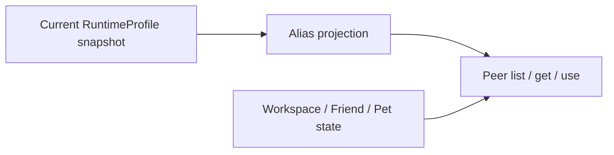

# Peer Resources

[Go API Reference](https://pkg.go.dev/github.com/GizClaw/gizclaw-go/pkgs/gizclaw/services/runtime/peerresource)

`peerresource` projects the current RuntimeProfile into the Peer RPC surface. Workflow, Model, Voice, and Tool values are safe alias DTOs; the projection never returns canonical resource IDs, providers, tenants, credentials, ownership, or executor routing.

Workflow list requires an explicit Collection and preserves the dynamic membership declared under `workflows.collections`. Workflow aliases are globally unique, so get uses the alias alone. Model, Voice, and Tool catalogs come from their respective RuntimeProfile resource maps. Every catalog response includes the RuntimeProfile name and content revision.

Peer resource create/put/delete exists only for Workspace state. Admin owns canonical Workflow, Model, Credential, and Tool mutation. Workspace create validates `collection` plus `workflow_alias`, stores Collection as an internal label, and list performs exact Collection filtering. Generic labels remain an Admin/storage detail and are not exposed in the Peer DTO.

Catalog resolution takes a fresh profile snapshot for each operation. A dangling alias is unavailable without exposing its canonical target. Removing a Workflow alias does not remove or hide existing Workspace state; execution returns not found until a compatible alias is available again.
