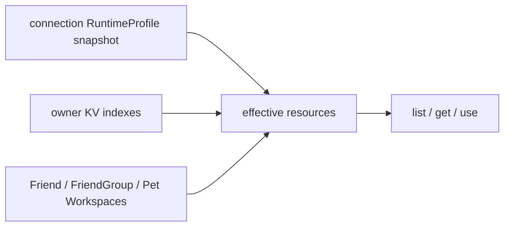

# Peer Resources

[Go API Reference](https://pkg.go.dev/github.com/GizClaw/gizclaw-go/pkgs/gizclaw/services/runtime/peerresource)

`peerresource` aggregates AI, Firmware, Gameplay, Social, Workspace history, and Tool domains into the Peer RPC surface. It computes visible resources from the current connection's RuntimeProfile, caller ownership, and domain relationships.

## Effective resource set

RuntimeProfile map values are concrete resource names. Lists add profile resources in alias order, deduplicate them, and then add owned resources. Workspace lists also add Friend, FriendGroup, and Pet domain Workspaces. A mapped resource returning 404 is skipped instead of failing the list.

Get and use do not check ownership for RuntimeProfile resources. Update and delete require ownership or the relevant system-Workspace domain rule. An unregistered connection has no profile snapshot but may call the same RPC and access owned or domain-visible resources.

## Creation and ownership

When a Peer creates Workspace, Model, Credential, or Tool through public CRUD, the domain service takes `owner_public_key` from context and writes an owner KV index. Resource and owner-index records use an atomic batch. A later put cannot transfer ownership.

The public Workflow surface is list/get only. Admin can still manage every resource. RuntimeProfile aliases exist only inside the profile allow list and Gameplay references; normal RPC parameters always use concrete resource names.
