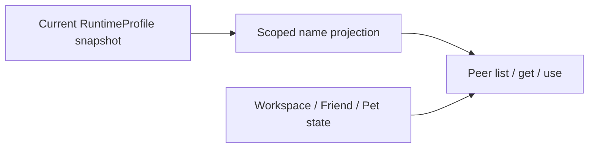

# Peer Resources

[Go API Reference](https://pkg.go.dev/github.com/GizClaw/gizclaw-go/pkgs/gizclaw/services/runtime/peerresource)

`peerresource` projects the current RuntimeProfile into the Peer RPC surface. Workflow, Model, Voice, and Tool values expose scoped `name` DTOs. These names originate from RuntimeProfile binding aliases but are the only public Peer identity; AST Workflow values additionally carry the Workspace language-pair default needed for name-based creation. The projection never returns canonical resource IDs, providers, tenants, credentials, ownership, or executor routing.

```mermaid
flowchart LR
    Profile["Current RuntimeProfile snapshot"] --> Name["Scoped name projection"]
    Name --> RPC["Peer list / get / use"]
    Domain["Workspace / Friend / Pet state"] --> RPC
```

Workflow list requires an explicit Collection and preserves the dynamic membership declared under `workflows.collections`. Projected Workflow names are unique within the current RuntimeProfile, so get uses the name alone. Model, Voice, and Tool catalogs come from their respective RuntimeProfile resource maps. Every catalog response includes the RuntimeProfile name and content revision.

Peer resource create/put/delete exists only for Workspace state. Admin owns canonical Workflow, Model, Credential, and Tool mutation. Workspace create validates `collection` plus `workflow_name`, stores Collection as an internal label, and list performs exact Collection filtering. Generic labels remain an Admin/storage detail and are not exposed in the Peer DTO.

Firmware is not part of the RuntimeProfile name catalog. A RegistrationToken may bind one canonical Firmware ID to a Peer; `server.register` returns its scoped Firmware name, and `server.firmware.get` resolves that caller binding without exposing the ID. The device requests one channel and receives its external HTTPS `.tar.zlib` URL, SHA-256, and archive size. Peer RPC does not list Firmware or transfer package bytes.

Catalog resolution takes a fresh profile snapshot for each operation. A dangling internal binding is unavailable without exposing its canonical target. Removing a Workflow binding does not remove or hide existing Workspace state; execution returns not found until the same Peer name is restored.
