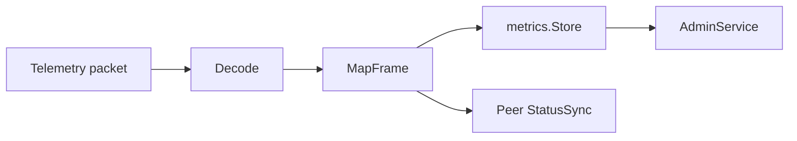

# Peer Telemetry

[Go API Reference](https://pkg.go.dev/github.com/GizClaw/gizclaw-go/pkgs/gizclaw/services/runtime/peertelemetry)

`peertelemetry` Decode the Peer telemetry packet, project the frame into metrics sample and fixed Peer status patch, and provide aggregation entry for Admin query.

## Data flow

## Core structure and main function

| Structure or function | Function |
| --- | --- |
| `Decode` | Verify and decode the telemetry protobuf payload. |
| `MapFrame` | Map frame to metrics and `StatusPatch`. |
| `Service` | Handle Peer telemetry ingestion. |
| `StatusSync` | Merge patch into Peer runtime status. |
| `AdminService` | Provides Admin query for telemetry metrics. |
| `PeerStatusStore` / `StatusService` | Isolate persistence status and update interface. |

Telemetry schema belongs to `api/proto/telemetry`, metrics persistence belongs to `pkgs/store/metrics`. This package only has decoding, mapping and synchronization strategies.

Network observation `imei` / `imsi` values pass pattern and cellular-route validation into the `StatusPatch`, and `StatusSync` merges them per field by observation time into `PeerStatus.network_imei` / `network_imsi`, never as metrics or logs; see [Telemetry API](/en/developing/api/proto/telemetry#network-reporting) for the rules.

Activity observation `activity` and its optional `detail` enter the `StatusPatch` together, and `StatusSync` merges them as one unit into `PeerStatus.activity` / `activity_detail`, again as status and never as metrics; `SystemObservation.firmware_version` follows the same per-field rule into `PeerStatus.firmware_version`. See [Telemetry API](/en/developing/api/proto/telemetry#activity-reporting) for the rules.

The observation time of each telemetry-sourced field lives in the typed
`PeerStatus.telemetry_observed_at`, whose members are named after the `PeerStatus` field each one
describes and hold RFC 3339 timestamps. Those timestamps are what per-field ordering is decided on: a
late or replayed report is rejected instead of overwriting a newer observation. A member is absent
until that field has been observed at least once.

`telemetry_observed_at` is Server-maintained and not device-writable: a `telemetry_observed_at` carried
on a control response is dropped, and the observation time comes only from what the Server recorded
when it handled the observation.

Validated OTA observations update queryable runtime OTA status through `StatusSync`, without payload logs or metrics; see [Telemetry API](/en/developing/api/proto/telemetry#ota-reporting) for fields and SDK usage.
