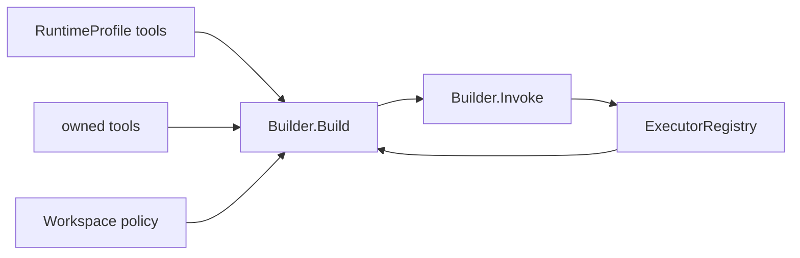

# Toolkit

[Go API Reference](https://pkg.go.dev/github.com/GizClaw/gizclaw-go/pkgs/gizclaw/services/runtime/toolkit)

`toolkit` owns persistent Tool resources, the executor registry, and the ToolKit view built for an Agent runtime.

`Builder.Build` reads concrete Tool values from the current RuntimeProfile before reading the owner KV index, then deduplicates and skips missing Tools. Enabled state, exposure policy, and executor availability are still checked at build and invoke time. RuntimeProfile grants list/get/use only; an owner can fully manage its own Tool.

Aliases do not enter Tool RPC or executor names. `weather: weather-v2` allows the concrete Tool `weather-v2`; Agents and clients still invoke the concrete name.
