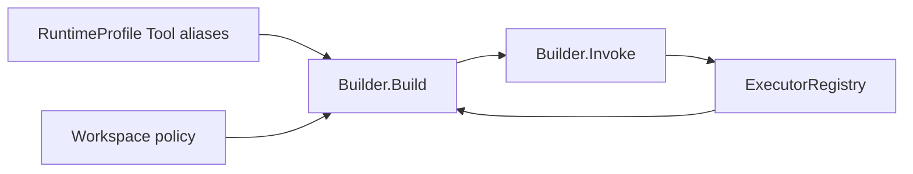

# Toolkit

[Go API Reference](https://pkg.go.dev/github.com/GizClaw/gizclaw-go/pkgs/gizclaw/services/runtime/toolkit)

`toolkit` owns canonical Tool storage, executor registration, and the ToolKit view used by an Agent runtime. Canonical Tools are Admin-managed.

`Builder.Build` resolves symbolic Tool aliases from the current RuntimeProfile snapshot, then applies Workspace policy, Tool enabled/exposure rules, and executor availability. Peer list/get returns only alias i18n and safe input/output schemas. Invocation resolves the alias to its canonical Tool and executor entirely on the Server.

Peer requests never submit a canonical Tool ID through an alias field and cannot mutate Tool or executor definitions.
