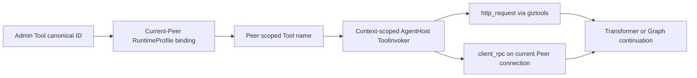

# Tools

[Go API Reference](https://pkg.go.dev/github.com/GizClaw/gizclaw-go/pkgs/gizclaw/services/runtime/toolkit)

`toolkit` owns typed Tool Resource persistence, common validation, defensive
snapshots, and canonical-ID policy filtering. Admin Tool resources have a
server-assigned `metadata.id` and immutable `metadata.name`. RuntimeProfile
bindings and Admin `ToolkitPolicy.tool_ids` store canonical IDs. Peer RPC
projects each binding key as a scoped Tool `name`; Peer Toolkit policy and
invocation use only that name and never expose the canonical ID.

Two Tool types are supported:

- `http_request` declares one fixed HTTPS `GET` or JSON `POST` operation.
  Arguments map from RFC 6901 pointers to query or body fields. The declaration
  fixes status, response pointer, timeout, and response-size limits.
- `client_rpc` invokes a handler mounted by canonical name in the current
  connected Peer SDK. It contains no method, handler ID, Peer ID, endpoint, or
  Credential configuration.

There is no `source`, `builtin`, executor registry, duplicate Tool identity,
`output_schema`, or provider ToolCall ID in the Resource contract.

## HTTP authentication and transport

HTTP auth is a closed union: `none`, `bearer`, `header_api_key`, `volc_ark`,
`volc_search`, `volc_openapi`, `aliyun_app_code`, or
`aliyun_openapi_v3`. Bearer tokens and header API keys are write-only Resource
fields: omitting the same method's secret on update retains it, replacing it
rotates it, and changing method removes it. Admin reads, RuntimeProfile
projections, model definitions, logs, and results never contain those values.

Provider methods resolve one `volc` or `aliyun` Credential at invocation time.
Volc Ark/Search use their fixed API-key fields; Volc OpenAPI and Alibaba Cloud
OpenAPI V3 sign the final request. Alibaba Cloud Marketplace uses AppCode.
`pkgs/giztools` contains only stateless execution helpers: the bounded HTTP
request mapper/executor and the current-connection `client.tool.invoke` wire
client. It does not resolve Resources, policy, RuntimeProfiles, select a Peer,
or implement `genx.ToolInvoker`.

HTTP execution permits HTTPS only, disables redirects and environment proxies,
checks every DNS result for private, loopback, link-local, multicast,
unspecified, carrier-grade NAT, and Server-denied networks, and validates JSON
status, content type, size, syntax, and response pointers. It never retries.

## Runtime chain

```mermaid
flowchart LR
    Resource["Admin Tool canonical ID"] --> Profile["Current-Peer RuntimeProfile binding"]
    Profile --> Policy["Peer scoped Tool name"]
    Policy --> Invoker["Context-scoped AgentHost ToolInvoker"]
    Invoker --> HTTP["http_request via giztools"]
    Invoker --> Client["client_rpc on current Peer connection"]
    HTTP --> Continue["Transformer or Graph continuation"]
    Client --> Continue
```

Disabled Tools are not advertised. Dangling or duplicate canonical-ID bindings
fail scope construction. Every invocation re-reads and reauthorizes the
Resource, validates model arguments, and dispatches by `spec.type`; it does not
fall back to another type, name, owner Profile, or online Peer.

Client `timeout` and `unavailable` are bounded JSON Tool results submitted to
the model continuation. Raw handler, transport, Peer, and Credential details
are redacted. Tool calls and Tool results remain internal to the Transformer or
Graph and are not public assistant stream control messages.
