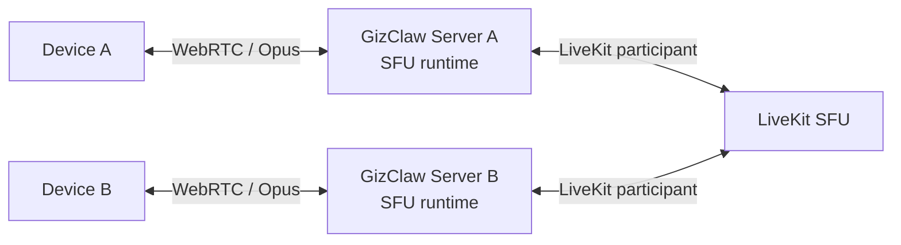
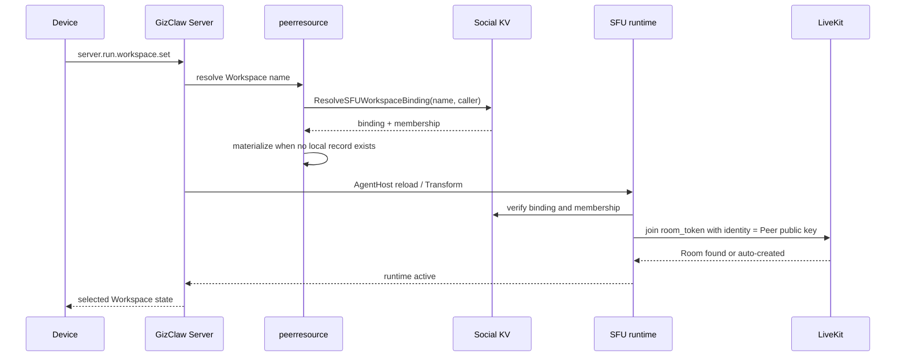
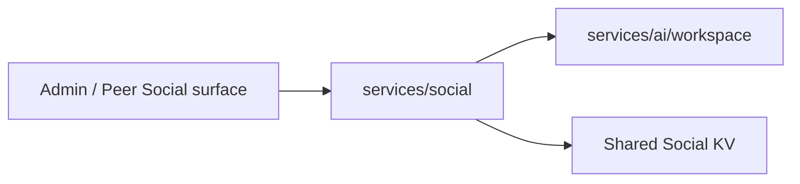

# services/social

`pkgs/gizclaw/services/social` Owns GizClaw’s social graph, including contacts, friend relationships, and friend groups. Each subpackage is responsible for a clear resource boundary.

## Directory structure

```text
services/social/
├── contact/       # Contact resources
├── friend/        # friend requests and friend relationships
└── friendgroup/   # groups, members, invitations, and Workspace/SFU binding
```

## Subdirectory responsibilities

### contact

Owns peer's contact resources and contact lifecycle. Contact is the address book data maintained by the user, which is not equivalent to the established friend relationship or the underlying giznet peer connection.

### friend

Owns friend-request creation, acceptance, rejection, and friend-relationship reads and deletion. A Friend relationship directly grants both peers access to its system Workspace without creating a generic access role.

Peer RPC exposes a Friend relationship's stable identity as `name`, using the other Peer public key already scoped to the authenticated caller; get/info/delete accept that same `name`. Profile presentation is `FriendInfo.display_name`. The deterministic relationship ID remains internal and on Admin/persistence surfaces only.

Each direct-friend chat lifecycle owns an independent system Workspace. The stable `RelationID` identifies only the peer pair. Each transition from no relationship to active creates a new opaque incarnation and derives a new Workspace name from `(RelationID, incarnation)`. A durable creation intent fixes that incarnation, the Workspace owner and name, and the incarnation's SFU `room_token`; the Workspace is always bound to the built-in `system-sfu` Workflow and is never selected from a RuntimeProfile. If the process stops between Workspace creation and reciprocal relationship commit, retry or startup reconciliation reuses the same intent instead of creating another identity. An immutable per-incarnation decision atomically chooses either the reciprocal relationship commit or cancellation, so two servers sharing the relationship store cannot win both transitions. A delete received while that intent is pending records the cancellation decision and removes the never-active Workspace; a delayed creator that loses the decision also repeats that idempotent cleanup instead of allowing startup reconciliation to restore the relationship. Every cleanup compare-and-deletes the pair's current creation intent only when its stored incarnation still matches, so delayed work from one lifecycle cannot remove a re-add lifecycle's recovery intent.

Friend relationship rows carry the exact Peer-visible Workspace name, while their internal binding `friend-workspace-bindings/<relationID>` stores the canonical Workspace ID used by retirement, `PendingDeletion`, runtime, and asset cleanup, plus the [SFU binding](#sfu-workspace) shared by both peers. Formal friend deletion atomically removes both relationship rows and stores a minimal ID-based retirement intent in one KV `BatchMutate`; only after that commit does it enqueue cleanup. A compact retirement receipt preserves the canonical identity and immutable name needed for idempotent completed-delete retries. Re-adding the friend always creates a new Workspace and a new `room_token` and does not inspect, clear, or reuse the old Workspace's cleanup state. A relationship or binding missing its final-schema identity fields is invalid; there is no legacy identity fallback. The peer who creates the invite token is the initiator and immutable Workspace owner; the accepting peer receives access without sharing ownership. Admin creation uses its explicit owner.

A Friend invite token is an opaque, byte-exact credential. `friend.add` treats only an empty or whitespace-only value as a missing argument; it does not trim or syntax-check any other input, and creates a relationship only for an exact match with a currently active token. Unknown, arbitrarily formatted, whitespace-wrapped, cleared, and expired tokens all return not found, while the caller's own token returns conflict. Store reads, decoding, active-record validation, and expired-record cleanup failures return one redacted internal error. Every rejection leaves Friend relationships and Workspaces unchanged and keeps the underlying Peer connection usable.

### friendgroup

Owns friend groups, members, invites, and the authoritative canonical `friend_group_id -> workspace_id` binding. Admin always addresses a Group by canonical ID. Peer RPC accepts only the current member's local Group `name`, which the service resolves to the canonical ID within that owner/member scope. Different peers may use different names for the same Group and may reuse the same name for their own resources. Group membership directly grants access to the group system Workspace.

Each Friend Group lifecycle owns a system Workspace. Creation rollback may immediately delete an unused Workspace. Formal group deletion first atomically removes Group, invite, member, and belongs records and stores a retirement intent in one shared relationship-store transaction. After that commit, it creates a Friend Group data `PendingDeletion`, then places the Workspace in its own `PendingDeletion`. Runtime and artifacts remain physically intact for their owning asynchronous cleaners. A peer-created group belongs to its creator; Admin creation requires an explicit owner. Membership grants Workspace access without changing ownership. The Workspace is always bound to the built-in `system-sfu` Workflow; the Group's SFU binding lives at `social-workspace-bindings/friend-groups/<groupID>` and is committed together with the Group record's `CreateIfAbsent`.

Peer membership objects use `name` as their identity within `friend_group_name`; Admin membership objects retain canonical `id` plus the scoped `name`. A Friend Group holds at most 10 members including the owner; the cap is fixed by `socialutil.FriendGroupMemberLimit` and is not configurable through RuntimeProfile or Server config. `friend_group.join`, `members.add`, and Admin member creation return `409 Conflict` with error code `FRIEND_GROUP_FULL` when the Group is full, without consuming the invite token. Friend Group owns no messages, History, audio store, TTL, or cleanup loop.

The relationship commit and Workspace retirement are two retryable phases. If
phase one fails, both the relationship and Workspace remain usable. If phase
two fails, the retirement intent remains; retrying the same deletion only
finishes `PendingDeletion` for the same Workspace and never restores or
re-deletes the relationship. Relationship invalidation Peer Events are emitted
only after both phases satisfy the success contract.

Friend deletion, Group deletion, and member removal revoke the affected Peers'
SFU runtimes without pushing any cancellation signal: each runtime re-reads its
own binding and stops within one recheck interval; see
[Revocation](#revocation). Workspace listing, ordinary get, and new explicit
selection continue to deny access according to relationships and
`PendingDeletion`.

## Multi-Server boundary

The Friend, Friend Group, and Peer Stores share one KV backend (the multi-server deployment uses a single Redis) and are the source of truth, so invite tokens, relationships, memberships, and SFU bindings are visible to every Server. Workspace, Workflow, and RuntimeProfile catalogs stay Server-local. Cross-Server friend creation and cross-Server group membership are supported operations: creation and membership paths do not compare Peers' fixed Server assignments, and `PeerAssignments` is used only for Peer home routing and Peer Event delivery.

Servers share logical identity, never in-process objects:

| Globally consistent (shared Social KV) | Server-local |
| --- | --- |
| Friend/Group lifecycle and membership | Online Peer connection |
| Workspace identity (ID, name, owner) | Local Workspace record and SFU runtime |
| SFU `url`, `room_token`, `generation` | LiveKit participant connection |

Any Server that may host a member's connection activates the same Workspace using only the shared Social KV and its local `sfu` driver; no call back to an owner Server is needed. On-demand creation of the local Workspace record is described in [Multi-Server materialization](#multi-server-materialization).

## SFU Workspace

Friend and Friend Group voice run on one kind of SFU Workspace: the Social resource owns a logical Workspace, and once an online Peer selects it through `server.run.workspace.set`, the GizClaw Server bridges that Peer's GenX audio stream into the SFU Room declared by the Social resource. The Device keeps its existing WebRTC connection and never connects to or learns about LiveKit; the Edge only forwards the existing Giznet connection.


```mermaid
flowchart LR
    A["Device A"] <-->|"WebRTC / Opus"| SA["GizClaw Server A<br/>SFU runtime"]
    B["Device B"] <-->|"WebRTC / Opus"| SB["GizClaw Server B<br/>SFU runtime"]
    SA <-->|"LiveKit participant"| LK["LiveKit SFU"]
    SB <-->|"LiveKit participant"| LK
```

### Resource model

Each Friend relationship incarnation and each Friend Group lifecycle owns one system Workspace:

```yaml
id: <workspace_id>
name: <workspace_name>
workflow: system-sfu
parameters: null
system: true
owner_public_key: <initiator or Group owner>
```

`system-sfu` is a built-in system Workflow: its driver is `sfu`, its payload is an empty object, and `EnsureBuiltinWorkflows` in `services/ai/workflow` materializes it idempotently on every Server at startup. Admin create, put, and delete against it return `409`, `400`, and `404` with error code `WORKFLOW_BUILTIN`, and the Workflow list hides it. `sfu` is not a `ReusableWorkflowDriver`, so Pet cannot nest it.

An SFU Workspace is an empty runtime entry point. It owns no Workspace History, messages, media assets, Agent memory, or configurable fields, and generic Workspace put cannot modify it. History RPCs return empty results for it, it never emits `workspace_history_updated`, it is not eligible for Gameplay Workspace Reward, and it cannot back an OpenAI Conversation.

### Binding

Friend and Friend Group each persist one SFU binding in the shared Social KV, shaped as `socialutil.SFUBinding`:

```yaml
sfu:
  url: wss://sfu.internal      # this Server's services.sfu.url
  room_token: room-<random>    # public Room identity minted at creation
  generation: 1                # incremented on every binding replacement
```

| Social resource | KV key | Committed with |
| --- | --- | --- |
| Friend | `friend-workspace-bindings/<relationID>` | The creation intent mints `room_token`; the binding commits in the same `BatchMutate` as both relationship rows |
| Friend Group | `social-workspace-bindings/friend-groups/<groupID>` | The Group record's `CreateIfAbsent` |

`room_token` is a public, stable Room identity, not a LiveKit credential; every Server of one Social lifecycle uses the same `url + room_token`. Directional Friend rows do not copy SFU fields. A Friend Group's `room_token` is not derived from the group ID; adding or removing ordinary members changes neither the Workspace identity, the `room_token`, nor the `generation`, so the remaining members keep their Room. When the Server has no `services.sfu`, Friend and Friend Group creation fail with `ErrSFUNotConfigured`.

Creating a Social resource does not create a LiveKit Room. LiveKit creates the Room named `room_token` when the first participant joins and destroys it itself after the last participant leaves; the Social resource and Workspace identity persist and the next activation recreates the Room.

### Activation flow


```mermaid
sequenceDiagram
    participant D as Device
    participant S as GizClaw Server
    participant R as peerresource
    participant K as Social KV
    participant W as SFU runtime
    participant L as LiveKit

    D->>S: server.run.workspace.set
    S->>R: resolve Workspace name
    R->>K: ResolveSFUWorkspaceBinding(name, caller)
    K-->>R: binding + membership
    R->>R: materialize when no local record exists
    S->>W: AgentHost reload / Transform
    W->>K: verify binding and membership
    W->>L: join room_token with identity = Peer public key
    L-->>W: Room found or auto-created
    W-->>S: runtime active
    S-->>D: selected Workspace state
```

Before attaching, the runtime validates against the authoritative Social KV: the Friend's current incarnation is still active and the caller is a member; the Friend Group still exists and the caller is a current member; the Workspace identity matches the binding exactly; and the resource has not entered retirement. `Manager` consults Friend bindings first, then Friend Group bindings; a Workspace neither service owns resolves to `sfu.ErrNotBound`.

Each Peer uses its own public key as its unique LiveKit participant identity. One Peer has at most one participant at a time: when the Peer re-activates on another Server it joins with the same identity, LiveKit evicts the old participant, and the old runtime treats the `DuplicateIdentity` disconnect as a normal termination without reconnecting. `server.run.workspace.set` cancels the old runtime before activating the new one; Peer disconnect, Workspace retirement, and Server shutdown share that shutdown path.

Inbound Opus packets and BOS/EOS from the Peer enter GenX input only while the active runtime is an attached SFU runtime. When the runtime is not attached, has been revoked, or cannot be verified, the Server rejects the turn with a typed EOS on the same `stream_id`; the error codes are listed in [Events](/references/events). Connector behavior is described in [SFU composition boundary](/en/developing/gizclaw/services/ai#sfu-composition-boundary).

### Media and downlink

An SFU Workspace is a walkie-talkie: every listener hears one speaker at a time, the link is half-duplex, and the downlink decodes nothing.

Uplink: the runtime splits the Device's Opus stream into utterances. The first voiced frame (anything but an Opus silence frame) opens an utterance; the Device's EOS for that stream, or `services.sfu.talk_hangover` (default 500ms) without a voiced frame, closes it. Push-to-talk (BOS, frames, EOS per press) and realtime (one BOS, a continuous stream, EOS only when the session ends) follow that one rule, and Device BOS/EOS never touch the LiveKit connection. On open and close the runtime publishes `{"v":1,"type":"bos"|"eos","utterance":"<random id>","seq":<monotonic per sender>}` on the LiveKit reliable data channel under topic `gizclaw.sfu.talk`; the sender identity is LiveKit's `SenderIdentity`, never the payload, and messages with an unknown version or shape are counted and dropped. Silence frames are not written to the track while no utterance is open, so LiveKit sees DTX only. The frame rule is the only uplink VAD: a Device that streams raw, un-gated audio in realtime mode keeps one utterance open for as long as it streams; a sender-side energy VAD is the fix.

Half-duplex: while this Peer's utterance is open the runtime forwards no downlink and never takes the floor; remote BOS received meanwhile is only remembered as open.

Floor: the runtime tracks the open utterances per remote identity from the data channel. When the floor is free and the Peer is not talking, the first remote BOS takes it; on release the earliest still-open remote utterance takes over. Only the holder's Opus packets are forwarded, after RTP reordering; every other identity's packets are dropped and counted. The floor is released by the holder's EOS; by `services.sfu.floor_idle` (default 300ms) without a voiced packet from the holder (the utterance is marked idle and competes again only once a voiced packet arrives); by the holder's track being muted or unsubscribed; by the holder leaving the Room; or by this Peer starting its own utterance.

Downlink passthrough: forwarded packets reach AgentHost as GenX chunks marked `audio/opus; passthrough=1`, with a fresh `stream_id` per floor hold and the participant identity as `label`. `PeerConn` writes each payload unchanged to the Device's Opus track, bypassing the AgentHost decoder and mixer, as received (LiveKit already delivers at source pace). The Opus RTP clock is always 48 kHz while the payload keeps the sending Device's internal bandwidth, so no transcoding is needed. BOS/EOS still pass through `MixerOutput` route bookkeeping, so the Device receives paired audio BOS/EOS Peer Events.

### Revocation

The following changes terminate established SFU participants:

- Friend deletion (`friend.delete`).
- Friend Group deletion (`friend_group.delete`).
- Member removal from a Friend Group (`members.delete`, Peer retirement).

The Social service commits the relationship change in one `BatchMutate` (incrementing `generation` when the binding itself is replaced) and pushes no cancellation signal to any Peer or Server. The SFU runtime terminates itself: it re-reads its binding in the shared Social KV every `services.sfu.recheck_interval` and fails closed as soon as the membership is gone, the generation differs, or the resolver errors, disconnecting the participant and ending the session. Local and remote Peers behave identically, so revocation is eventually consistent and stops forwarding within one recheck interval. New turns are not subject to that delay: every inbound BOS and Opus packet re-checks membership per Peer and is rejected with a typed EOS, never buffered. The Workspace deletion cleaner's asynchronous quiesce still performs the final release.

### Multi-Server materialization

Workspace catalogs are Server-local. When `peerresource` resolves a Workspace name that the shared Social KV binds for the caller but the local catalog lacks, it calls `CreateSystemWorkspace` with the binding's `WorkspaceID`, `WorkspaceName`, `Owner`, and the `system-sfu` Workflow to create the local copy. Every Server's copy carries the same identity, driver, and binding; copies never mint their own Room identity or decide the lifecycle independently. Social SFU Workspaces are never owner-granted, only membership-granted, and they are the only non-owned Workspaces admitted to restricted reload.

### Configuration

The LiveKit URL, API Key, and API Secret are one Server-level configuration under `services.sfu` (see [Server configuration](/en/developing/gizclaw/server/main)):

```yaml
services:
  sfu:
    url: wss://sfu.internal
    api_key_file: /etc/gizclaw/sfu/api_key
    api_secret_file: /etc/gizclaw/sfu/api_secret
    recheck_interval: 5s      # optional, default 5s
    reconnect_timeout: 30s    # optional, default 30s
    talk_hangover: 500ms      # optional, default 500ms; closes an uplink utterance without voiced frames
    floor_idle: 300ms         # optional, default 300ms; releases the downlink floor without voiced packets
```

Credentials are read from files at startup only and never enter the Social KV, Workspaces, Peer APIs, Events, logs, or generated SDKs; SFU is not selected per profile through RuntimeProfile, Workspace, or Admin API. Omitting the block disables SFU Workspaces on that Server.

### Limits

- A Friend Group holds at most 10 members including the owner; exceeding it returns `FRIEND_GROUP_FULL`.
- One participant per Peer at a time; one shared Agent per Workspace per Server.
- Every listener hears one speaker at a time (the floor), half-duplex; no mixing and no downlink decoding.
- No voice mail, message history, recording download, or history playback.
- No PTT, realtime, ASR, transcript, model, or memory configuration on the Workspace; push-to-talk and continuous input share one publish path.
- Restarting the single-node LiveKit interrupts in-progress calls; the runtime reconnects within `reconnect_timeout` and does not promise lossless failover.

## Dependencies and boundaries


```mermaid
flowchart LR
    Surface["Admin / Peer Social surface"] --> Social["services/social"]
    Social --> Workspace["services/ai/workspace"]
    Social --> KV["Shared Social KV"]
```

Should be placed at `services/social`:

- Domain behaviors for Contact, friend request, friend relationship, group, member, and group-to-Workspace resolution.
- Validation, storage, and cleanup of Social relationship resources.

Shouldn't be placed here:

-Giznet peer connection or signaling contact.
- RuntimeProfile persistence, owner indexes, or generic registration logic.
- SFU connector, workspace runtime, or generic messaging transport.
- Admin/Peer route registration.

When adding social capabilities, you should first determine whether it belongs to contact, friend, or friend group; only add new sub-packages when new independent resources and life cycles are formed.

Contact mutation and retirement coordinate per owner. Friend retirement snapshots hold only the target Peer admission gate while reciprocal relation changes retain relation-key serialization. Friend Group snapshots use the same target-Peer admission boundary; group deletion acquires the canonical ordered owner/member Peer set plus the group lock. A retirement scan never stops relations or groups that do not involve the target Peer.
