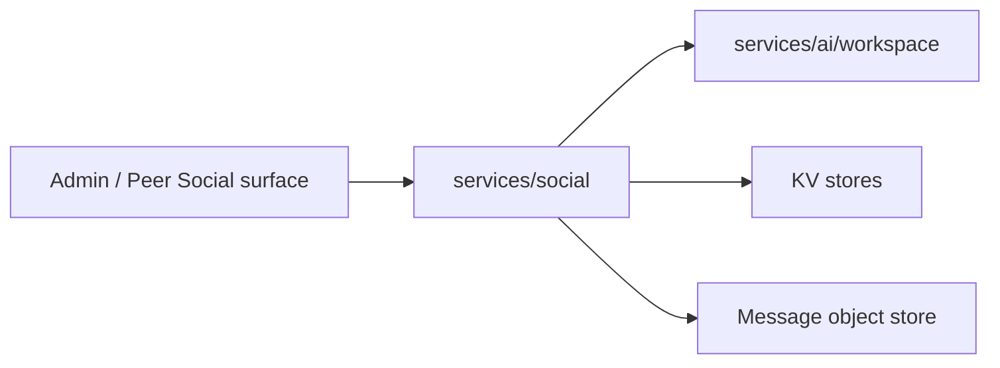

# services/social

`pkgs/gizclaw/services/social` Owns GizClaw’s social graph, including contacts, friend relationships, and friend groups. Each subpackage is responsible for a clear resource boundary.

## Directory structure

```text
services/social/
├── contact/       # Contact resources
├── friend/        # friend requests and friend relationships
└── friendgroup/   # groups, members, messages, and message assets
```

## Subdirectory responsibilities

### contact

Owns peer's contact resources and contact lifecycle. Contact is the address book data maintained by the user, which is not equivalent to the established friend relationship or the underlying giznet peer connection.

### friend

Owns friend-request creation, acceptance, rejection, and friend-relationship reads and deletion. A Friend relationship directly grants both peers access to its system Workspace without creating a generic access role.

Each direct-friend chat lifecycle owns an independent system Workspace. The stable `RelationID` identifies only the peer pair. Each transition from no relationship to active creates a new opaque incarnation and derives a new Workspace name from `(RelationID, incarnation)`. A durable creation intent fixes that incarnation, the Workspace owner and name, and the Chatroom Workflow selected from the owner's RuntimeProfile `workflows.system.friend_chatroom`. If the process stops between Workspace creation and reciprocal relationship commit, retry or startup reconciliation reuses the same intent instead of creating another identity. An immutable per-incarnation decision atomically chooses either the reciprocal relationship commit or cancellation, so two servers sharing the relationship store cannot win both transitions. A delete received while that intent is pending records the cancellation decision and removes the never-active Workspace; a delayed creator that loses the decision also repeats that idempotent cleanup instead of allowing startup reconciliation to restore the relationship. Every cleanup compare-and-deletes the pair's current creation intent only when its stored incarnation still matches, so delayed work from one lifecycle cannot remove a re-add lifecycle's recovery intent.

Friend relationship rows store the exact Workspace name for their lifecycle. Formal friend deletion atomically removes both relationship rows and stores a minimal retirement intent in one KV `BatchMutate`; only after that commit does it place that exact Workspace in `PendingDeletion`. A compact retirement receipt then preserves the identity needed for idempotent completed-delete retries. Re-adding the friend always creates a new Workspace and does not inspect, clear, or reuse the old Workspace's `PendingDeletion`, cleanup task, runtime, history, or artifacts. Only legacy relationship rows without `workspace_name` fall back to the pair-only legacy name. The peer who creates the invite token is the initiator and immutable Workspace owner; the accepting peer receives access without sharing ownership. Admin creation uses its explicit owner.

### friendgroup

Owns friend groups, members, messages, invites, and message assets. Group membership directly grants access to the group system Workspace.

Each Friend Group lifecycle owns a system Workspace. Creation rollback may immediately delete an unused Workspace. Formal group deletion first atomically removes Group, invite, member, and belongs records and stores a retirement intent in one shared relationship-store transaction. After that commit, it creates a Friend Group data `PendingDeletion` with the message-store and message-asset locators, then places the Workspace in its own `PendingDeletion`. Messages, history, runtime, and artifacts remain physically intact for their owning asynchronous cleaners. A peer-created group belongs to its creator; Admin creation requires an explicit owner. Membership grants data access without changing ownership. The owner's RuntimeProfile `workflows.system.group_chatroom` selects the persisted Chatroom Workflow.

The relationship commit and Workspace retirement are two retryable phases. If
phase one fails, both the relationship and Workspace remain usable. If phase
two fails, the retirement intent remains; retrying the same deletion only
finishes `PendingDeletion` for the same Workspace and never restores or
re-deletes the relationship. Relationship invalidation Peer Events are emitted
only after both phases satisfy the success contract.

A revoked active Chatroom does not auto-switch Workspaces. Every new turn checks
the authoritative relationship before forwarding, ASR, model execution, or
history. An invalid turn is not persisted and returns a typed EOS error with
the same `stream_id`. Workspace listing, ordinary get/history, and new explicit
selection continue to deny access according to relationships and
`PendingDeletion`.

## Dependencies and boundaries


```mermaid
flowchart LR
    Surface["Admin / Peer Social surface"] --> Social["services/social"]
    Social --> Workspace["services/ai/workspace"]
    Social --> KV["KV stores"]
    Social --> Assets["Message object store"]
```

Should be placed at `services/social`:

- Domain behaviors for Contact, friend request, friend relationship, group, member and message.
- Validation, storage and cleanup of Social resources.

Shouldn't be placed here:

-Giznet peer connection or signaling contact.
- RuntimeProfile persistence, owner indexes, or generic registration logic. Social only resolves an owner's current profile to select the configured system Workflow before creating domain state.
- Chat Agent, workspace runtime, or generic messaging transport.
- Admin/Peer route registration.

When adding social capabilities, you should first determine whether it belongs to contact, friend, or friend group; only add new sub-packages when new independent resources and life cycles are formed.
