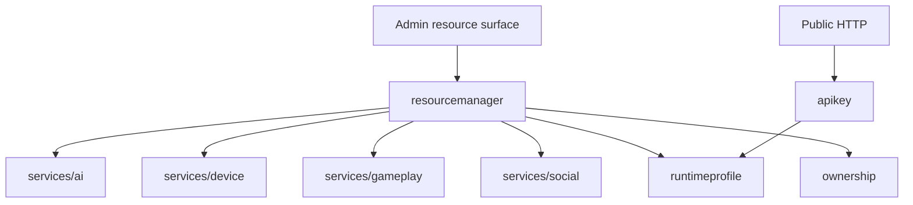

# services/system

`pkgs/gizclaw/services/system` provides shared system services including RuntimeProfile, device registration, API keys, resource ownership, and declarative resource management.

## Directory structure

```text
services/system/
├── ownership/         # owner context, owner index keys, and write rules
├── pendingdeletion/   # durable pending-deletion tasks and managed processor
├── apikey/            # Device-bound API key issuance, authentication, and cleanup
├── resourcemanager/   # unified entry point for Admin declarative resources
└── runtimeprofile/    # RuntimeProfile and RegistrationToken
```

## Subdirectory responsibilities

### ownership

Defines owner context and KV index conventions used by persisted resources. On the Peer surface, Workspace is user-created state; canonical Model, Credential, Workflow, and Tool mutation is Admin-only. Friend, FriendGroup, and Pet relationships add visibility for their system Workspaces.

### pendingdeletion

Defines the versioned, backend-neutral `PendingDeletion` envelope, durable task/source contracts, registration, bounded scanning and workers, leases, replay phases, persisted retry state, and the operator list/get/retry service. A domain deletion request atomically creates or reuses one minimal cleanup descriptor in that resource's physical store while retaining the active resource and indexes. Stable locator-derived IDs make producer retries address the same event; the immutable marker fingerprint prevents an earlier generation or stale lease from mutating later work.

The common processor contains no resource deletion policy and never marks a generic task complete after a handler returns. A domain handler revalidates its marker, current lease, and exact resource generation, then atomically removes the resource and its source-owned marker, locator, and task state. Outcomes are `deferred`, bounded retryable failure, or terminal `failed`; operator retry preserves the replay phase. Completed tasks disappear immediately without a receipt or history. The production registry contains `gameplay/pet`, `friend_group/friend_group`, `workspace/workspace`, and `peer/peer`; each source advertises only kinds for which it owns a registered handler. The Peer handler coordinates domains, but narrow domain adapters perform the actual cleanup. The Peer KV retains only its permanent tombstone after completion.

Metrics report active depth, oldest active age, claims, active workers, phase latency, deferrals, retries, terminal failures, transition errors, and completions using bounded source/kind/status/phase/outcome labels. They never use resource IDs, owners, deletion IDs, descriptors, fingerprints, lease tokens, or error text as labels. Metrics storage failure cannot stop cleanup.

### runtimeprofile

Owns RuntimeProfile and RegistrationToken KV state, schema validation, deterministic revisions, hash indexes, and registration resolution. It projects Admin resources through safe aliases and defines no reader/member role system. See [RuntimeProfile and device registration](./runtime-profile).

### apikey

Issues long-lived keys for a registered Peer, stores complete keys in plaintext for management recovery, enforces same-owner management, and revokes all owner keys during Peer retirement. It does not own HTTP routing, Edge proxying, or business resource implementations.

### resourcemanager

Provides unified declarative resource dispatch for Admin apply, show, and general resource operations. It knows which domain services should be handed over to different resource kinds, but does not reimplement business rules for credentials, workflow, firmware, gameplay or social.

Every concrete Resource carries a caller-supplied `metadata.id`. ResourceManager looks up and dispatches by `(kind, id)`, passes that ID unchanged to the domain service on create, and requires the desired ID to match the existing ID on update. It never generates an ID, performs a name lookup, or falls back from name to ID. Foreign-key inputs already contain the target canonical ID. `ResourceList` only dispatches its items in order and has no top-level ID.

ResourceManager is the cross-domain coordination layer and is not the actual owner of all GizClaw resources.

## Dependencies and boundaries



Should be placed at `services/system`:

- Product authorization capabilities that are uniformly used across domains.
- Cross-domain dispatch and common management boundaries of Declarative resources.
- System-owned migration, validation and persistence rules.

Shouldn't be placed here:

-Resources in each field realize their own business.
- Giznet transport security policy or WebRTC signaling crypto.
- Edge proxy token forwarding.
- CLI config, storage backend creation and process life cycle.
- Generic helper put in to avoid selecting domain ownership.
