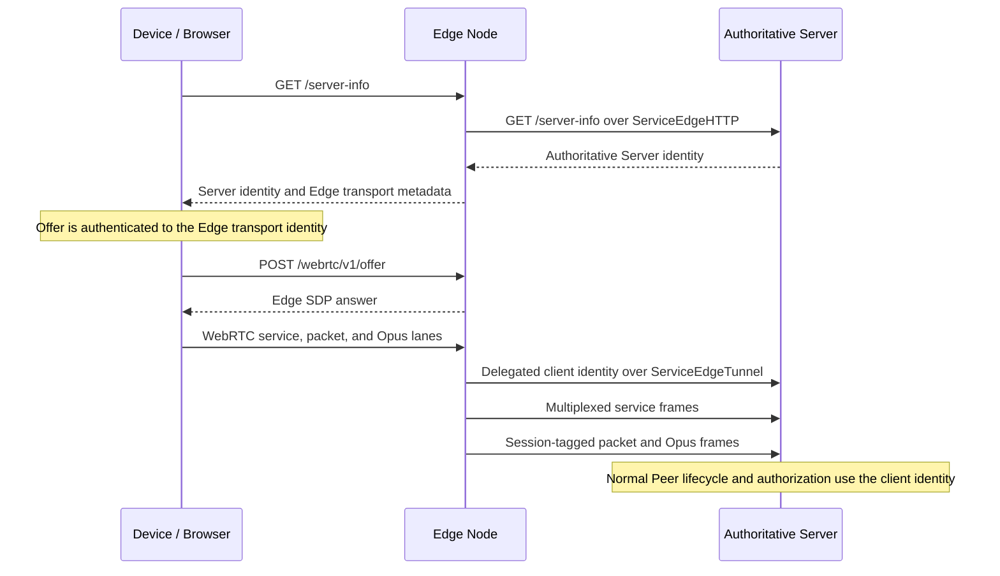
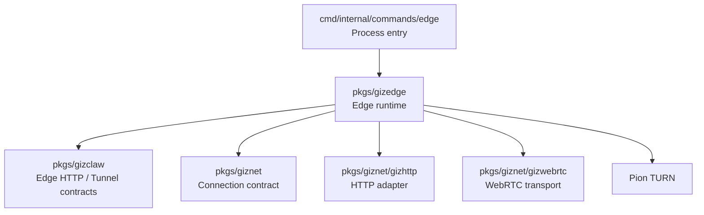

# pkgs/gizedge

`pkgs/gizedge` provides the GizClaw Edge Node ingress runtime. It accepts
public browser and device HTTP requests and forwards them to the configured
authoritative GizClaw Server over a `giznet` WebRTC connection.

When gateway mode is enabled, the Edge also terminates client WebRTC transport
and proxies logical connections over a bounded Server upstream pool. The Edge
is still not the owner of business data: client identity, final authorization,
domain services, and resource storage remain on the authoritative Server.

[Go API References](https://pkg.go.dev/github.com/GizClaw/gizclaw-go@v0.0.0-20260707135347-b9bf1fb24b9f/pkgs/gizedge)

## Directory structure

```text
pkgs/gizedge/
├── config.go     # Edge workspace configuration and boundary validation
├── edge.go       # public ingress, upstream connections, and request forwarding
├── gateway.go    # client termination, logical connections, and bounded upstream pool
└── turn.go       # optional TURN server runtime
```

`pkgs/gizedge` is currently a flat package. The code here together constitutes a single Edge Node runtime, and there are no internal modules that need to be broken into independent public sub-packages.

## Device connection lane

After startup, the Edge has a WebRTC giznet connection to the authoritative
Server. A device then performs Server discovery and gateway signaling through
the Edge:



The ownership boundaries are:

- `/server-info.public_key` always identifies the authoritative Server.
  `transport.public_key`, `transport.endpoint`, and
  `transport.signaling_path` select only the Edge WebRTC transport.
- The Edge validates signaling and creates the client PeerConnection, then
  sends a short-lived, replay-protected delegated envelope containing the
  physical Edge identity, logical client public key, target Server identity,
  validity window, and remote address.
- The Server accepts `ServiceEdgeTunnel` only from active `edge-node` peers,
  validates the envelope, and attaches the logical client to the normal Peer
  lifecycle, service policy, and domain authorization.
- Reliable service streams use one tunnel control DataChannel per logical
  session. Direct packets and Opus use a separate unreliable, session-tagged
  packet lane.
- Gateway transport does not expose authoritative Server ICE/TURN servers to
  the client, so the normal gateway path creates no per-client Server TURN
  allocation.

The Edge does not execute GizClaw domain handlers locally or establish a second
business authorization model.

## Directory Responsibilities

### Edge Configuration

The Edge workspace configuration describes the basic information required to run the current node:

- The Edge Node's own giznet identity.
- Public HTTP listen address and external endpoint.
- The endpoint and public key of a single upstream Server.
- Selection of TLS certificate source.
- Optional TURN listener, public endpoint, relay address, credential and relay port range.
- Optional gateway ICE UDP listener, public endpoint, capacity, upstream pool,
  buffer, idle, and drain bounds.

The configuration belongs to the Edge runtime and does not reuse the storage, service or domain configuration of GizClaw Server. Server config should also not assume the public ingress and TURN parameters of the Edge process.

Currently only disabled paths work for the TLS certificate source; Edge RPC and file certificate sources are still not implemented. Development guidelines cannot write these configuration values ​​as supported capabilities.

### Public Ingress

Public ingress is responsible for:

- Listen to the public HTTP endpoint of the Edge Node.
- Forward allowed browser/device API requests to authoritative Server.
- Provides the CORS behavior required by ingress for browser requests.
- Publish Edge Node external endpoint in server-info response.
- Close the HTTP server, upstream connection and related listeners when the process stops.

Edge ingress does not have business implementations of Peer HTTP, OpenAI-compatible HTTP, or other product routes. The specific route is provided by `pkgs/gizclaw` Server, and Edge only forwards the public surface.

### Upstream Connection

The Edge uses `pkgs/giznet/gizwebrtc` to connect to the configured authoritative
Server. `ServiceEdgeHTTP` carries public HTTP forwarding and
`ServiceEdgeTunnel` carries gateway logical sessions.

Each gateway upstream is one WebRTC PeerConnection and SCTP association. Every
logical session has its own `ServiceEdgeTunnel` DataChannel on its selected
upstream, but those DataChannels still share association-level congestion
control and scheduling. While `max-upstreams` has room, the pool therefore
opens a separate upstream for each new active session before sharing an
association. Once full, it uses least-active selection.

By default, one upstream holds at most 2,048 active logical sessions and enters
draining after 8,192 cumulatively opened tunnel streams. A growth failure is a
throughput-optimization failure, not a capacity failure: admission falls back
to an existing healthy upstream when it still has session capacity. Failure of
one upstream closes only its pinned sessions.

HTTP forwarding and gateway upstreams are long-lived runtime state. The Edge
package must not copy GizClaw handlers to bypass upstream unavailability.

### Gateway Capacity and Lifecycle

The default gateway capacity is 30,000 sessions across at most 16 upstreams.
Signaling reserves handshake, total-session, and upstream-stream capacity
before creating Server state. Exhaustion returns stable `503`
`gateway_over_capacity` JSON with `Retry-After: 1`.

Each session has a default 1 MiB bounded tunnel buffer. Temporary reader
slowdown applies backpressure instead of truncating a large reliable stream;
exceeding the session or frame bound closes that session. Idle sessions expire
after five minutes. Shutdown stops admission, drains for 30 seconds, and then
closes remaining sessions.

For throughput sizing, let `B` be measured single-association throughput and
`W` be independently measured usable path bandwidth. Reaching 80% path
utilization initially requires `ceil(0.8 × W / B)` active upstreams, bounded by
`max-upstreams`. For an observation of `B = 10.10 Mbps` and `W = 200 Mbps`,
the estimate is 16 upstreams, matching the default. Three
active sessions are placed on three associations, so aggregate throughput
should approach three times `B` until another distributed resource saturates.

At the same defaults, 30,000 mostly idle sessions average 1,875 sessions per
upstream, below the 2,048 hard limit. This is a capacity-model target, not a
real 30,000-session proof. The local baseline starts one Server and two
independently identified Edges, establishes 100 real client PeerConnections,
and verifies a bounded ping on every session. All sessions then cross one start
barrier to upload 4 MiB each concurrently, followed by a concurrent 4 MiB
download each. The test keeps the connections alive for another minute and
runs multiple bounded ping rounds:

```bash
bash tests/gizclaw-e2e/run_gateway_capacity_tests.sh
```

The default artifact is the ignored
`tests/gizclaw-e2e/testdata/gateway-capacity-100.json`;
`GIZCLAW_E2E_GATEWAY_CAPACITY_ARTIFACT` selects another output path. The run
requires 100/100 establishments, successful pings, no unexpected disconnect or
identity crossover, and an upstream assignment for every session on both
Edges. Each throughput direction requires 100/100 complete transfers, at least
200 Mbps aggregate, and at least 0.8 times the same run's sustained
single-session rate measured with 32 MiB. The larger baseline payload prevents
a short burst from inflating the baseline and making the ratio flaky. The
absolute floor rejects the former low-tens-of-Mbps association ceiling. The
retention ratio avoids demanding linear scaling when one session already
saturates the current path while still rejecting material concurrency
regression. This is evidence for the tested local Docker topology, not a
bandwidth promise for another network.

The artifact records the load-driver host and configuration, establishment and
ping failures, RTT, bytes, Edge/upstream distribution, RSS, Go/runtime active
CPU estimates, file descriptors, heap, and goroutines. Upload and download
each include the single-session baseline, 100-session aggregate Mbps computed
over one shared wall-clock interval, per-session rate percentiles, exact byte
completion, failures, and per-Edge/upstream aggregates. Client durations are
not summed or substituted for the shared start-to-finish interval. Ping
evidence also includes per-round and per-Edge/upstream RTT and failure
summaries so a transient path is not hidden by one aggregate percentile.
Memory and CPU points include their measurement source. Without Linux
`/proc/self/statm`, `rss_bytes` is marked as the `go_memstats_sys` fallback and
is not complete process RSS. Unsupported file-descriptor sampling is reported
as `-1`. A throughput failure, absolute-Mbps violation, or retention-ratio
violation also makes the entrypoint exit nonzero.

CPU, memory, file descriptors, establishment rate, and low-rate activity for
the complete topology must still be fitted from larger samples. Repeated
500/1,000-session runs, a long soak, per-process resource slopes, and the
30,000-session projection are a separate extended-capacity qualification.
Repeatable transport and full Edge benchmarks are:

```bash
go test -tags giznet_e2e ./tests/giznet-e2e/webrtc \
  -run '^$' -bench BenchmarkWebRTCServiceThroughput -benchtime=1x -count=5
go test ./pkgs/gizedge \
  -run '^$' -bench BenchmarkGatewayServiceThroughput -benchtime=1x -count=5
```

The deployed Docker suite records separate upload-only and download-only
one-client versus three-client observations. It is informational by default.
Controlled runners may set positive minimum client/aggregate ratios when the
path has enough headroom, or direction-specific aggregate Mbps floors derived
from independently measured usable bandwidth:

```bash
GIZCLAW_E2E_SPEED_MIN_UPLOAD_AGGREGATE_MBPS='<upload floor>' \
GIZCLAW_E2E_SPEED_MIN_DOWNLOAD_AGGREGATE_MBPS='<download floor>' \
go test -tags gizclaw_e2e ./tests/gizclaw-e2e/go/edge \
  -run '^TestGatewaySpeedOneVersusThreeClients$' -count=1 -v
```

`GIZCLAW_E2E_SPEED_MIN_CLIENT_RATIO` and
`GIZCLAW_E2E_SPEED_MIN_AGGREGATE_SCALE` remain available for an unsaturated
runner. Do not use a scale-only threshold when one client already approaches
the usable path limit.

### TURN

The Edge Node can run an optional TURN UDP relay at the same time, providing relay capabilities for connections that cannot directly establish a WebRTC path.

TURN runtime is only responsible for relay listener, authentication and relay port range. It is not responsible for GizClaw user logins, peer ACLs, route assignments, or business authorization. TURN credential and GizClaw resource credential are not the same type of data.

## Dependencies



The dependency direction is:

- CLI command select workspace and start `pkgs/gizedge`.
- `pkgs/gizedge` consumes the Edge service contract defined by GizClaw, but does not depend on the specific domain service.
- Edge uses `giznet`, `gizhttp` and `gizwebrtc` to establish the upstream data path.
- `pkgs/gizclaw` and `pkgs/giznet` are not dependent on `pkgs/gizedge`.

## Ownership Boundary

Should be placed at `pkgs/gizedge`:

- Edge workspace configuration and Edge-specific validation.
- Public ingress listener, proxy and Edge response rewrite.
- Edge to authoritative Server connection, login, reconnection and forwarding life cycle.
- Client WebRTC termination, logical-session admission, upstream pool, and
  gateway shutdown.
- TURN relay run by Edge Node itself.
- Shutdown and cleanup behaviors only belong to the Edge process.

Should not be placed in `pkgs/gizedge`:

- Peer, workspace, firmware, gameplay, social or Agent domain services.
- Authoritative resource storage and final resource-access decisions.
- Transport-independent connection contract or generic WebRTC implementation.
- HTTP/RPC handler for GizClaw Server.
- Server storage backend, migration and workspace runtime assembly.
- Global peer directory, mesh membership, cross-server data synchronization or route replication.

These contents belong to `pkgs/gizclaw`, `pkgs/giznet`, `cmd/internal/server` respectively, or are still the subsequent design scope of server mesh.

## Current boundary

Currently `pkgs/gizedge` connects to one authoritative Server and supports Edge
HTTP ingress, optional gateway termination, and optional TURN relay.

It is not a complete server mesh:

- The Edge is configured for one upstream Server.
- `ServiceEdgeHTTP` carries public request forwarding.
- `ServiceEdgeTunnel` carries logical client sessions over a bounded upstream
  pool.
- Edge control-plane RPC, certificate distribution, and non-disabled TLS
  certificate sources are not complete.
- The Edge does not maintain mesh membership or a global peer/resource route
  registry.
- This package does not replicate data or events between Servers.

Therefore, when adding a capability, you must first determine whether it is the responsibility of the current Edge ingress or the future work of the server mesh control plane; you cannot directly write `pkgs/gizedge` just because the capability is related to the public network entry point.
