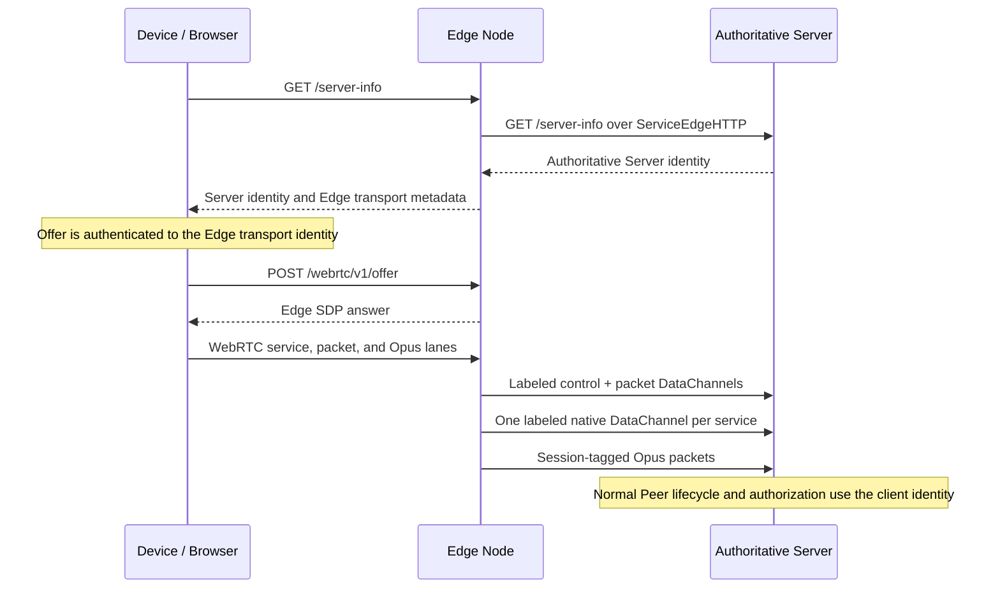
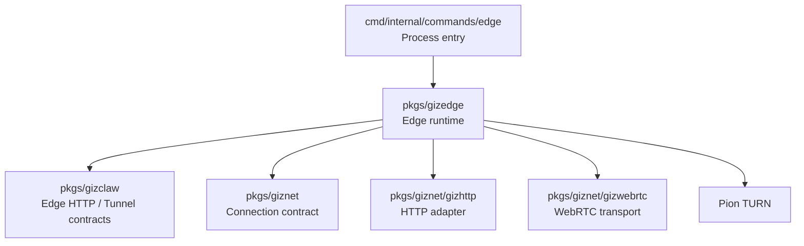

# pkgs/gizedge

`pkgs/gizedge` provides the GizClaw Edge Node ingress runtime. It accepts
public browser and device HTTP requests and forwards them to the configured
authoritative GizClaw Server over a `giznet` WebRTC connection.

When gateway mode is enabled, the Edge also terminates client WebRTC transport
and proxies logical connections over a bounded Server upstream pool. The Edge
is still not the owner of business data: client identity, final authorization,
domain services, and resource storage remain on the authoritative Server.

[Go API References](https://pkg.go.dev/github.com/GizClaw/gizclaw-go@v0.0.0-20260707135347-b9bf1fb24b9f/pkgs/gizedge)

## Directory structure

```text
pkgs/gizedge/
├── config.go     # Edge workspace configuration and boundary validation
├── edge.go       # public ingress, upstream connections, and request forwarding
├── gateway.go    # client termination, logical connections, and bounded upstream pool
├── upstream_relay.go # shared upstream TURN selection and health
└── turn.go       # optional TURN server runtime
```

`pkgs/gizedge` is currently a flat package. The code here together constitutes a single Edge Node runtime, and there are no internal modules that need to be broken into independent public sub-packages.

## Device connection lane

After startup, the Edge has a WebRTC giznet connection to the authoritative
Server. A device then performs Server discovery and gateway signaling through
the Edge:



The ownership boundaries are:

- `/server-info.public_key` always identifies the authoritative Server.
  `transport.public_key`, `transport.endpoint`, and
  `transport.signaling_path` select only the Edge WebRTC transport.
- The Edge validates signaling and creates the client PeerConnection. On its
  authenticated Server PeerConnection it opens canonical v2 control and packet
  labels. The control label alone declares the logical client public key and
  bounded remote address; there is no delegated body, expiry, or replay cache.
- The Server registers the v2 namespace only after the physical peer is active
  as `edge-node`, then attaches the declared client to the normal Peer lifecycle,
  service policy, and domain authorization.
- Each reliable client service maps to one labeled reliable ordered upstream
  DataChannel. Direct packets use one per-session unreliable channel. Opus alone
  retains the shared session-tagged physical packet lane.
- Gateway transport does not expose authoritative Server ICE/TURN servers to
  the client, so the normal gateway path creates no per-client Server TURN
  allocation.

The Edge does not execute GizClaw domain handlers locally or establish a second
business authorization model.

## Directory Responsibilities

### Edge Configuration

The Edge workspace configuration describes the basic information required to run the current node:

- The Edge Node's own giznet identity.
- One public client-ingress listen address and external endpoint shared by
  HTTP/signaling TCP and gateway ICE UDP.
- At least one ordered upstream Server entry; each entry pins an endpoint,
  public key, and optional relay-only TURN pool for Edge-to-Server PeerConnections.
- Selection of TLS certificate source.
- Optional TURN listener, public endpoint, relay address, credential and relay port range.
- Optional gateway capacity, upstream pool, buffer, idle, and drain bounds.
- An optional Prometheus Remote Write/query metrics backend.

Top-level `listen` is the only client-ingress bind tuple. The Edge opens
separate TCP and UDP sockets on that host and numeric port: TCP carries public
HTTP and signaling, while UDP carries ICE, DTLS, SCTP, and DataChannels when
gateway mode is enabled. Top-level `endpoint` is the matching externally
reachable tuple published in `/server-info.transport.endpoint`. When its host
is a concrete literal IP, the gateway also rewrites answer-SDP UDP host
candidates to that exact host and port. A hostname or unspecified address does
not trigger DNS lookup or fabricate a public candidate. NAT and container
deployments may use different local and external tuples, but the one external
`endpoint` must map both protocols. The optional `turn.listen` and
`turn.public-endpoint` remain separate because they configure a downstream
relay service rather than the client HTTP/WebRTC ingress.

The configuration belongs to the Edge runtime and does not reuse the storage, service or domain configuration of GizClaw Server. Server config should also not assume the public ingress and TURN parameters of the Edge process. Standalone Edge process metrics use a separate top-level configuration:

```yaml
metrics:
  remote-write-url: https://prometheus.example.invalid/api/v1/write
  query-url: https://prometheus.example.invalid
  bearer-token: <prometheus-token>
```

When all three fields are empty the recorder remains a no-op. Configuring any field requires valid Remote Write and query URLs; otherwise Edge fails before opening a listener. The bearer token is used only for backend requests and is never logged.

Currently only disabled paths work for the TLS certificate source; Edge RPC and file certificate sources are still not implemented. Development guidelines cannot write these configuration values ​​as supported capabilities.

### Public Ingress

Public ingress is responsible for:

- Listen to the public HTTP endpoint of the Edge Node.
- Forward allowed browser/device API requests to authoritative Server.
- Provides the CORS behavior required by ingress for browser requests.
- CORS returns the request's actual `Origin` with `Vary: Origin`; `OPTIONS` preflight for supported paths terminates at the Edge without consuming upstream capacity, and its method and header contract matches authoritative Public HTTP.
- Publish Edge Node external endpoint in server-info response.
- Close the HTTP server, upstream connection and related listeners when the process stops.

Edge ingress does not have business implementations of Peer HTTP, OpenAI-compatible HTTP, or other product routes. The specific route is provided by `pkgs/gizclaw` Server, and Edge only forwards the public surface.

### Upstream Connection

The Edge uses `pkgs/giznet/gizwebrtc` to connect to the configured authoritative
Server. `ServiceEdgeHTTP` carries public HTTP forwarding. Gateway logical
sessions use the registered `giznet/v2/tunnel/` DataChannel namespace and are
not a product service ID.

By default, omitting an entry's `ice-transport-policy` and `ice-servers`
preserves direct ICE. A relay deployment sets a pool of
at least two literal-IP TURN/UDP members:

```yaml
upstreams:
  - endpoint: https://server.example.invalid:9820
    public-key: <authoritative-server-key>
    ice-transport-policy: relay
    ice-servers:
      - urls: [turn:192.0.2.10:3478?transport=udp]
        username: <turn-rest-key-id>
        credential: <turn-rest-shared-secret>
        credential-mode: turn-rest
      - urls: [turn:192.0.2.11:3478?transport=udp]
        username: <turn-rest-key-id>
        credential: <turn-rest-shared-secret>
        credential-mode: turn-rest
```

Relay mode passes exactly one pool member and relay-only ICE to each new
upstream PeerConnection. HTTP forwarding and gateway upstreams share one
process-local round-robin health selector. A failed relay enters bounded
exponential backoff; another eligible member is tried within the existing
30-second connection budget, with at most five seconds per member. There is no
direct fallback. While establishing the required gateway warm pool, the Edge
also honors the selector's reported backoff and retries temporarily unavailable
members within one shared 30-second startup budget. If a five-second warmup
attempt establishes only part of the pool, the Edge keeps those associations
and retries only the missing slots within the same budget; configuration,
cancellation, and other errors still fail immediately. Successful reconnection
clears that member's failure state, while request cancellation, Edge shutdown,
and individual logical-session failure do not penalize it. Established gateway
sessions remain pinned and may fail with their physical upstream; a fresh client
reconnect selects from the current healthy pool.

Every pool member has exactly one lowercase `turn:` URL with a literal IPv4 or
bracketed IPv6 address, an explicit port, and only `transport=udp`. Static mode
(explicit or default) requires both `username` and `credential`. `turn-rest`
requires the shared-secret `credential`; its configured username/key ID is
optional. Invalid, duplicate, partial, hostname-based, TCP, or TLS relay
configuration fails before the Edge starts a listener.

Relay selection never changes the entry's `endpoint`, `public-key`, or
the Server identity used by signaling. The top-level `turn` block is separate:
it runs a downstream TURN server for device-to-Edge transport and is not a
member of the Edge-to-Server upstream pool. Relay usernames, credentials, SDP,
ICE candidate bodies, and business payloads must not be logged.

Each gateway upstream is one WebRTC PeerConnection and SCTP association. Every
logical session owns persistent control and packet channels, plus one native
channel per live service, on its selected upstream. Those DataChannels still
share association-level congestion control and scheduling. At startup the pool opens four upstreams, bounded by
`max-upstreams`, then assigns sessions by least-active selection. It opens
another upstream only after every healthy association reaches its configured
active-session capacity. This bounded warm pool avoids both single-association
head-of-line congestion and the cold-start cost of eagerly filling all 16
available slots.

By default, one upstream holds at most 2,048 active logical sessions, 32 active
channels per session, and 8,192 simultaneously active tunnel channels. Closed
channels release capacity; sequential opens do not rotate an upstream. The Edge fails startup
if it cannot establish the bounded warm pool. Later capacity growth fails only
the admission that required the unavailable association. Failure of one
upstream closes only its pinned sessions.

Pool eligibility has three states. A selectable association accepts new
admissions. A draining association accepts none, preserves already established
logical sessions, and closes after its final pinned session releases. A failed
association is terminal and closes immediately. A complete ten-second
native control/packet open error, a pre-accept channel close, or a complete
application-acceptance timeout drains a still-nonterminal association
without penalizing its TURN member; caller cancellation, Edge shutdown, an
explicit logical-session rejection, and other nonterminal protocol errors do
not change a healthy association's eligibility. Packet or parent-connection
failure marks the association failed and reports its relay attempt at most
once.

A fresh client has one private 30-second logical-session establishment budget
and may try at most two physical entries before Server acceptance. An alternate
creates a new control/packet pair and session ID; it does not replay an RPC or move an
accepted session. Selectable associations count toward warm capacity, while
`max-upstreams` continues to cap all live selectable and draining physical
associations. `X-GizClaw-Gateway-Upstream` remains the initially reserved entry
because signaling writes it before a possible alternate is known.

HTTP forwarding and gateway upstreams are long-lived runtime state. The Edge
package must not copy GizClaw handlers to bypass upstream unavailability.

### Gateway Capacity and Lifecycle

The default gateway capacity is 30,000 sessions across at most 16 upstreams.
Signaling reserves handshake, total-session, and active-channel capacity
before creating Server state. Exhaustion returns stable `503`
`gateway_over_capacity` JSON with `Retry-After: 1`.

Each session has a default 1 MiB reliable-write budget. One channel may consume
at most half, preserving sibling Event/RPC progress, and the association budget
is 32 MiB. Reservations remain until DataChannel `BufferedAmount` drains.
Idle sessions expire
after five minutes. Shutdown stops admission, drains for 30 seconds, and then
closes remaining sessions.

The composed nonterminal recovery regression uses two digest-pinned Coturn
members, relay-only upstream ICE, a test-only silent UDP fault boundary, and no
direct Edge-to-Server UDP path:

```bash
bash tests/gizclaw-e2e/run_gateway_relay_recovery_tests.sh
```

It proves that the initial native channels can open locally and then reach the
complete application-acceptance timeout, after which the same client
completes Register and Ping through the alternate before logical-session
acceptance. Live relay host failure, drain, capacity, and soak remain deployment
acceptance rather than package E2E claims.

`max-upstreams` is a capacity ceiling, not an eager throughput target. A single
association can serialize a large concurrent burst, while opening every slot
at once pays multiple independent SCTP cold-start and congestion-recovery
costs. The bounded four-association warm pool is the measured default for the
100-session local burst; higher-session tests must measure before changing that
tradeoff.

At the same defaults, 30,000 mostly idle sessions average 1,875 sessions per
upstream, below the 2,048 hard limit. This is a capacity-model target, not a
real 30,000-session proof. The local baseline starts one Server and two
independently identified Edges, establishes 100 real client PeerConnections,
and verifies a bounded ping on every session. All sessions then cross one start
barrier to upload 4 MiB each concurrently, followed by a concurrent 4 MiB
download each. The test keeps the connections alive for another minute and
runs multiple bounded ping rounds:

```bash
bash tests/gizclaw-e2e/run_gateway_capacity_tests.sh
```

The default artifact is the ignored
`tests/gizclaw-e2e/testdata/gateway-capacity-100.json`;
`GIZCLAW_E2E_GATEWAY_CAPACITY_ARTIFACT` selects another output path. The run
requires 100/100 establishments, successful pings, no unexpected disconnect or
identity crossover, and an upstream assignment for every session on both
Edges. Each throughput direction requires 100/100 complete transfers, at least
200 Mbps aggregate, and at least 0.8 times the same run's sustained
single-session rate measured with 32 MiB. The larger baseline payload prevents
a short burst from inflating the baseline and making the ratio flaky. The
absolute floor rejects the former low-tens-of-Mbps association ceiling. The
retention ratio avoids demanding linear scaling when one session already
saturates the current path while still rejecting material concurrency
regression. This is evidence for the tested local Docker topology, not a
bandwidth promise for another network.

The artifact records the load-driver host and configuration, establishment and
ping failures, RTT, bytes, Edge/upstream distribution, RSS, Go/runtime active
CPU estimates, file descriptors, heap, and goroutines. Upload and download
each include the single-session baseline, 100-session aggregate Mbps computed
over one shared wall-clock interval, per-session rate percentiles, exact byte
completion, failures, and per-Edge/upstream aggregates. Client durations are
not summed or substituted for the shared start-to-finish interval. Ping
evidence also includes per-round and per-Edge/upstream RTT and failure
summaries so a transient path is not hidden by one aggregate percentile.
Memory and CPU points include their measurement source. Without Linux
`/proc/self/statm`, `rss_bytes` is marked as the `go_memstats_sys` fallback and
is not complete process RSS. Unsupported file-descriptor sampling is reported
as `-1`. A throughput failure, absolute-Mbps violation, or retention-ratio
violation also makes the entrypoint exit nonzero.

The fixed 500-session qualification is:

```bash
bash tests/gizclaw-e2e/run_gateway_capacity_500_tests.sh
```

It repeats three fresh one-Server/two-Edge stacks with zero ramp and 500
simultaneous Dials. Each Edge owns 250 sessions and exactly four upstream
associations. Every run requires 500/500 usable sessions, no failures,
disconnects, restarts, or identity crossover, at least 20 sessions/s, Dial p95
at most 1 second and p99 at most 5 seconds, and exactly 500 MiB transferred in
each direction at least 200 Mbps aggregate. The 32 MiB single-session
baseline and aggregate ratios are diagnostic only. Publishable artifacts must
report the clean final PR head.

On 2026-08-02, three clean-head runs on one Darwin/arm64 host with 16 logical
CPUs, Go 1.26.4, and an OrbStack Linux/aarch64 Docker one-Server/two-Edge
topology with direct container signaling endpoints all passed. Every run
established 500/500 usable sessions, reported zero transfer failure or
unexpected disconnect, and transferred exactly 500 MiB in each direction
above 200 Mbps. These measurements qualify only that host and topology; they
do not qualify 1,000 sessions, a soak, or a deployment network.

The fixed relay-only 1,000-session burst and soak entrypoints are:

```bash
bash tests/gizclaw-e2e/run_gateway_capacity_1000_tests.sh
bash tests/gizclaw-e2e/run_gateway_capacity_1000_soak_tests.sh
```

The burst entrypoint requires a clean head and repeats three fresh
one-Server/two-Edge/two-Coturn stacks. Each run releases 1,000 Dials through
one barrier with concurrency 1,000 and no ramp, holds the 1,000 live sessions
for 30 seconds, and performs final liveness before bounded teardown. Each Edge
must own exactly 500 sessions across four gateway upstreams. The establishment,
application transfer of exactly 1,000 MiB (1,048,576,000 bytes) in each
direction, 200 Mbps aggregate, timing,
resource, relay-selection, ten-allocation, restart, and cleanup gates are the
same fixed contract as the smaller tiers. The load driver fixes and records
`GOGC=200` so collection of its roughly 2 GiB client heap does not become the
limiting stage during synchronized transfer. Current process CPU and
completed-GC live-heap evidence still gate long-lived stability; this setting
does not alter Edge, Server, or Coturn runtime behavior.

The soak entrypoint first reruns all three burst repetitions on the same clean
head, then starts one new no-ramp 1,000-session stack and holds it for 60
minutes. Complete liveness rounds start every 30 seconds. A heartbeat is
printed at least every 30 seconds and at each liveness-round boundary with
active-session, ping, disconnect, open-FD, RSS, goroutine, Docker-role sample
count, historical-gap, and current-age evidence. The runner fails and cleans up
as soon as a ping, disconnect, identity, round-duration, or 2.1-second resource
sample-gap gate becomes irrecoverable. Speed runs also print progress at least
every 15 seconds while active; silence until the 60-minute deadline is not treated
as healthy execution. Distinct initial and
final 1 MiB-per-session upload/download checkpoints must each exceed 200 Mbps,
and each final direction must retain at least 80% of its initial aggregate and
of its per-session p01, p05, and p50 throughput. The p95 and p99 throughput
values remain upper-tail diagnostics rather than degradation gates.
Fresh-stack HTTP and ready-file waits print the service state and elapsed time
every 15 seconds; silence after Compose startup is not readiness evidence.
The ordered qualification builds one run-ID-scoped service image from its clean
head and reuses that exact image across repetitions. Every repetition still
gets fresh containers, networks, volumes, ports, and credentials. Failed
attempts retain only the clean-HEAD-scoped image for same-head retries; changing
the head changes the tag, and a completed qualification removes the exact
image. After every fresh stack reaches readiness,
a 120-second post-start stabilization window reports container health every 15
seconds before measurement, including repetitions that reuse the image.
A fixed 120-second stabilization window, with 15-second progress, follows each
1,000-session fresh-stack teardown so delayed Docker-VM reclamation does not
pollute the next run. A failed upload gate skips the now-irrelevant download.

Artifact version 18 records the actual hold boundaries and compares the first
and last ten minutes. On a Ping failure, the artifact also records the failed
request's pre-close DataChannel ID, state, buffered amount, byte counts, and
parent-association state. It also captures address-free PeerConnection, ICE,
and SCTP states plus ICE packet/byte and SCTP byte counters, then performs one
bounded diagnostic Ping on a fresh DataChannel over the same association and
captures the parent counters again. The diagnostic Ping is excluded from
acceptance counts and never changes the original failure into a pass.
The median per-round RTT p99, RSS, open FDs, completed-GC
Go live heap, and goroutine medians must not grow by more than 20%. The current
Go heap-object count is retained as a diagnostic but is not a growth gate,
because it varies with the normal GC cycle; sampling never forces a GC. CPU and
network-rate changes use the same relative bound with absolute noise floors of
0.10 core and 1,024 bytes/s; UDP/UDP6 socket medians use the 20% bound. RSS,
CPU, and open-FD samples are tied to one process ID and start time. For Docker
roles, `/proc/<pid>/net/{udp,udp6,dev}` describes the container network
namespace, not only sockets and traffic owned by that process. These checks
cover the load driver, both Edges, both Coturn members, and Server, reject
process-counter resets, and require resource gaps no larger than 2.1 seconds.
On Darwin and Linux the load driver uses the operating system's cumulative
process user-plus-system CPU from `getrusage`; unsupported platforms retain the
named Go-runtime active-CPU fallback. This avoids treating deferred runtime CPU
class updates as process-CPU growth while preserving the same qualification
threshold.
Unavailable external Go runtime metrics and load-driver namespace
socket/network metrics are named explicitly rather than represented by
fabricated values.

Logical-session cleanup has a 30-second bound; the ten physical TURN allocations
are checked from source-qualified Coturn counters once per second while the
Edges are alive and must return to zero within 15 seconds after Edge shutdown.
The monitor must produce its first sample before the workload starts, and its
millisecond timestamps must be non-decreasing with no gap above 2.1 seconds;
equal values are allowed only when distinct nanosecond samples truncate to the
same millisecond.
These commands qualify only their recorded host, Docker engine, clean commit,
and topology; they are not a 30,000-session or WAN guarantee.

On 2026-08-07, clean executable head
`a2ff5b791a5c60c3b80052204717ac277e43c885` completed the ordered relay-only
qualification once on a Darwin/arm64 host with 16 logical CPUs, Go 1.26.4, and
64 GiB RAM, using OrbStack 2.2.1 Linux/aarch64 Docker with 16 logical CPUs and
15.67 GiB RAM. The three fresh-stack burst prerequisites established
1,000/1,000 sessions at 159.90, 1,118.18, and 158.99 sessions/s. Their Dial
p95/p99 values were 681.57/776.75 ms, 749.00/806.92 ms, and 589.81/669.13 ms;
synchronized upload/download throughput was 453.54/482.89, 415.54/455.50, and
484.35/413.58 Mbps. Every run assigned 500 sessions to each Edge, transferred
exactly 1,000 MiB per direction, kept all ten relay allocations live, and
completed bounded cleanup with no correctness, liveness, exit, or restart
failure.

The fresh 60-minute soak then established 1,000/1,000 sessions at 1,074.63
sessions/s with Dial p95/p99 of 718.53/838.54 ms. It completed 122,000 accepted
Pings with no failure, disconnect, or identity crossover. Initial
upload/download were 415.51/425.25 Mbps and final upload/download were
424.20/524.18 Mbps; aggregate retention was 102.09%/123.26%, and the lowest
accepted per-session retention was 96.66%. Late median round-p99 RTT fell by
11.11%. Late-window RSS growth was 10.89% and 16.49% on the two Edges, -52.64%
on the load driver, -0.65% on Server, and about -2.78% on both Coturn members;
the load driver's completed-GC live heap grew 10.98%. Every supported six-role
resource gate passed, with at least 3,679 one-second samples per role and a
maximum gap of 1.033 seconds. Both Edges remained relay-only, logical cleanup
finished in 45.55 ms with no close failure, and both Coturn members returned
from five to zero allocations within 15 seconds. Documentation-only commits
after this result do not change the qualified executable.

This fixed qualification establishes the 1,000-session burst and soak boundary
only. It does not infer a higher-session capacity projection.
Repeatable transport and full Edge benchmarks are:

```bash
go test -tags giznet_e2e ./tests/giznet-e2e/webrtc \
  -run '^$' -bench BenchmarkWebRTCServiceThroughput -benchtime=1x -count=5
go test ./pkgs/gizedge \
  -run '^$' -bench BenchmarkGatewayServiceThroughput -benchtime=1x -count=5
```

The deployed Docker suite records separate upload-only and download-only
one-client versus three-client observations. It is informational by default.
Controlled runners may set positive minimum client/aggregate ratios when the
path has enough headroom, or direction-specific aggregate Mbps floors derived
from independently measured usable bandwidth:

```bash
GIZCLAW_E2E_SPEED_MIN_UPLOAD_AGGREGATE_MBPS='<upload floor>' \
GIZCLAW_E2E_SPEED_MIN_DOWNLOAD_AGGREGATE_MBPS='<download floor>' \
go test -tags gizclaw_e2e ./tests/gizclaw-e2e/go/edge \
  -run '^TestGatewaySpeedOneVersusThreeClients$' -count=1 -v
```

`GIZCLAW_E2E_SPEED_MIN_CLIENT_RATIO` and
`GIZCLAW_E2E_SPEED_MIN_AGGREGATE_SCALE` remain available for an unsaturated
runner. Do not use a scale-only threshold when one client already approaches
the usable path limit.

### TURN

The Edge Node can run an optional TURN UDP relay at the same time, providing relay capabilities for connections that cannot directly establish a WebRTC path.

TURN runtime is only responsible for relay listener, authentication and relay port range. It is not responsible for GizClaw user logins, peer ACLs, route assignments, or business authorization. TURN credential and GizClaw resource credential are not the same type of data.

### Upstream relay qualification

An Edge can connect its control association and bounded gateway upstream pool
directly to the authoritative Server or force those associations through the
configured Coturn pool with `ice-transport-policy: relay`. Relay mode selects
one pool member per Dial and does not fall back to a direct candidate. This is
an Edge-to-Server product topology; the transport-only Giznet Coturn suite does
not exercise it.

Successful upstream ownership emits one sanitized selected-ICE observation for
the control epoch and one for each live gateway entry. The observation is used
by the gateway capacity qualification described in the Testing Guide. It is
diagnostic evidence, not a public API or a production performance guarantee.

In the 2026-08-04 local 12-run qualification, all 100- and 500-session direct
and relay runs passed. Direct/Coturn median throughput was 654/578 versus
416/568 Mbps at 100 sessions and 476/612 versus 417/606 Mbps at 500 sessions.
The material upload delta was also reproduced by the same-head transport-only
Giznet diagnostic after removing the product Edge and Server, so this result
does not identify an Edge pool, tunnel, or Server capacity limit. The measured
owner boundary is the local Coturn relay path; see the Testing Guide for the
full latency table and non-production boundary.

## Dependencies



The dependency direction is:

- CLI command select workspace and start `pkgs/gizedge`.
- `pkgs/gizedge` consumes the Edge service contract defined by GizClaw, but does not depend on the specific domain service.
- Edge uses `giznet`, `gizhttp` and `gizwebrtc` to establish the upstream data path.
- `pkgs/gizclaw` and `pkgs/giznet` are not dependent on `pkgs/gizedge`.

## Ownership Boundary

Should be placed at `pkgs/gizedge`:

- Edge workspace configuration and Edge-specific validation.
- Public ingress listener, proxy and Edge response rewrite.
- Edge to authoritative Server connection, login, reconnection and forwarding life cycle.
- Client WebRTC termination, logical-session admission, upstream pool, and
  gateway shutdown.
- TURN relay run by Edge Node itself.
- Shutdown and cleanup behaviors only belong to the Edge process.

Should not be placed in `pkgs/gizedge`:

- Peer, workspace, firmware, gameplay, social or Agent domain services.
- Authoritative resource storage and final resource-access decisions.
- Transport-independent connection contract or generic WebRTC implementation.
- HTTP/RPC handler for GizClaw Server.
- Server storage backend, migration and workspace runtime assembly.
- Global peer directory, mesh membership, cross-server data synchronization or route replication.

These contents belong to `pkgs/gizclaw`, `pkgs/giznet`, `cmd/internal/server` respectively, or are still the subsequent design scope of server mesh.

## Current boundary

`pkgs/gizedge` reads only a non-empty ordered `upstreams` list. Every entry pins one complete Server endpoint, public key, ICE policy, and relay pool. The former singular `upstream` is no longer part of the configuration shape and is ignored like any other unknown field; a missing or empty valid `upstreams` list, duplicate identities/endpoints, and incomplete entries fail before the listener opens.

For an authenticated logical Client session, the Edge asks any reachable configured Server for the shared fixed Peer assignment, validates that the returned Server identity is configured, and acquires only that Server's target pool. Assignment-not-found uses the first reachable ordered entry for first claim. Control, services, packets, audio, retries, and teardown remain pinned to one target; target transport failure never substitutes another Server owner or replays application work. A one-entry list uses the same routing and Server-admission path.

Public `/server-info` and API-key-only HTTP/OpenAI requests continue through the first reachable ordered bootstrap Server because they do not establish a logical Peer session. Assignment endpoint metadata cannot override the pinned Edge configuration. Relay selector, health, and backoff remain isolated per Server entry.

It is not a complete server mesh:

- The Edge has a configured Server list, not dynamic mesh membership or service discovery.
- `ServiceEdgeHTTP` carries public request forwarding.
- The `giznet/v2/tunnel/` native-channel namespace carries logical client
  sessions over a bounded upstream pool; `ServiceEdgeTunnel 0x32` is retired.
- Edge control-plane RPC, certificate distribution, and non-disabled TLS
  certificate sources are not complete.
- The Edge does not maintain mesh membership or a global peer/resource route
  registry.
- This package does not replicate data or events between Servers.
- It does not route Workspaces, Chatrooms, History, or Social execution between Servers.

Therefore, when adding a capability, you must first determine whether it is the responsibility of the current Edge ingress or the future work of the server mesh control plane; you cannot directly write `pkgs/gizedge` just because the capability is related to the public network entry point.

## Gateway lifecycle logs

For every logical-session attempt, the gateway emits
`gizclaw: peer stream lifecycle` at `session_establishing` and either a bounded
`terminal` failure or `session_accepted`, `bridge_started`, and `terminal`.
These records carry the generated `tunnel_session_id`, authenticated
logical `peer_public_key`, and bounded upstream `entry_id`. Terminal `result`
and `reason` distinguish completion, cancellation, timeout, transport close, and
bridge error without recording the raw error. The Edge never logs the declared
remote address or tunnel payload.

After `bridge_started`, the single terminal record also projects the bounded
`BridgeObservation`: `bridge_path`, `bridge_direction`, `bridge_phase`, and
`bridge_error_class`. Destination-open failures add one aggregate count plus
first/last direction and class. An exact established-session capacity rejection
adds `bridge_capacity_scope=session|association`, `bridge_active_channels`, and
`bridge_channel_limit`; unknown buffer-limit paths omit those three fields.
Exact capacity takes precedence as `transport_error/channel_capacity_rejected`,
another open rejection maps to `transport_error/bridge_error`, and an observed
EOF or closed terminal maps to `closed/transport_closed` even though the
compatibility bridge error is nil. Clean, cancellation, and deadline observations
remain `success/completed`, `canceled/context_canceled`, and
`timeout/deadline_exceeded`. No per-stream lifecycle record is added.

The Server receives the same tunnel session identifier in its accepted
`SessionDeclaration`; that identifier is the supported cross-process query key.
