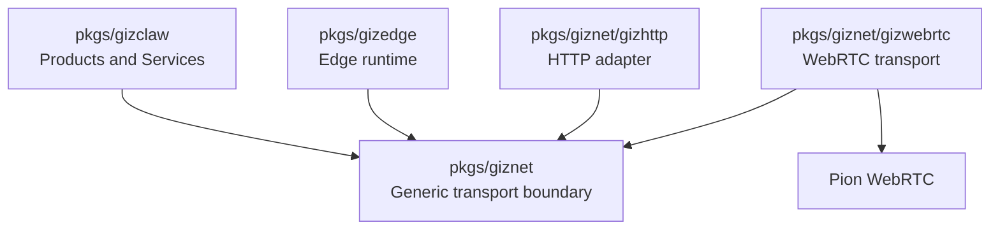

# pkgs/giznet

`pkgs/giznet` is the universal connection and transport layer of GizClaw. It isolates upper-layer services from specific transport implementations, enabling GizClaw Server, Edge Node, and other connecting parties to use unified peer connection, service stream, and packet transport capabilities.

This directory does not own GizClaw's product business. It is only responsible for establishing connections, identifying peers, carrying streams or packets, and providing security policy entry at the transmission boundary.

[Go API References](https://pkg.go.dev/github.com/GizClaw/gizclaw-go@v0.0.0-20260707135347-b9bf1fb24b9f/pkgs/giznet)

## Directory structure

```text
pkgs/giznet/
├── gizhttp/      # general adapters between HTTP and giznet service streams
└── gizwebrtc/    # WebRTC-based giznet transport
```

The root package holds transport-independent connection contracts and underlying types. Sub-packages rely on the root package to implement or adapt specific transmission capabilities.

## Directory Responsibilities

### giznet

`pkgs/giznet` The root directory defines transport-independent boundary, including:

- Peer identity and connection status.
- Public abstraction of Connection and listener.
- Transmission model for Reliable service stream and direct packet.
- Peer and service level security policy entry.
- Protocol, key and error definitions shared by all transport implementations.

These definitions must remain independent of GizClaw business. The upper layer can use them to host different services, but the root package does not know product concepts such as Admin, Device, Agent, OTA or Gameplay.

### gizhttp

`pkgs/giznet/gizhttp` Responsible for carrying standard HTTP requests and responses on the giznet service stream.

It is a general transport adapter that only connects HTTP and giznet and does not have specific routes, handlers, authentication roles or business responses. Specific surfaces such as Peer HTTP, Admin HTTP and Edge HTTP are assembled by the upper package.

### gizwebrtc

`pkgs/giznet/gizwebrtc` is the WebRTC transport implementation of giznet, responsible for WebRTC signaling, ICE, DataChannel, service stream, packet transport and connection life cycle.

WebRTC implementation details related to Pion are left in this subdirectory. The upper-layer GizClaw service relies on the giznet boundary and does not directly diffuse WebRTC types to the business layer.

`DialConfig.OnTiming` optionally receives one `DialTiming` snapshot before
`Dial` returns. It reports client PeerConnection, offer, ICE gathering,
signaling, remote-description, ICE-connected, DTLS-connected, and DataChannel
ready timing without exposing mutable Pion objects.

On a successful Dial, the snapshot also carries an immutable, address-free
selected ICE pair. It contains local and remote candidate type, protocol,
address family, component, nomination/state, and the bounded pair counters
available from Pion. It deliberately omits candidate IDs, addresses, ports,
priorities, foundations, URLs, SDP, and credentials. Missing optional counters
remain explicitly unsupported rather than being synthesized. The callback and
snapshot remain transport diagnostics; `giznet.Conn` does not expose Pion
objects or adopt an Edge-specific contract.

The 2026-08-04 same-head causal diagnostic used this public Giznet transport
without the product Edge or Server. Three 32 MiB runs per direction measured
direct at 818/798 Mbps and REST Coturn at 488/526 Mbps (relay/direct 0.597 and
0.659), while Coturn receive/send counters grew by about 220/219 MB. Together
with the product matrix, this reproduces the material delta below the
Edge/Server boundary and attributes the local result to the Coturn relay path.
It remains a local Docker transport diagnostic, not a production or WAN SLA.

`giznet.Conn` keeps its transport-independent `Dial` surface. Transports that
can cancel a pending service open may additionally implement
`giznet.ContextDialer`. `gizwebrtc.Conn.DialContext` closes only the pending
DataChannel when its context completes; it does not close the parent
PeerConnection. A pre-open DataChannel close or error returns
`gizwebrtc.ErrServiceOpen`, while a parent close continues to match
`giznet.ErrConnClosed`. The existing `Dial` method remains a compatibility
wrapper with a ten-second service-open bound.

Every open service DataChannel is registered against its logical service until
the corresponding `net.Conn` closes. Closing the stream removes it immediately,
and closing a service or parent connection closes a snapshot outside the
registry lock. Repeated short-lived RPC streams therefore do not accumulate in
the parent WebRTC connection, while service and parent shutdown still reject
new streams and close every stream that remains live.

General public client associations retain Pion's default SCTP receive window.
An Edge gateway gives at most 64 currently admitted client associations a 4
MiB burst window, limiting burst-profile receive credit to 256 MiB per Edge;
later associations retain the default until budget is released. The
32 MiB aggregate window is separately scoped to bounded Edge-to-Server upstream
associations: Edge dials request it under the configured `max-upstreams` limit,
and the Server selects it only after the authenticated peer is an active
`edge-node`. It matches the qualified burst of 64 transferring service streams
times their 512 KiB per-DataChannel send budget and prevents interleaved partial
messages from exhausting the receiver window before delivery. A connection
also admits at most 2,048 remotely opened service DataChannels, matching the
gateway's active-session ceiling per upstream association; excess channels are
closed before delivery, so service labels cannot create unbounded queues. SCTP
retransmission is capped at 250 ms, and DTLS
flights use a 250 ms initial retransmission interval, so lost handshake flights
during a burst do not add the one-second defaults. SCTP reliable delivery and
its retransmission count remain unchanged; DTLS retransmission and exponential
backoff remain enabled.

## Dependencies



The dependency direction is:

- `pkgs/gizclaw` and `pkgs/gizedge` consume the generic transport boundaries provided by giznet.
- `gizhttp` and `gizwebrtc` rely on the giznet root package to complete the transport adapter or implementation.
- `pkgs/giznet` does not rely on `pkgs/gizclaw`, `pkgs/gizedge` or specific business services.

## Ownership Boundary

Should be placed at `pkgs/giznet`:

- Peer, connection, listener, stream, packet, security policy and transport basic definitions that can be reused by all connected parties.
- Network capabilities that are not tied to specific GizClaw product roles or business resources.

Should be placed at `pkgs/giznet/gizwebrtc`:

- Only implementations of WebRTC, ICE, signaling, DataChannel or Pion integration.
- WebRTC implementation of giznet transport boundary.

Should be placed at `pkgs/giznet/gizhttp`:

- Adaptation logic between HTTP and giznet service stream that can be reused by different upper-layer services.

Should not be placed in `pkgs/giznet`:

- Specific RPC method, HTTP route or service ID ownership of Admin, Peer and Edge.
- Device, Agent, OTA, Gameplay, Social and other business services.
- Server storage, workspace, configuration loading and CLI startup assembly.
- Firmware, board, desktop UI or browser product logic.
- Authorization rules that only make sense for a single GizClaw business surface.

These contents belong to `pkgs/gizclaw`, `pkgs/gizedge`, `cmd/internal/server` or the corresponding client directory.
