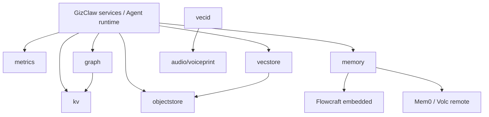

# pkgs/store Overview

`pkgs/store` Provides GizClaw with basic persistence and indexing capabilities that are used in multiple fields. This defines a storage abstraction and generic implementation that does not own business rules for Peer, Agent, AI, Gameplay or other product resources.

## Package structure

```text
pkgs/store/
├── graph/        # Entity / Relation graph abstraction
├── kv/           # Ordered hierarchical key-value store
├── logstore/     # Searchable immutable/mutable records and log drivers
├── memory/       # Observation extraction, fact recall, and provider adapters
├── metrics/      # Time-series sample write and query
├── objectstore/  # Prefix-addressable binary object storage
├── storage/      # Typed physical connection configs, instances, and lifecycle
├── vecid/        # Vector locality-sensitive identity registry
└── vecstore/     # Vector similarity index
```

| Package | Core Boundary | Key Consumers |
| --- | --- | --- |
| [graph](./graph) | Entity, Relation and adjacency query | Agent memory, recall |
| [kv](./kv) | Ordered hierarchical key, CRUD and range traversal | GizClaw services, Agent memory, other stores |
| [logstore](./logstore) | Structured record append/mutation, backend-neutral query and pagination | Process logs and conversation/event producers |
| [memory](./memory) | Raw observations, fact recall/update/delete, and asynchronous operations | Agent runtimes and memory evaluation harnesses |
| [metrics](./metrics) | Sample writing, instant/range query and aggregation | Peer telemetry, Server metrics |
| [objectstore](./objectstore) | Binary object, prefix list/delete and expiration | Firmware, workspace, gameplay assets, HNSW |
| [vecid](./vecid) | Vector hashing, bucket and identity clustering | Voiceprint detection |
| [vecstore](./vecstore) | Vector add/search/delete and HNSW persistence | Agent recall, memory index |

## Dependencies



`cmd/internal/server` exclusively owns YAML DTOs, strict decoding, environment expansion, and workspace-relative path resolution, then passes plain Go configurations to public packages. `pkgs/store/storage` opens and owns physical resources. The root `pkgs/store` package validates Storage/Store combinations and constructs logical Stores. Neither public package reads YAML or JSON or selects service bindings.

### Server composition contract

`storage` is the dynamic inventory of physical Data Connectors. Each `kind` directly identifies one concrete backend and owns its path, DSN, endpoint, credentials, pool or client, readiness, and lifecycle. `stores` combines a Store kind with a Storage kind to construct a logical interface scoped by prefix, table, database, or topic. The fixed typed `services` block binds built-in consumers to named compatible Stores. Registry names are exact and have no reserved service meaning.

| Store kind | Interface and scope |
| --- | --- |
| `keyvalue` | `kv.Store`; optional key prefix for Badger/memory, or a required prefix that the SQLite/PostgreSQL backend uses as its physical table name |
| `sql` | borrowed `*sqlx.DB` physical pool; service owns its schema |
| `objectstore` | `objectstore.ObjectStore`; optional object prefix |
| `metrics` | `metrics.Store`; `memory`, Prometheus, ClickHouse, or a SQLite/PostgreSQL table |
| `log.immutable` | `logstore.ImmutableStore`; Volc topic or a ClickHouse/SQLite/PostgreSQL table |
| `log.mutable` | `logstore.MutableStore`; a ClickHouse/SQLite/PostgreSQL table |

| Storage kind | Physical configuration |
| --- | --- |
| `badger` | `dir` |
| `memory` | no properties |
| `filesystem.dir` | `dir` |
| `sqlite` | exactly one of `dir` or `dsn` |
| `postgresql`, `clickhouse` | `dsn` |
| `prometheus` | remote-write/query URLs and optional bearer token |
| `volc-tls` | endpoint, region, and credentials |

The public Go API does not use one generic property bag containing `Kind` and
every backend field. `storage.Config` is a package-sealed configuration
interface, and each backend exposes only its own valid fields:

```go
physical, err := storage.New(map[string]storage.Config{
	"main": storage.PostgreSQLConfig{DSN: postgresDSN},
	"cache": storage.BadgerConfig{Dir: cacheDir},
	"local": storage.MemoryConfig{},
})
```

The concrete implementations are `BadgerConfig`, `MemoryConfig`,
`FilesystemDirConfig`, `SQLiteConfig`, `PostgreSQLConfig`, `ClickHouseConfig`,
`PrometheusConfig`, and `VolcTLSConfig`. A Go caller therefore cannot pass a
directory to PostgreSQL or a DSN/provider credential to Badger.
`cmd/internal/server` retains the flat YAML DTO and explicitly converts each
`kind` to its concrete Go type; YAML fields never enter the public config types.

Multiple Stores may borrow one connector. The caller closes logical `Stores` first and physical `Storage` second. `memory` is a stateless marker; every keyvalue or metrics Store that references it creates an independent instance. `vecstore` and `graph` have no built-in Server consumer, so they are not command-layer Store kinds; their public packages and constructors remain available. Memory connections selected through RuntimeProfile and MemoryLayout remain outside this registry.

A SQLite/PostgreSQL KV Store declares only one single-segment `prefix`; the backend uses it directly as the quoted physical table name and does not repeat that prefix inside encoded keys. Metrics and Log Stores continue declaring `table`. These physical names are unqualified ASCII names of at most 63 bytes; a KV prefix may also contain `-`. Logical declarations cannot claim the same physical table on one connector: SQLite compares ASCII names case-insensitively, while PostgreSQL compares exact quoted names. The registry validates the complete compatibility, scope, and table-claim set before any DDL. Construction directly ensures the table and indexes with idempotent `CREATE ... IF NOT EXISTS`, then validates the exact columns, primary key, identity, and indexes. It creates no schema version or history table and never imports or rewrites existing backend data. A compatible existing table is reused; an incompatible definition fails startup. Logical `Close` changes only adapter state and never closes the borrowed `*sqlx.DB`.

`storage.SQLTable` is the single owner of SQLite/PostgreSQL borrowed-table dialect, identifier, quoting, initialization, and schema-inspection behavior; callers can construct it only from a validated pool and table name. KV, Metrics, and Log continue owning their business table definitions but consume this storage capability directly, without a separate SQL backend helper package.

### Process SQLite DSN contract

`pkgs/store/storage` accepts modernc SQLite DSNs and continues to support
modernc parameters such as `_pragma`. GizClaw owns the connection's
`busy_timeout`, WAL journal mode, and foreign-key PRAGMAs. The
`go-sqlite3`-compatible shorthand parameters `_busy_timeout`/`_timeout`,
`_foreign_keys`/`_fk`, `_journal_mode`/`_journal`,
`_synchronous`/`_sync`, `_auto_vacuum`/`_vacuum`, and `_query_only` are not
supported and are rejected before the database is opened. This prevents a
dependency update from silently changing database-file or connection behavior;
configure a different policy in storage-owned code instead of through these DSN
shortcuts.

## Placement rules

Storage interfaces, backend adapters, and common key, query, index, expiration, and persistence semantics that can be reused across domains are stored here. Domain resource schema, HTTP/RPC, authorization, process configuration, and repositories belonging only to a single domain should not be placed in `pkgs/store`.
