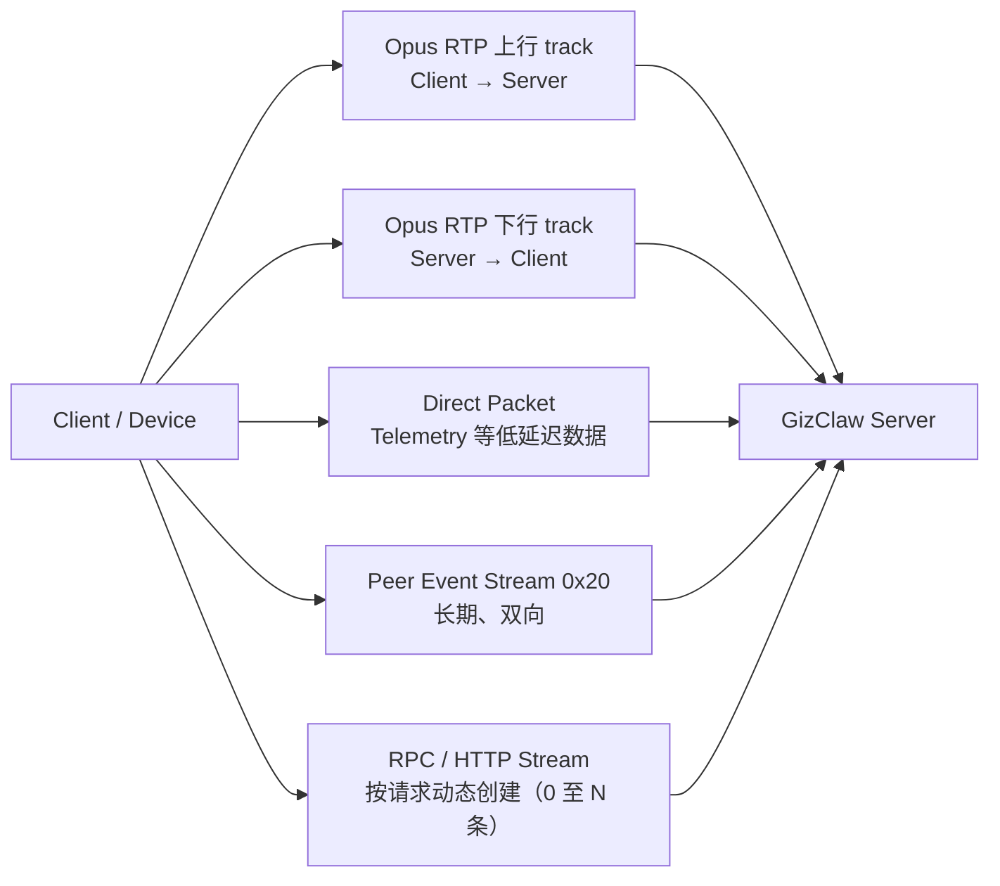

# Streams

一条 GizClaw Peer connection 同时承载实时 media、direct packet 和可靠 service stream。它们的可靠性、生命周期和载荷不同，不能把所有数据都当作同一种“stream”。

## Transport overview

| Stream | 方向 | 承载与可靠性 | 生命周期 | 主要载荷 |
| --- | --- | --- | --- | --- |
| Opus media uplink | Client / Device → Server | WebRTC audio RTP | Peer connection 级别的一条 remote track | 麦克风实时 Opus packets。 |
| Opus media downlink | Server → Client / Device | WebRTC audio RTP | Peer connection 级别的一条 remote track | Agent 输出经 mixer 合成后的实时 Opus packets。 |
| Direct packet | 双向 | unordered、`maxRetransmits=0` DataChannel | 一条 connection 级长期 channel | 单字节 protocol 加 packet payload；适合允许丢包的高频数据。 |
| Peer Event Stream | 双向 | reliable、ordered service DataChannel，ID `0x20` | 每条 Peer connection 通常保持一条 | Protobuf BOS、EOS、文本和资源失效通知；不含实时音频 bytes。 |
| RPC service stream | 双向 | reliable、ordered service DataChannel | 通常每次调用新建；Server 也接受同一 channel 上的顺序调用 | Protobuf request/response、有限 binary stream。 |
| HTTP service stream | 请求方 ↔ Provider | reliable、ordered service DataChannel | 每次 HTTP round trip 动态打开 | HTTP request 与 response。 |

因此 stream 数量不是常量。空闲的常见会话有双向 audio RTP、一个 packet
DataChannel，并可选地保持一个 Peer Event Stream；每个并发 RPC 或 HTTP
请求都会再增加一条 service DataChannel。

## 一条连接有多少个 stream

| 类别 | 常见数量 | 说明 |
| --- | ---: | --- |
| Opus RTP uplink | 1 | Client / Device 麦克风上行。 |
| Opus RTP downlink | 1 | Server 混音后的音频下行。 |
| Direct packet DataChannel | 1 | Telemetry 等允许丢包的 connection-scoped packet。 |
| Peer Event Stream | 0 或 1 | Client 打开后通常在整条 Peer connection 生命周期内保持。 |
| RPC service stream | 0–N | 按调用动态创建。 |
| HTTP service stream | 0–N | 按 HTTP round trip 动态创建。 |

Peer Event Stream 是 connection-scoped transport，不属于某个 Workspace 或页面。
一个 Client 应为一条 Peer connection 维护一个 session，再在本地把事件分发给
当前 conversation、聊天 viewer 和资源 controller。页面 controller 不应各自打开
新的 `0x20` stream。

## Audio streams

WebRTC 两端各创建一条 Opus audio track：Client / Device 的 track 用于上行麦克风，Server 的 track 用于下行混音播放。Giznet API 以 `ProtocolOpusPacket 0x10` 暴露这些 Opus packets，但 WebRTC 实现会把该 protocol 映射到 RTP track，不会把它写进 direct packet DataChannel。

音频的生命周期 metadata 可以通过 [Events](./events) 的 `bos` / `eos`、`kind=audio` 和 `mime_type` 表达；实时音频 bytes 仍只走 RTP。

## Direct packets

Direct packet channel 的每条消息由一个 protocol byte 和 payload 组成。`0x00`–`0x3f` 保留给 Giznet well-known protocols，`0x40`–`0xff` 可用于应用或自定义 protocol。

| Protocol | 方向 | 作用 |
| --- | --- | --- |
| `0x10` `ProtocolOpusPacket` | 双向 API | Opus media 的 Giznet API 标识；WebRTC wire 使用 RTP，不占用 packet DataChannel。 |
| `0x40` `EventStreamTelemetry` | Client / Device → Server | 上报高频 telemetry packet。队列满时允许丢弃，不能用于必须可靠送达的状态。 |

未知的 direct packet protocol 不会被当作 service stream；Server 当前忽略未注册 packet。

## RPC streams

RPC 使用可靠、有序的 service DataChannel。Service ID 选择 Provider，RPC frame 定义单条 channel 内的 framing，binary stream 则是在 RPC request 或 response 中传输有界 bytes。

### Service stream IDs

每次 `Dial(serviceID)` 创建一条独立的可靠、有序 service DataChannel。相同 service ID 可以同时存在多条 channel。

| ID | 名称 | Provider / 用途 |
| ---: | --- | --- |
| `0x00` | `ServicePeerRPC` | Peer RPC。Client 调用 Server；Server 也可反向调用 Client provider。 |
| `0x01` | `ServicePeerHTTP` | Peer HTTP API。 |
| `0x02` | `ServicePeerOpenAI` | OpenAI-compatible HTTP API。 |
| `0x10` | `ServiceAdminHTTP` | Admin HTTP API。 |
| `0x20` | `EventStreamAgent` | 长期双向 Peer Event Stream；名称为兼容标识。 |
| `0x30` | `ServiceEdgeHTTP` | Edge-node HTTP forwarding。 |
| `0x31` | `ServiceEdgeRPC` | Edge-node control RPC。 |

HTTP endpoint 见 [Admin API](/api/)；RPC method 见 [RPC API Reference](./rpc)。

### RPC frames

RPC service stream 内使用统一的 4-byte little-endian header：前 2 bytes 是 payload length，后 2 bytes 是 frame type。单个 frame payload 最大为 65,535 bytes。

| Type | 数值 | Payload | 作用 |
| --- | ---: | --- | --- |
| `FrameTypeEOS` | `0` | 必须为空 | 结束当前方向的一段 frame sequence。 |
| `FrameTypeJSON` | `1` | JSON | RPC JSON payload；Peer Event Stream 不接受。 |
| `FrameTypeBinary` | `2` | bytes | Protobuf envelope、PeerEvent 或业务 binary chunk。 |
| `FrameTypeText` | `3` | text / continuation bytes | RPC text payload；Peer Event Stream 不接受。 |

普通 unary RPC 的双方序列都是 `Protobuf envelope → EOS`。Binary RPC 在 request 或 response envelope 与 EOS 之间加入零个或多个 `FrameTypeBinary` chunks。`all.speed_test.run` 可以同时进行双向 binary frames；Firmware、history audio、Workspace icon、Badge PIXA 和 Pet PIXA 下载使用 Server → Client / Device binary frames。

RPC EOS 只结束当前 frame sequence，不等于 [Event `type=eos`](./events#four-different-end-boundaries)，也不等于关闭 service DataChannel。当前调用方通常为一次调用打开一条新 channel；RPC Server 也支持在仍然打开的 channel 上顺序处理多个请求。

### Binary streams

以下都是 request-scoped RPC binary streams。Audio 只是其中一种业务 payload；
这些数据不属于 WebRTC audio track，也不属于 Peer Event Stream。

| RPC method | Binary frames 方向 | Payload |
| --- | --- | --- |
| `all.speed_test.run` | 双向 | 指定长度的测速 bytes。 |
| `server.speech.transcribe` | Client / Device → Server | Request envelope 后上传的有界音频；Server 返回最终 transcript。 |
| `server.speech.synthesize` | Server → Client / Device | Response metadata 后返回的有界合成音频。 |
| `server.workspace.history.audio.get` | Server → Client / Device | Workspace history 音频。 |
| `server.firmware.files.download` | Server → Client / Device | Firmware artifact 文件。 |
| `server.workspace.icon.download` | Server → Client / Device | Workspace icon。 |
| `server.badge_def.pixa.download` | Server → Client / Device | Badge Definition PIXA。 |
| `server.pet.pixa.download` | Server → Client / Device | Pet PIXA。 |

每个方向都以 RPC EOS 结束。方法参数和用途见 [RPC API Reference](./rpc)，其中语音方法位于[独立流式语音](./rpc#独立流式语音)，history audio 位于 [Workspace 与 history](./rpc#workspace-与-history)。

更完整的 Peer connection 组件职责见[开发指引：Connection](/zh/developing/gizclaw/peer/conn#传输-contract)。

## Reliable ordered service stream writing

HTTP、RPC 与 Event 的上层 framing 不因 DataChannel 分片而改变；DataChannel message boundary 不是上层 frame boundary。所有 reliable、ordered `giznet/v1/service/<id>` DataChannel 都遵守同一写入模型：

- 每个 channel 只有一个串行 writer，并发逻辑写入的 bytes 不会交错。
- 每个原生 DataChannel message 最多承载 1400 bytes，接收端按连续 byte stream 重组 HTTP 或 RPC/Event frame。
- writer 在 buffered amount 到达 high-water 时停止入队，只在 buffered-amount-low 通知后确认队列不高于 low-water 才恢复。
- 写入完成只表示全部 bytes 已被本地 WebRTC 发送队列接受，不表示远端已经接收或处理。
- close、error、send failure 以及调用路径已有的 timeout/cancellation 会唤醒并终止 active/queued writes。部分逻辑写入失败后，该 service channel 必须关闭，剩余 bytes 不会换新 channel 重试。

| SDK | High-water | Low-water | Native message max |
| --- | ---: | ---: | ---: |
| Go server | 1 MiB | 256 KiB | 1400 bytes |
| JavaScript | 1 MiB | 256 KiB | 1400 bytes |
| Flutter | 1 MiB | 256 KiB | 1400 bytes |
| C API v2 default | 256 KiB | 64 KiB | 1400 bytes |

C 调用方可以通过 `gzc_client_config_t.service_write_high_water_bytes` 与 `service_write_low_water_bytes` 调大阈值；自定义 high-water 不得小于 1400 bytes，且 low-water 必须小于 high-water。`write_timeout_ms` 使用 platform 的单调 `time_instant_ms` 计算完整同步逻辑写入的 elapsed time。同步 C API 只在调用期间借用 caller buffer。

Unreliable/unordered direct packet DataChannel、Telemetry packet 与 RTP media 不使用 service writer，也不继承上述 water marks。BOS/EOS 等业务边界仍由各自上层协议定义。
