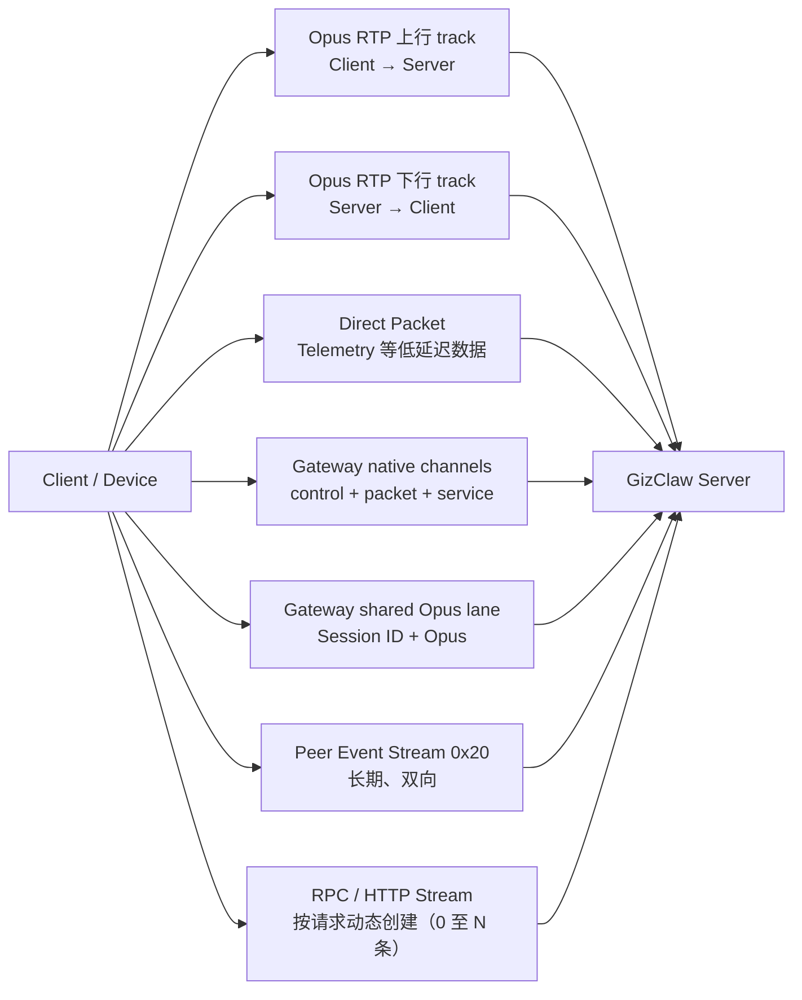

# Streams

一条 GizClaw Peer connection 同时承载实时 media、direct packet 和可靠 service stream。它们的可靠性、生命周期和载荷不同，不能把所有数据都当作同一种“stream”。


```mermaid
flowchart LR
    Client["Client / Device"] --> MediaUp["Opus RTP 上行 track<br/>Client → Server"] --> Server["GizClaw Server"]
    Client --> MediaDown["Opus RTP 下行 track<br/>Server → Client"] --> Server
    Client --> Packet["Direct Packet<br/>Telemetry 等低延迟数据"] --> Server
    Client --> EdgeChannels["Gateway native channels<br/>control + packet + service"] --> Server
    Client --> EdgeOpus["Gateway shared Opus lane<br/>Session ID + Opus"] --> Server
    Client --> Events["Peer Event Stream 0x20<br/>长期、双向"] --> Server
    Client --> Services["RPC / HTTP Stream<br/>按请求动态创建（0 至 N 条）"] --> Server
```

## Transport overview

| Stream | 方向 | 承载与可靠性 | 生命周期 | 主要载荷 |
| --- | --- | --- | --- | --- |
| Opus media uplink | Client / Device → Server | WebRTC audio RTP | Peer connection 级别的一条 remote track | 麦克风实时 Opus packets。 |
| Opus media downlink | Server → Client / Device | WebRTC audio RTP | Peer connection 级别的一条 remote track | Agent 输出经 mixer 合成后的实时 Opus packets。 |
| Direct packet | 双向 | unordered、`maxRetransmits=0` DataChannel | 一条 connection 级长期 channel | 单字节 protocol 加 packet payload；适合允许丢包的高频数据。 |
| Gateway logical packet | Edge ↔ Server | 每个 session 一条 unordered、`maxRetransmits=0` DataChannel | logical connection 级长期 channel | 单字节 protocol 加原始 direct-packet payload；label 负责 session 路由。 |
| Gateway Opus lane | Edge ↔ Server | physical unordered、`maxRetransmits=0` DataChannel | 每条 Edge upstream 一条，共享给多个 logical sessions | version、16-byte session ID 与 Opus payload。 |
| Peer Event Stream | 双向 | reliable、ordered service DataChannel，ID `0x20` | 每条正常 Client / Device Peer connection 必须保持一条 | Protobuf BOS、EOS、文本和资源失效通知；不含实时音频 bytes。 |
| RPC service stream | 双向 | reliable、ordered service DataChannel | 每次调用新建，完成后关闭 | Protobuf request/response、有限 binary stream。 |
| HTTP service stream | 请求方 ↔ Provider | reliable、ordered service DataChannel | 每次 HTTP round trip 动态打开 | HTTP request 与 response。 |

因此总 stream 数量不是常量。正常 Client / Device Peer connection 的四条
connection-scoped transport 是固定且必需的；每个并发 RPC 或 HTTP 请求都会在
此基础上增加一条独立 service DataChannel。

## 一条连接有多少个 stream

| 类别 | 数量 contract | 说明 |
| --- | ---: | --- |
| Opus RTP uplink | 1 | Client / Device 麦克风上行。 |
| Opus RTP downlink | 1 | Server 混音后的音频下行。 |
| Direct packet DataChannel | 1 | Telemetry 等允许丢包的 connection-scoped packet。 |
| Peer Event Stream | 1 | reliable、ordered 的 connection-owned `0x20`。 |
| RPC service stream | 0–N | 按调用动态创建。 |
| HTTP service stream | 0–N | 按 HTTP round trip 动态创建。 |

Peer Event Stream 是 connection-scoped transport，不属于某个 Workspace 或页面。
连接建立路径必须创建并等待它打开，再把连接报告为 ready。一个 Client 为一条
Peer connection 维护一个 physical session，并在本地把事件分发给当前
conversation、聊天 viewer 和资源 controller。页面 controller 只能订阅；打开、
关闭、reload 或切换 Workspace 都不能创建、替换或关闭 physical `0x20`。

任一必需 transport 意外关闭都会使整个 Peer connection 不再健康并触发完整关闭；
重连创建的是一条具有全新四条 transport 的 Peer connection，不在旧连接内单独
替换 Event。重复 packet channel、Event channel 或 Opus uplink 不能替换已接受的
实例，也不能形成两个 active owner。

## Audio streams

WebRTC 两端各创建一条 Opus audio track：Client / Device 的 track 用于上行麦克风，Server 的 track 用于下行混音播放。Giznet API 以 `ProtocolOpusPacket 0x10` 暴露这些 Opus packets，但 WebRTC 实现会把该 protocol 映射到 RTP track，不会把它写进 direct packet DataChannel。

音频的生命周期 metadata 通过 [Events](./events) 的 `bos` / `eos` 和 `kind=audio` 表达，实时音频 bytes 仍只走 RTP。下行连接只有一条固定 Opus track，因此混音总生命周期的 `mime_type` 为空；Agent source MIME 只用于 Server 内部解码。上行输入可以继续用 event MIME 描述其逻辑 route。

Workspace reload 替换 Agent input 时，只替换逻辑 user-audio route。Server 通过现有
Event Stream 发送 `INPUT_ROUTE_RELOADED` EOS，选择连续录音恢复的 Client 再在同一
Event Stream 发送 fresh BOS。JavaScript Client 通过
`createContinuousAudioRouteRearm` 声明 active continuous route；该 owner 自己订阅 EOS、
发送 replacement BOS 并报告新的 stream ID，调用方不需要手动分发 EOS。这个 re-arm 不重新获取或停止麦克风，不调用
`replaceTrack`，不重新协商 WebRTC，也不创建、关闭或替换 Opus uplink、Opus downlink、
Direct Packet DataChannel、physical `0x20` Event Stream 或 PeerConnection。

## Direct packets

Direct packet channel 的每条消息由一个 protocol byte 和 payload 组成。`0x00`–`0x3f` 保留给 Giznet well-known protocols，`0x40`–`0xff` 可用于应用或自定义 protocol。

| Protocol | 方向 | 作用 |
| --- | --- | --- |
| `0x10` `ProtocolOpusPacket` | 双向 API | Opus media 的 Giznet API 标识；WebRTC wire 使用 RTP，不占用 packet DataChannel。 |
| `0x11` `ProtocolTunnelPacket` | Edge ↔ Server | Gateway physical upstream 上仅存的 session-tagged Opus payload；禁止 logical client 直接嵌套发送。 |
| `0x40` `EventStreamTelemetry` | Client / Device → Server | 上报高频 telemetry packet。队列满时允许丢弃，不能用于必须可靠送达的状态。 |

Direct Packet DataChannel 上收到 `0x10` 时必须静默丢弃，不能当作音频交付，也
不能关闭 DataChannel 或 Peer connection。其他不支持的保留 protocol
`0x00`–`0x3f` 同样静默丢弃；后续合法 packet、Event 和 service stream 继续工作。
`0x40`–`0xff` 仍可交给上层注册方；上层未注册时由其忽略。

## RPC streams

RPC 使用可靠、有序的 service DataChannel。Service ID 选择 Provider，RPC frame 定义单条 channel 内的 framing，binary stream 则是在 RPC request 或 response 中传输有界 bytes。

`server.workspace.history.audio.download` 与 `server.friend_group.messages.audio.download` 都使用相同的下载顺序：request envelope、request EOS、response metadata envelope、一个或多个 binary frame、response EOS。Friend Group 版本按 `friend_group_name + history_name` 鉴权和寻址，metadata 回显这两个 identity；客户端必须校验 `audio/*` MIME、累计 bytes 精确等于 `size_bytes`，并收到最终 EOS 后才把下载视为完整。

### Service stream IDs

每次 `Dial(serviceID)` 创建一条独立的可靠、有序 service DataChannel。相同 service ID 可以同时存在多条 channel。
关闭或写入失败只影响对应 channel，不能替换或关闭相同 ID 的其他 channel，也
不能占用或替换 connection-owned Event transport。C cgo backend 同时保留最多
16 条本地主动创建的 service DataChannel，其中 connect 创建的 Event 占一条，因此正常连接还可同时打开 15 条 caller-created service channel。达到上限时新建明确返回 `GZC_ERR_CHANNEL_LIMIT`，不会复用或替换已有 channel；关闭一条后即可再次创建。

| ID | 名称 | Provider / 用途 |
| ---: | --- | --- |
| `0x00` | `ServicePeerRPC` | Peer RPC。Client 调用 Server；Server 也可反向调用 Client provider。 |
| `0x01` | `ServicePeerHTTP` | Peer HTTP API。 |
| `0x02` | `ServicePeerOpenAI` | OpenAI-compatible HTTP API。 |
| `0x10` | `ServiceAdminHTTP` | Admin HTTP API。 |
| `0x20` | `EventStreamAgent` | 长期双向 Peer Event Stream；名称为兼容标识。 |
| `0x30` | `ServiceEdgeHTTP` | Edge-node HTTP forwarding。 |
| `0x31` | `ServiceEdgeRPC` | Edge-node control RPC。 |

### Gateway native channels

Edge-to-Server 不再使用 `ServiceEdgeTunnel 0x32` 或 application-level stream mux。受信的
active Edge 在同一条 physical WebRTC PeerConnection 上使用下列 canonical label：

```text
giznet/v2/tunnel/<session-id>/control/<client-public-key>/<remote-addr-base64url>
giznet/v2/tunnel/<session-id>/packet
giznet/v2/tunnel/<session-id>/service/<service-id>/<channel-id>
```

control channel 可靠有序，只承载一次 `GZT2` Server acceptance result；它的 label 是
logical client identity 与 endpoint 的唯一声明。packet channel 无序且
`maxRetransmits=0`，每条消息只有 protocol byte 与 direct-packet payload。每个 Event、RPC、
HTTP 或其他 service 使用独立的可靠有序 DataChannel；Edge 创建奇数 channel ID，Server
创建偶数 channel ID。关闭一条 service channel 只关闭对应 logical stream。

Opus 不进入这些 channel。它继续使用 `ProtocolTunnelPacket 0x11` 的 shared physical
unreliable lane，并带 version 与 16-byte session ID。多个 native DataChannel 可隔离 writer、
backpressure 和 close/reset，但仍共享一条 SCTP association 的拥塞控制；需要 aggregate
throughput 时仍以独立 physical upstream 扩展。

每个 session 默认最多 32 条 active tunnel channels，每条 upstream 最多 8192 条；默认
2048 sessions 会占用 control、packet、mandatory Event 共 6144 条，并保留 2048 条并发
request service。可靠写入同时受每 channel、1 MiB session 和 32 MiB association budget
约束；buffered bytes 排空后才释放 reservation。

HTTP endpoint 见 [Admin API](/api/)；RPC method 见 [RPC API Reference](./rpc)。

### RPC frames

RPC service stream 内使用统一的 4-byte little-endian header：前 2 bytes 是 payload length，后 2 bytes 是 frame type。单个 frame payload 最大为 65,535 bytes。

| Type | 数值 | Payload | 作用 |
| --- | ---: | --- | --- |
| `FrameTypeEOS` | `0` | 必须为空 | 结束当前方向的一段 frame sequence。 |
| `FrameTypeJSON` | `1` | JSON | RPC JSON payload；Peer Event Stream 不接受。 |
| `FrameTypeBinary` | `2` | bytes | Protobuf envelope、PeerEvent 或业务 binary chunk。 |
| `FrameTypeText` | `3` | text / continuation bytes | RPC text payload；Peer Event Stream 不接受。 |

普通 unary RPC 的双方序列都是 `Protobuf envelope → EOS`。Binary RPC 在 request 或 response envelope 与 EOS 之间加入零个或多个 `FrameTypeBinary` chunks。`all.speed_test.run` 可以同时进行双向 binary frames；Firmware、history audio、Workspace icon、Badge PIXA 和 Pet PIXA 下载使用 Server → Client / Device binary frames。

RPC EOS 结束当前方向的 frame sequence；完整 request/response lifecycle 结束后，Provider 关闭该 service DataChannel。它不等于 [Event `type=eos`](./events#four-different-end-boundaries)。一条 RPC DataChannel 只承载一个请求；顺序或提前缓冲的第二个请求不会被 dispatch，下一次 RPC 必须新建 channel。

### Binary streams

以下都是 request-scoped RPC binary streams。Audio 只是其中一种业务 payload；
这些数据不属于 WebRTC audio track，也不属于 Peer Event Stream。

| RPC method | Binary frames 方向 | Payload |
| --- | --- | --- |
| `all.speed_test.run` | 双向 | 指定长度的测速 bytes。 |
| `server.speech.transcribe` | Client / Device → Server | Request envelope 后上传的有界音频；Server 返回最终 transcript。 |
| `server.speech.extract` | Client / Device → Server | Request envelope 后上传的有界音频；Server 返回 transcript 与 schema-constrained JSON。 |
| `server.speech.synthesize` | Server → Client / Device | Response metadata 后返回的有界合成音频。 |
| `server.workspace.history.audio.download` | Server → Client / Device | Workspace history 音频。 |
| `server.workspace.icon.download` | Server → Client / Device | Workspace icon。 |
| `server.badge_def.pixa.download` | Server → Client / Device | Badge Definition PIXA。 |
| `server.pet.pixa.download` | Server → Client / Device | Pet PIXA。 |

每个方向都以 RPC EOS 结束。方法参数和用途见 [RPC API Reference](./rpc)，其中语音方法位于[独立流式语音](./rpc#独立流式语音)，history audio 位于 [Workspace 与 history](./rpc#workspace-与-history)。

更完整的 Peer connection 组件职责见[开发指引：Connection](/zh/developing/gizclaw/peer/conn#传输-contract)。

## Reliable ordered service stream writing

HTTP、RPC 与 Event 的上层 framing 不因 DataChannel 分片而改变；DataChannel message boundary 不是上层 frame boundary。所有 reliable、ordered `giznet/v1/service/<id>` DataChannel 都遵守同一写入模型：

- 每个 channel 只有一个串行 writer，并发逻辑写入的 bytes 不会交错。
- 原生 DataChannel message 上限按 SDK 资源边界选择：Go、JavaScript 与 Flutter 使用 16 KiB，嵌入式 C SDK 使用 4 KiB；接收端按连续 byte stream 重组 HTTP 或 RPC/Event frame。
- writer 在 buffered amount 到达 high-water 时停止入队，只在 buffered-amount-low 通知后确认队列不高于 low-water 才恢复。
- 写入完成只表示全部 bytes 已被本地 WebRTC 发送队列接受，不表示远端已经接收或处理。
- close、error、send failure 以及调用路径已有的 timeout/cancellation 会唤醒并终止 active/queued writes。部分逻辑写入失败后，该 service channel 必须关闭，剩余 bytes 不会换新 channel 重试。

| SDK | High-water | Low-water | Native message max |
| --- | ---: | ---: | ---: |
| Go server | 1 MiB | 256 KiB | 16 KiB |
| JavaScript | 1 MiB | 256 KiB | 16 KiB |
| Flutter | 1 MiB | 256 KiB | 16 KiB |
| C SDK default | 256 KiB | 64 KiB | 4 KiB |

C 调用方可以通过 `gzc_client_config_t.service_write_high_water_bytes` 与 `service_write_low_water_bytes` 调大阈值；自定义 high-water 不得小于 4 KiB，且 low-water 必须小于 high-water。`write_timeout_ms` 使用 platform 的单调 `time_instant_ms` 计算完整同步逻辑写入的 elapsed time。同步 C API 只在调用期间借用 caller buffer。

C SDK 的 `gzc_rpc_request_start` 为每个 unary 请求创建独立 service
DataChannel。调用方仍是唯一的 `gzc_client_poll` owner；poll 会按 DataChannel
identity 把任意交错到达的 response 分发给对应 request。`result` 本身不 poll，
pending 返回 `GZC_ERR_WOULD_BLOCK`。完成、取消、超时、远端关闭或 client 关闭只
终止并释放该 request 的 channel，不关闭 sibling channel 或 Peer connection。
response view 由 request 持有，直到 `gzc_rpc_request_destroy`；platform allocator
必须比 request handle 活得更久。

Unreliable/unordered direct packet DataChannel、Telemetry packet 与 RTP media 不使用 service writer，也不继承上述 water marks。C SDK 的 Opus RTP 接收使用一次连续分配的固定槽位 ring，默认 64 packets；调用方只能在 connect 前通过 `gzc_client_set_opus_rx_capacity` 调整容量。队列满时覆盖最旧 Opus，client close 或显式 `gzc_client_discard_opus_rx` 立即清空队列；`gzc_client_read_packet_into` 可以直接写入 caller storage，并在 buffer 太小时保留 packet 供重试。BOS/EOS 等业务边界仍由各自上层协议定义。
