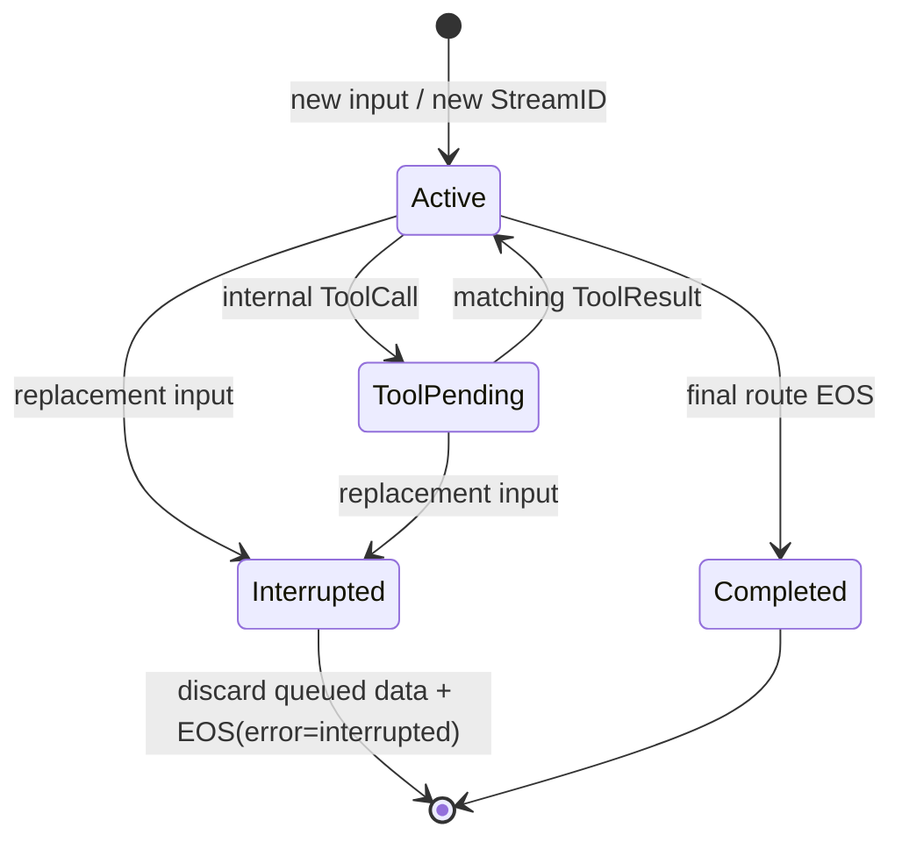

# Agent Runtime

[`pkgs/agent`](https://pkg.go.dev/github.com/GizClaw/gizclaw-go/pkgs/agent) 定义拥有完整模型推理轮次的 AI Agent。Agent 保持 `genx.Transformer` 输入输出契约，但会在内部完成模型调用、ToolCall 执行、ToolResult 回传、继续推理和最终输出。

Chatroom、AST Translate、ASR、TTS 和普通媒体 pipeline 只转换 stream，不拥有模型推理轮次，因此仍是 Transformer。GizClaw Agent Host 为两类 runtime 使用独立 registry；共享 workspace stream host 不会改变它们的分类。

## Package 边界

| Package | 职责 |
| --- | --- |
| `pkgs/agent` | Agent interface、可执行 Toolkit、pull-output buffer、StreamID 和 interruption contract。 |
| `pkgs/agent/flowcraft` | GizClaw-owned Flowcraft graph、GenX model adapter、LogStore history 和 Memory 集成。 |
| `pkgs/agent/eino` | Eino ReAct graph、Eino native Tool adapter、LogStore history 和 Memory 集成。 |
| `pkgs/agent/doubaorealtime` | 豆包 Realtime Duplex `1.2.6.0` function-call session。 |
| `pkgs/agent/dashscoperealtime` | Qwen3.5 Omni Realtime typed function-call session。 |
| `pkgs/gizclaw/services/runtime/agenthost` | 解析 Workspace、授权 Toolkit、构造和复用 Agent，并适配可选产品 API。 |

`pkgs/agent` 不依赖 GizClaw Resource、ownership/access profile、Workspace、Peer、RPC 或生成 API。产品层先解析 model、store、resource access 和 device-bound executor，再把完成解析的依赖传给具体 Agent Config。每个实现拥有自己的强类型 Config；不存在跨 provider 的 union Config。

## Toolkit 与 ToolCall

Agent-facing Toolkit 同时提供不可变的 Tool declaration snapshot 和对应的 `Invoke`。GizClaw 只把通过 owner/RuntimeProfile 选择、Workflow allow-list、enabled state、executor availability 和 device binding 检查的 Tool 放入 Toolkit；调用名称还必须存在于该 snapshot。执行时会按当前 resource-access context 重新构建访问范围并检查实时可用性，但不会执行构造后才出现、从未声明给模型的 Tool。

一次 Tool-capable turn 按以下顺序运行：

```text
model round -> ordered ToolCalls -> Toolkit.Invoke -> ordered ToolResults
            -> same model turn -> final text/audio
```

- ToolCall 和 ToolResult 是 Agent 内部控制流，不从 Agent output 泄漏。
- 多个 ToolCall 严格按 provider/model 顺序执行，不并行，也不自动重试。
- 原始 call ID 必须保留到 ToolResult。
- `MaxToolCalls` 统计同一 user turn 内跨多个 model round 的总调用数，而不只是单批调用数。
- business failure 使用结构化 error ToolResult 返回模型；取消、协议损坏或无法形成合法结果会终止当前 turn。
- 等待 device-backed Tool 时只暂停当前 turn worker；input reader、interruption 和已缓存输出仍继续工作。

## Stream 生命周期

每轮 assistant response 使用新的非空 StreamID。同一 response 的 text/audio route 共享 StreamID，但每个 MIME route 都有自己的 EOS。Tool-only model round 不创建外部 EOS。

Agent 在 provider reader 与 pull-based `Stream.Next()` 之间拥有 growable buffer。provider output 不依赖 consumer pull 提供背压；配置 byte limit 时按 payload bytes 计数，超过上限会返回可观察错误，不静默丢弃或重排。



Replacement input 会线性化执行以下操作：

1. 取消旧 turn context，并在 provider 支持时请求取消当前 response。
2. 阻止旧 epoch 的 late provider chunks 和 Tool results 回到 model 或 output。
3. 删除旧 StreamID 尚未被 pull 的所有 chunk。
4. 为每个仍打开的 MIME route 返回同一旧 StreamID 的 `EOS(error=interrupted)`。
5. 为 replacement response 分配新 StreamID。

Tool executor 的取消是 best effort。已经提交的设备副作用不会被自动回滚或重试，但迟到的结果会被丢弃。

## History 与 Memory

Agent output `Next()` 成功取出 chunk 是 canonical assistant history 的可见性边界。Provider 已生成但尚在 buffer 中的内容不算已交付：

- completed response 保存 consumer 实际 pull 的内容；
- interrupted response 只保存已 pull prefix，并带 interrupted 状态；
- 被 interruption 从 buffer 删除的内容不进入 history；
- 该边界只证明 immediate consumer 已接收，不代表设备已播放。

Flowcraft 和 Eino 可直接接收 `logstore.MutableStore` 保存各自 schema 的 ordered conversation history，也可接收独立的 `memory.Store`。History 保存 turn、ToolCall 和 ToolResult 连续性；Memory 在模型调用前 recall 长期事实，并在 completed、已 pull 的 user/assistant turn 后 observe。Nil Memory 只禁用长期记忆，不影响 live conversation 或 History。

Assistant 内容已经越过 pull-visible 边界后，History 或 Memory 写入失败不能撤回已交付内容。Flowcraft/Eino 因此把这类失败交给各自 Config 的 `OnBackgroundError`；未配置 callback 时记录错误日志。Memory `Observe` 同步返回的 failed operation 同样上报，pending operation 则由 Memory Store 持久化并异步完成，不阻塞当前 response。

## 具体实现

| Agent | Model/runtime | Tool continuation | History / Memory |
| --- | --- | --- | --- |
| Flowcraft | owned lower-level Flowcraft graph + GenX resolver | owned sequential registry middleware | Flowcraft schema-v1 LogStore；可选 Memory |
| Eino | Eino ReAct + GenX `ToolCallingChatModel` adapter | Eino native ToolsNode，`ExecuteSequentially` | Eino-owned LogStore schema；可选 Memory |
| Doubao Realtime | Realtime Duplex `1.2.6.0` | provider handler waits for actual Toolkit results | provider session continuity |
| DashScope Realtime | typed Qwen3.5 Omni Realtime SDK | output-index order, submit results, then `response.create` | provider session continuity |

Flowcraft product composition 不生成 Cloud/Claw config 文件，也不使用外部 Claw 或其 Memory lifecycle。`flowcraft-history/message` schema version 1 继续读取，避免已有 history 静默消失。

## 验证

修改 Agent runtime 时至少运行：

```sh
go test -race ./pkgs/agent/...
go test ./pkgs/genx/... ./pkgs/gizclaw/services/runtime/agenthost/...
go test ./...
git diff --check
```

涉及 Workflow OpenAPI 或 RPC schema 时，还必须重新生成并测试全部 committed Go/JavaScript consumer。
