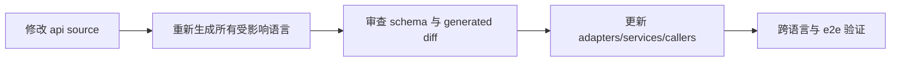

# API 生成与变更

API 变更必须从根 `api/` 的 source schema 开始。禁止直接修改 `generated.go`、`*.pb.go`、JavaScript generated client 或 C nanopb output。

## 生成链路

| Source | 主要输出 | 命令 |
| --- | --- | --- |
| HTTP OpenAPI + shared schemas | Go HTTP server/client/models | `go generate ./pkgs/gizclaw/api/adminhttp ./pkgs/gizclaw/api/apitypes ./pkgs/gizclaw/api/peerhttp ./pkgs/gizclaw/api/openaihttp` |
| `api/proto/rpc/**/*.proto` | Go Protobuf | `go generate ./pkgs/gizclaw/api/rpcproto` |
| RPC descriptors/wrappers | `rpcapi` committed surface | `go generate ./pkgs/gizclaw/api/rpcapi` |
| HTTP + RPC schemas | JavaScript SDK | `npm --prefix sdk/js run gen:sdk` |
| RPC Protobuf | C nanopb SDK | `go generate ./sdk/c/gizclaw` |
| Telemetry Protobuf | Go/JavaScript telemetry | `go generate ./pkgs/gizclaw/api/telemetry` 与 `npm --prefix sdk/js run gen:telemetry` |

全量 Go API 可以使用：

```sh
go generate ./pkgs/gizclaw/api/...
```

## 一次完整变更



审查不能只看生成文件。应先确认 source contract 是否正确，再确认每个生成 surface 新鲜一致，最后验证调用点和业务实现。

## 最低验证

按变更范围选择，但至少包括：

```sh
go test ./pkgs/gizclaw/api/... ./pkgs/gizclaw/... ./sdk/go/... -count=1
npm --prefix sdk/js test
git diff --check
```

RPC/C surface 变化时增加 C generation/build tests；管理资源变化时增加 resource manager 与 CLI e2e；HTTP endpoint 变化时覆盖 strict adapter 的成功和用户可见错误路径。

生成后如果出现大量无关 diff，应先检查工具版本、排序和 template，而不是提交噪声。Generated output 必须与同一提交中的 source schema 一致。
