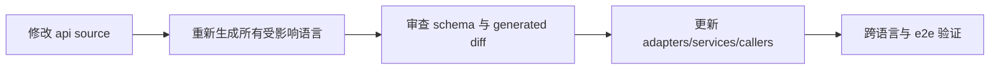

# API 生成与变更

API 变更必须从根 `api/` 的 source schema 开始。禁止直接修改由第三方工具生成的 `*.pb.go`、OpenAPI Go output、JavaScript generated client 或 C nanopb output。`rpcapi/generated.go` 是历史遗留的手工维护 wrapper，不属于第三方生成输出；修改时必须同时核对 source proto、`rpcproto` 和 codec tests。

## 生成链路

| Source | 主要输出 | 命令 |
| --- | --- | --- |
| HTTP OpenAPI + shared schemas | Go HTTP server/client/models | `go generate ./pkgs/gizclaw/api/adminhttp ./pkgs/gizclaw/api/apitypes ./pkgs/gizclaw/api/peerhttp ./pkgs/gizclaw/api/openaihttp` |
| `api/proto/rpc/**/*.proto` | Go Protobuf | `go generate ./pkgs/gizclaw/api/rpcproto` |
| RPC descriptors/wrappers | 手工维护的 `rpcapi` committed surface | `go test ./pkgs/gizclaw/api/rpcapi`（当前 `go generate` 也只执行该验证，不会重新生成文件） |
| HTTP + RPC schemas | JavaScript SDK | `npm --prefix sdk/js run gen:sdk` |
| RPC Protobuf | C nanopb SDK | `go generate ./sdk/c/gizclaw` |
| Telemetry Protobuf | Go/JavaScript telemetry | `go generate ./pkgs/gizclaw/api/telemetry` 与 `npm --prefix sdk/js run gen:telemetry` |

全量 Go API 可以使用：

```sh
go generate ./pkgs/gizclaw/api/...
```

## 一次完整变更



审查不能只看生成文件。应先确认 source contract 是否正确，再确认每个生成 surface 新鲜一致，最后验证调用点和业务实现。

## 最低验证

按变更范围选择，但至少包括：

```sh
go test ./pkgs/gizclaw/api/... ./pkgs/gizclaw/... ./sdk/go/... -count=1
npm --prefix sdk/js test
git diff --check
```

RPC/C surface 变化时增加 C generation/build tests；管理资源变化时增加 resource manager 与 CLI e2e；HTTP endpoint 变化时覆盖 strict adapter 的成功和用户可见错误路径。

生成后如果出现大量无关 diff，应先检查工具版本、排序和 template，而不是提交噪声。Generated output 必须与同一提交中的 source schema 一致。

## Generator ownership

- `rpcproto/*.pb.go` 由第三方 `protoc-gen-go` 直接生成。
- `adminhttp`、`apitypes`、`openaihttp` 和 `peerhttp` 的 Go output 由第三方 `oapi-codegen` 生成；仓库内工具可以准备输入，但不因此拥有生成模板。
- 第三方生成器产生的 alias、helper signature 或 import qualifier 保持生成结果，不为本地风格规则手改、fork generator 或追加 AST normalizer。
- 仓库手写代码和仓库自有 generator 直接使用类型所属 package，不新增仅用于重命名或 re-export 的跨 package alias。
