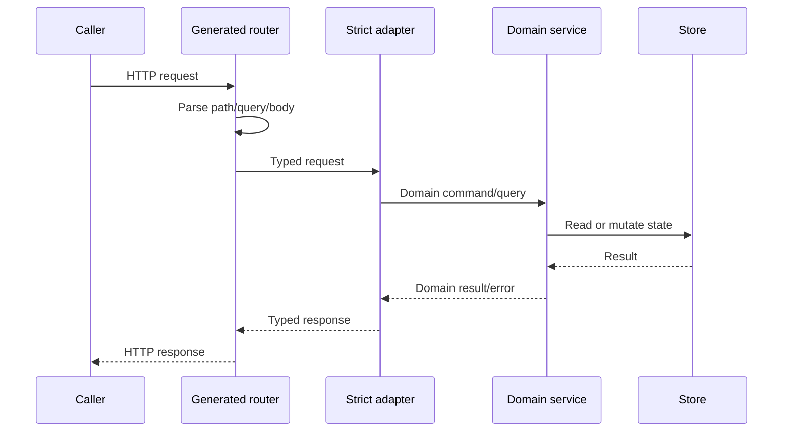

# HTTP API

GizClaw Server 对外维护三个独立 HTTP surface。它们可以复用 DTO，但面向的 caller、认证方式和业务边界不同，不能合并成一个“大而全”的 router contract。

## Surface

| Source | Caller 与职责 | Go 生成结果 |
| --- | --- | --- |
| `admin.json` | 管理员管理资源、Peer、Telemetry 和运维动作 | `pkgs/gizclaw/api/adminhttp` |
| `peer.json` | Public/Peer 登录、自身状态、Server info 与 WebRTC offer | `pkgs/gizclaw/api/peerhttp` |
| `openai-compat/v1/service.json` | OpenAI-compatible model、chat 与 audio subset | `pkgs/gizclaw/api/openaihttp` |

Desktop application contract 属于 `apps/wails`，不属于 GizClaw Server HTTP API。

## 请求流

OpenAPI 拥有 path、method、parameters、wire DTO 和 response status。Adapter 负责把生成类型映射到领域调用。Service 拥有 authorization decision、资源规则和 persistence。不要把业务实现写进 generated package，也不要让 service 直接解析 Fiber request。

## 变更规则

- 新 endpoint 先选择正确 surface，再定义稳定 operation ID。
- 跨 surface DTO 通过 `$ref` 指向 `shared.json`；Admin 声明式资源定义在 `resources/*.json`，并由 `shared.json` 的生成入口聚合。只有一个 Resource owner 的 Spec 直接定义在对应 Resource 文件中。
- 明确 success 与所有 user-visible error response，不能只生成 happy path。
- 修改 schema 后必须重新生成 strict server/client，并让实际 handler 满足新 interface。
- Authentication middleware 与 endpoint 自认证边界必须由 server composition 明确实现；OpenAPI security declaration不能代替运行时验证。

`/webrtc/v1/offer` 属于 signaling 入口。其身份由 Offer contract 自身验证时，不应再隐式依赖另一套 HTTP session 前置条件。

## 子文档

- [Admin API](./admin)：管理员资源、Peer 管理与运维 surface。
- [Public API](./public)：WebRTC 建连前入口与 Peer 自身 surface。
- [OpenAI Compatible](./openai-compatible)：OpenAI-compatible 模型、Chat 与 Audio surface。

设计资料：[Shared 与 Resources](./shared-resources) · [依赖规则](./type-dependencies)
