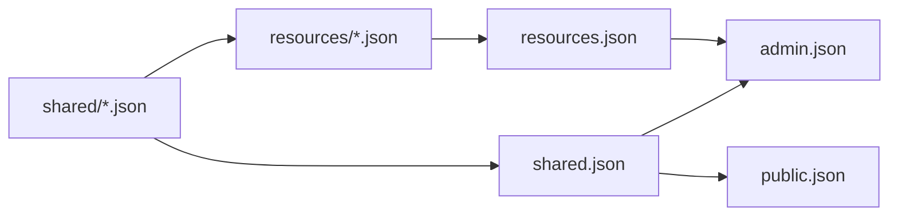

# Shared 与 Resources

`api/http/shared/` 与 `api/http/resources/` 表达不同所有权。Shared 是跨 surface 或跨领域复用的 contract；Resources 是 Admin 声明式资源及其专属数据。

## shared

`shared/` 只保存具有至少两个实际 consumers，或明确属于跨领域 contract 的数据结构、enum 和 value object。`shared.json` 聚合这些定义，并通过 `#/components/schemas` 提供给多个 HTTP surfaces 和 codegen。

适合放在 `shared/` 的内容：

- request/response 之间共享的稳定 DTO；
- 有独立语义的 enum、spec 或 nested value；
- 多个 HTTP surface 需要使用的 error 和 pagination 类型。

不适合放在这里的内容：单个 Resource 专属 Spec、只有一个父 schema 的小 value object、database row、service dependency、runtime lock、内部 cache state，以及只由单个 handler 使用的临时结构。

## Shared 列表

`shared/` 包含以下按 owner 组织的 schema 文件。

### 跨 HTTP surface

| 文件 | 包含的 schema | 实际消费者 |
| --- | --- | --- |
| `shared/error.json` | `ErrorPayload`、`ErrorResponse` | Admin、Peer、Desktop HTTP |
| `shared/device.json` | `DeviceInfo`、`HardwareInfo`、`PeerIMEI`、`PeerLabel` | Admin Peer view、Peer self/registration |
| `shared/runtime.json` | `Runtime` 及其共同 runtime value | Admin Peer runtime、Peer self runtime |

这是确定的跨 surface shared 集合。`PeerRegistrationStatus`、`PeerStatus` 和 `ServerInfo` 目前只属于 Public API，应直接定义在 `public.json`，不能因为它们包含 “Peer” 就放入 shared。

### Admin API 与多个 Resources 共用

| 文件 | 包含的 schema family | 复用边界 |
| --- | --- | --- |
| `shared/acl.json` | Permission、Policy、Resource、Subject、Role/View 公共 value | ACL Admin endpoints 与多个 ACL Resources |
| `shared/configuration.json` | `Configuration`、firmware/agent selection 等配置 value | Peer/registration model 与 PeerConfig Resource |
| `shared/gameplay.json` | Gameplay metadata、Pet、Badge、Points、Game Result、共同规则 value | Gameplay Admin endpoints 与 Game/Pet/Badge Resources |
| `shared/firmware.json` | Firmware、slot、artifact 与 selection 公共 value | Firmware Admin endpoints 与 Firmware Resource |
| `shared/credential.json` | Credential body 与可复用 credential value | Credential Admin endpoint 与 Credential Resource |
| `shared/model.json` | Model kind、capabilities、provider、source 与 provider data | Model Admin endpoint 与 Model Resource |
| `shared/voice.json` | Voice provider、source 与 provider data | Voice Admin endpoint 与 Voice Resource |
| `shared/tool.json` | Tool executor、trigger、source 与 JSON schema value | Tool APIs、Workflow/Toolkit 与 Tool Resource |
| `shared/workflow.json` | Workflow document、metadata、driver 与各 workflow variant | Workflow Admin API、Workspace parameters 与 Workflow Resource |
| `shared/workspace.json` | Workspace parameters、input mode 与共同 workspace value | Workspace Admin API、Workflow runtime 与 Workspace Resource |
| `shared/provider-tenants.json` | Provider tenant 共同 enum/value | Model、Voice 与各 Provider Tenant Resources |

这里保留的是被 Admin response/request 与 Resource spec 共同引用的 value，并不包含 Resource envelope。每个 Resource 专属的 `*Spec` 仍放在对应 `resources/*.json`；如果某个 value 最终只剩一个 owner，也应继续内联，而不是因为出现在本表就永久保留。

### 明确不属于 Shared

| 类型 | 所属位置 |
| --- | --- |
| `PeerRegistrationStatus`、`PeerStatus`、`ServerInfo` | `public.json` |
| `ResourceAPIVersion`、`ResourceKind`、`ResourceMetadata` | `resources/base.json` |
| `ApplyAction`、`ApplyResult`、Resource union | `resources/base.json` 或 `resources.json` |
| `ModelSpec`、`VoiceSpec`、`FirmwareSpec` 等单一 Resource Spec | 对应 `resources/<resource>.json` |
| OpenAI-compatible request/response models | `openai-compat/v1/service.json` |
| Desktop-only context、view 与 session models | `apps/wails` Desktop contract |

`shared.json` 只导出上面 Shared 列表中的 schema。它不得为了让 `apitypes` 一次生成所有 symbol，而重新导出整个 Resource graph。

## resources

`resources/` 描述 Admin 声明式资源。它们服务于 `admin apply`、`admin show` 和 resource manager，不被 Peer HTTP 或 Desktop surface 使用。

一个 resource schema 应表达：

- resource kind 与稳定 identity；
- 用户可以声明的 spec；
- apply/show 需要保留的 metadata；
- 与其他 resource 的显式引用。

只被一个 Resource 使用的 Spec 应与 Resource 定义在同一文件。例如只有 Model Resource 使用的 `ModelSpec` 应位于 `resources/model.json`，不再单独建立 `shared/model_spec.json`。

运行时连接、stream、临时状态和 provider client 不能塞进 resource spec。Resource 表达期望状态，领域 service 负责校验并实现该状态。

## 复用关系

依赖必须是 `shared ← resources ← admin`，以及 `shared ← public/openai-compatible`。`shared.json` 不能反向聚合 `resources/`。

新增字段时应优先修改其真正拥有者：真正共享的 value 修改 `shared/`，声明式资源和专属 Spec 修改 `resources/`，只属于某个 endpoint 的输入则留在该 surface。不要复制一份名字相近但逐渐漂移的 schema。

## 稳定性边界

Schema name、property name、required 集合、enum value、discriminator 和 OpenAPI operation ID 都会影响生成 API。重命名或改变 optional/nullable 语义属于 caller-facing contract 变化，必须与所有生成语言和调用点一起审查。
