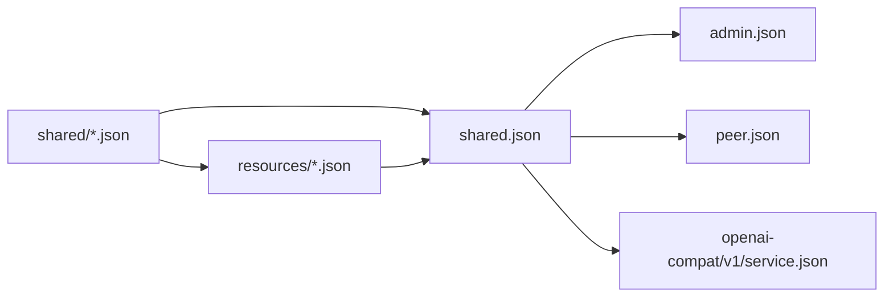

# HTTP Schema 依赖规则

HTTP schema 按所有权分为 Shared、Resources 和三个 API surfaces。当前生成入口使用一个 `shared.json` 聚合 Shared values 与 Resource graph；`shared/` 和 `resources/` 仍按所有权保持独立。

## 目录

```text
api/http/
├── admin.json
├── peer.json
├── openai-compat/
│   └── v1/
│       └── service.json
├── shared.json
├── shared/
│   └── ...
└── resources/
    └── ...
```

## 依赖方向



依赖必须保持单向：

```text
shared/ ← resources/ ← shared.json ← admin
shared.json ← public
shared.json ← openai-compatible
```

`shared/` 不得引用 `resources/`。`resources/` 可以引用 `shared/`。`shared.json` 是生成入口，同时导出两层的稳定 schema；它的文件名不表示 Resource 属于 Shared ownership。

## Shared 规则

Schema 只有满足以下至少一个条件才能进入 `shared/`：

- 被两个以上 HTTP surfaces 直接使用；
- 被两个以上领域 owner 使用；
- 是多个 Resources 共用的稳定 value contract。

需要生成 Go 或 JavaScript symbol，不构成 Shared 的理由。只有一个 owner 的 schema 与 owner 放在同一文件。

### Shared 封闭清单

`shared/` 只允许包含以下文件：

| 文件 | 拥有的 schema |
| --- | --- |
| `error.json` | `ErrorPayload`、`ErrorResponse` |
| `device.json` | `DeviceInfo`、`HardwareInfo`、`PeerIMEI`、`PeerLabel` |
| `runtime.json` | `Runtime` 及跨 surface runtime values |
| `acl.json` | Permission、Policy、ACL Resource、Subject、Role/View 公共 values |
| `configuration.json` | `Configuration`、firmware/agent selection 等共同配置 values |
| `gameplay.json` | Gameplay metadata、Pet、Badge、Points、Game Result 与共同规则 values |
| `firmware.json` | Firmware、slot、artifact 与 selection 公共 values |
| `credential.json` | Credential body 与跨 Resource/API 使用的 credential values |
| `model.json` | Model kind、capabilities、provider、source 与 provider data |
| `voice.json` | Voice provider、source 与 provider data |
| `tool.json` | Tool executor、trigger、source 与 JSON schema values |
| `workflow.json` | Workflow document、metadata、driver 与 workflow variants |
| `workspace.json` | Workspace parameters、input mode 与共同 workspace values |
| `provider-tenants.json` | Model/Voice 共用的 provider tenant enums 与 values |

这是封闭清单，不是示例。未列出的 schema 必须定义在其 owner 文件中：

- Public-only DTO 放入 `peer.json`。
- Admin endpoint 专属 DTO 放入 `admin.json`。
- OpenAI-compatible DTO 放入 `openai-compat/v1/service.json`。
- Resource、专属 `*Spec` 和 nested values 放入对应 `resources/<kind>.json`。
- Resource envelope、metadata、kind、Apply contract 与 union 放入 `resources/resource.json`。

新增 `shared/*.json` 必须先证明存在多个独立 consumers，并同步更新本清单。不能先创建文件，再以“可能复用”为理由留在 Shared。

## Resource 规则

每个 `resources/<kind>.json` 同时拥有：

- Resource envelope 的具体 kind；
- 该 Resource 专属 Spec；
- 只服务于该 Resource 的 nested values；
- 对 Shared schema 的显式引用。

`resources/resource.json` 拥有 `ResourceAPIVersion`、`ResourceKind`、`ResourceMetadata`、Apply contract 与 Resource union。Resource 专属 Spec 不放入 `shared/`。

## Surface 规则

- `admin.json` 通过 `shared.json` 引用 Shared values 与 Resource graph。
- `peer.json` 只引用 `shared.json`，不引用 Admin Resources。Public-only DTO 直接定义在 `peer.json`。
- OpenAI-compatible models 留在自己的 `service.json`；只有确实与其他 GizClaw HTTP surfaces 共用的 contract 才引用 `shared.json`。
- Desktop application contract 属于 `apps/wails`，不进入 Server HTTP API schema graph。

## 文件边界

文件边界按共同 owner 和共同变更确定：

- 单一 Resource 的 `*Spec` 内联到对应 Resource 文件。
- 一个领域中的 parent、enum 与 nested value 合并在同一个 Shared 文件。
- 只有存在独立复用和稳定语义时才拆出新 Shared 文件。

Schema 文件合并不得改变 JSON property、required/nullable 语义、enum value、discriminator 或 OpenAPI operation ID。
